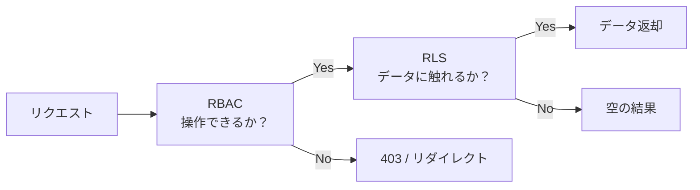
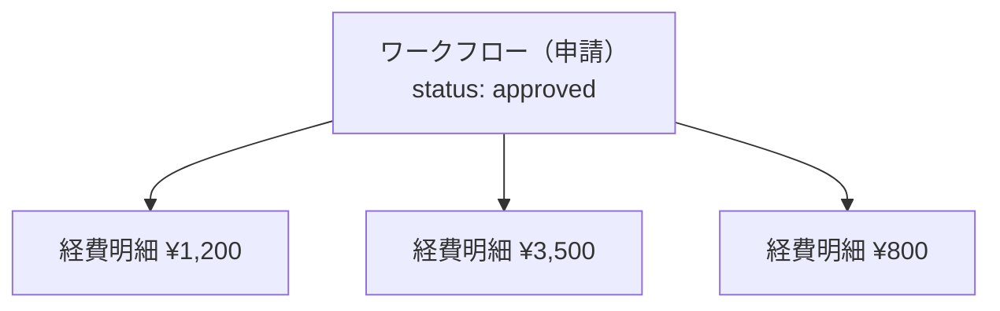

> [!WARNING]
> 以下の概念の混同は設計レビューで頻出します。
> 先に正しく区別しておくと、キャッチアップが **2〜3倍速** になります。

---

## 監査ログ vs 履歴

|  | 監査ログ（Audit Log） | 履歴（History） |
|---|---|---|
| **目的** | 証跡（いつ誰が何をしたか） | 業務の流れを追う |
| **対象** | 全業務イベント | 特定リソースの変遷 |
| **格納先** | `audit_logs` テーブル（INSERT ONLY） | 各リソースのタイムライン表示 |
| **利用者** | IT Admin / Tenant Admin / 監査人 | 申請者 / 承認者 / PM |
| **改ざん** | 防止（UPDATE/DELETE禁止） | 業務上の修正は許容 |
| **例** | `workflow.approve by user_123 at 2026-02-22` | 「2/22に田中さんが承認しました。コメント: "OK"」 |

**ルール**: 監査ログは **システムが自動記録** し、履歴は **UIに表示するための整形データ**。

---

## RBAC vs RLS

|  | RBAC | RLS |
|---|---|---|
| **問い** | この操作が**できるか**？ | このデータに**触れていいか**？ |
| **制御場所** | アプリ層（Middleware / Server Action） | DB層（PostgreSQL） |
| **粒度** | 画面 / ボタン / API単位 | 行単位 |
| **失敗時** | `/unauthorized` にリダイレクト | クエリ結果が空 or エラー |
| **例** | 「MemberはPJ作成ボタンが非表示」 | 「テナントAのデータがテナントBから見えない」 |

**どちらか片方だと何が起きる？**
- **RBACだけ**: アプリのバグでSQLに全件取得が漏れたら→**データ漏洩**
- **RLSだけ**: 権限のないボタンが画面に出てしまい→**UX混乱 + 無駄なエラー**

→ 詳細: [ADR-0001](../../adr/adr-0001/) / [権限と認可](../../spec/authz/)

---

## 申請（Request）vs 実データ（Expense / Timesheet / Invoice）

|  | 申請（Request） | 実データ |
|---|---|---|
| **役割** | 承認の器 | 業務の実体 |
| **例** | 経費申請、工数締め申請 | 経費明細、工数レコード |
| **状態管理** | draft→submitted→approved | 申請のステータスに従属 |
| **テーブル** | `workflows` | `expenses`, `timesheets`, `invoices` |

**設計の問い**: 状態管理は申請（workflow）側？ 実データ側？ → **OpsHubでは申請側で統一管理**。

---

## 所属（Membership）vs 所有（Ownership）

|  | 所属 | 所有 |
|---|---|---|
| **意味** | テナント/PJに「属している」 | そのデータを「作った」 |
| **RLSでの使用** | テナント内のデータが見える根拠 | 自分のデータだけ見える根拠 |
| **例** | テナントAのメンバーはAの全PJ一覧が見える | 自分の工数のみ編集可能 |

**ルール**: OpsHubでは `tenant_id` で所属フィルタ、`created_by = auth.uid()` で所有フィルタ。
