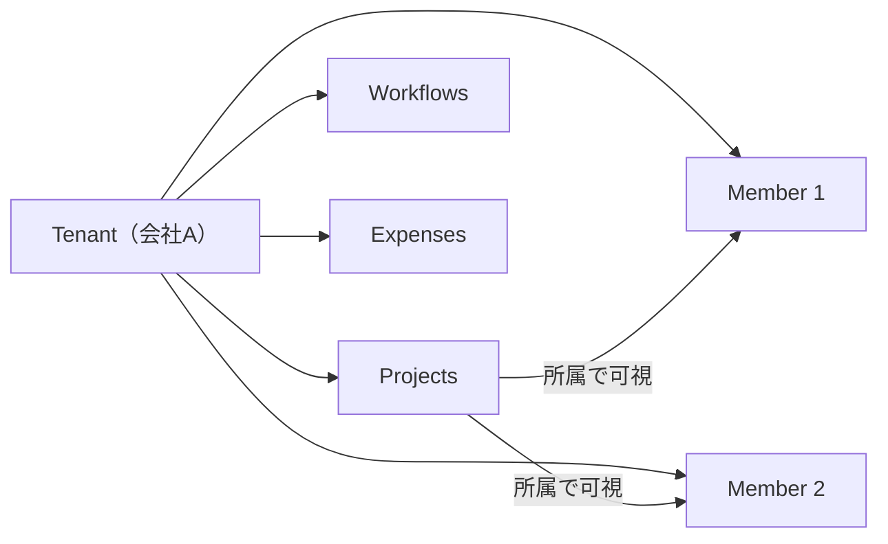
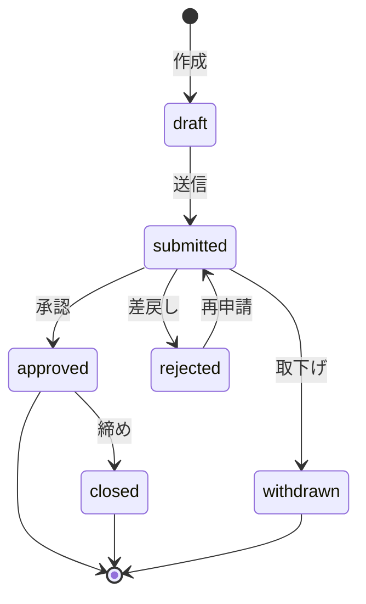

> [!CAUTION]
> この5つの軸がブレると、DB・UI・承認フロー・監査の**すべてが崩れます**。
> 設計レビューでは常にここに立ち返ってください。

---

## 1. データ境界は「テナント」と「所属（Membership）」

- **テナント＝会社単位**。全データは原則テナントで区切る
- 個人所有ではなく **「所属による可視性」** が基本
- ここが固まると **RLSが一気に単純** になる

→ 詳細: [ADR-0003 マルチテナント](../../adr/adr-0003/)

## 2. 権限は「操作権限（RBAC）」と「データ権限（RLS）」の二段構え

| 層 | 問い | 制御場所 |
|---|---|---|
| **RBAC** | 画面/操作が**できるか**？ | アプリ層（Middleware, Server Action） |
| **RLS** | そのデータに**触れていいか**？ | DB層（PostgreSQL RLS） |

- どちらか片方だけだと運用で破綻しやすい（特に監査性）
- **RBACだけ**→ アプリのバグでデータ漏洩
- **RLSだけ**→ 画面に「権限なし操作」のボタンが出る

→ 詳細: [ADR-0001 RBAC/RLS](../../adr/adr-0001/) / [権限と認可](../../spec/authz/)

## 3. 中心ドメインは「ワークフロー（状態遷移）」

- 申請・工数締め・経費締め・請求…全部 **状態遷移** が核
- 状態の定義と「誰がどの状態を変更できるか」が肝
- 状態遷移と履歴（監査）を **最初に決める** と手戻り激減

→ 詳細: [状態遷移/シーケンス](../../detail/sequences/)

## 4. 「締め（Close/Lock）」は業務システムのコア

**締めが曖昧だと、DB・UI・承認フローが全部揺れる。**

| 問い | 設計で決めること |
|---|---|
| 締めたら編集できる？ | `status = 'closed'` で UPDATE を RLS で禁止 |
| 差戻しできる？ | 締め→差戻しの状態遷移を許可するか |
| 修正は別申請？ | 修正申請（amendment）の業務フローを定義 |

> 月次締め・工数締め・経費締めなど、各ドメインの「締め」ルールを明確に。

## 5. 監査ログは「業務イベント」で残す

- CRUDだけでなく、**承認・差戻し・締め** が監査の本丸
- 監査ログを仕様に組み込むと「大規模感」が本物になる

| 記録すべきイベント | 理由 |
|---|---|
| 承認 / 差戻し | 意思決定の証跡 |
| 締め / ロック解除 | 会計期間の確定 |
| ロール変更 | 権限付与の追跡 |
| データ削除 | 消えたデータの追跡 |

→ 詳細: [監査ログ方針](../../spec/audit-logging/)
