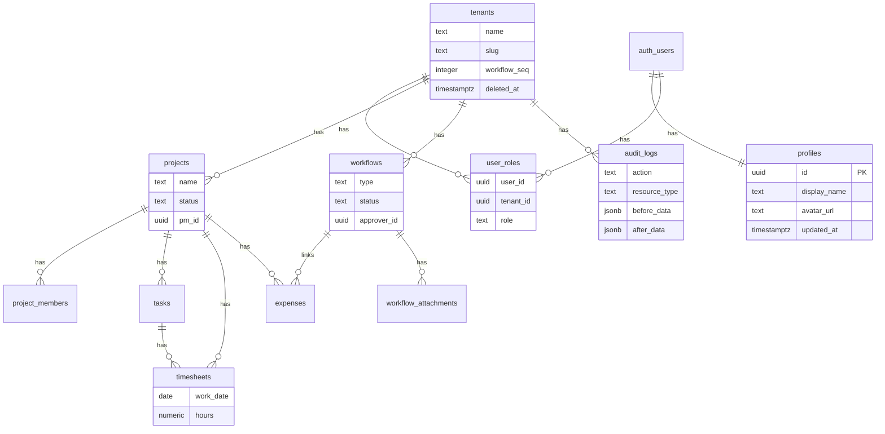

## 目的 / In-Out / Related
- **目的**: 主要テーブルのスキーマを定義し、実装の基盤を確立する
- **対象範囲（In）**: テーブル定義、制約、Index、共通カラム規約
- **対象範囲（Out）**: マイグレーションスクリプト（実装フェーズ）
- **Related**: [ADR-0003](../../adr/adr-0003/) / [ADR-0004](../../adr/adr-0004/) / [ロール定義](../../requirements/roles/) / [RLS設計](../rls/)

---

## 共通カラム規約

全業務テーブルに以下のカラムを必須とする：

| カラム | 型 | 制約 | 用途 |
|---|---|---|---|
| `id` | `uuid` | PK, DEFAULT gen_random_uuid() | 主キー |
| `tenant_id` | `uuid` | NOT NULL, FK→tenants(id) | テナント分離（ADR-0003） |
| `created_by` | `uuid` | NOT NULL, FK→auth.users(id) | 作成者 |
| `updated_by` | `uuid` | FK→auth.users(id) | 最終更新者 |
| `created_at` | `timestamptz` | NOT NULL, DEFAULT now() | 作成日時 |
| `updated_at` | `timestamptz` | NOT NULL, DEFAULT now() | 更新日時（トリガーで自動更新） |

---

## DD-DB-001 tenants（テナント）

| 列名 | 型 | NULL | 制約 | 備考 |
|---|---|---:|---|---|
| id | uuid | NOT NULL | PK | — |
| name | text | NOT NULL | — | テナント表示名 |
| slug | text | NOT NULL | UNIQUE | URL用の識別子 |
| settings | jsonb | — | DEFAULT '{}' | テナント固有設定 |
| workflow_seq | integer | NOT NULL | DEFAULT 0 | WF採番カウンター |
| deleted_at | timestamptz | — | — | 論理削除日時（30日保持後物理削除） |
| created_at | timestamptz | NOT NULL | DEFAULT now() | — |
| updated_at | timestamptz | NOT NULL | DEFAULT now() | — |

## DD-DB-002 user_roles（ユーザーロール）

| 列名 | 型 | NULL | 制約 | 備考 |
|---|---|---:|---|---|
| id | uuid | NOT NULL | PK | — |
| user_id | uuid | NOT NULL | FK→auth.users(id) | — |
| tenant_id | uuid | NOT NULL | FK→tenants(id) | — |
| role | text | NOT NULL | CHECK(IN member,approver,pm,accounting,it_admin,tenant_admin) | — |
| created_at | timestamptz | NOT NULL | DEFAULT now() | — |

- **UNIQUE**: (user_id, tenant_id, role)
- **Index**: (tenant_id, user_id), (user_id)

## DD-DB-003 projects（プロジェクト）

| 列名 | 型 | NULL | 制約 | 備考 |
|---|---|---:|---|---|
| id | uuid | NOT NULL | PK | — |
| tenant_id | uuid | NOT NULL | FK→tenants | — |
| name | text | NOT NULL | — | プロジェクト名 |
| description | text | — | — | — |
| status | text | NOT NULL | CHECK(IN planning,active,completed,cancelled) | — |
| start_date | date | — | — | — |
| end_date | date | — | — | — |
| pm_id | uuid | NOT NULL | FK→auth.users | プロジェクトマネージャー |
| created_by | uuid | NOT NULL | FK→auth.users | — |
| updated_by | uuid | — | FK→auth.users | — |
| created_at | timestamptz | NOT NULL | DEFAULT now() | — |
| updated_at | timestamptz | NOT NULL | DEFAULT now() | — |

- **Index**: (tenant_id, status), (tenant_id, pm_id)

## DD-DB-004 project_members（プロジェクトメンバー）

| 列名 | 型 | NULL | 制約 | 備考 |
|---|---|---:|---|---|
| id | uuid | NOT NULL | PK | — |
| project_id | uuid | NOT NULL | FK→projects | — |
| user_id | uuid | NOT NULL | FK→auth.users | — |
| tenant_id | uuid | NOT NULL | FK→tenants | 非正規化（RLS高速化） |
| created_at | timestamptz | NOT NULL | DEFAULT now() | — |

- **UNIQUE**: (project_id, user_id)
- **Index**: (tenant_id, user_id)

## DD-DB-005 tasks（タスク）

| 列名 | 型 | NULL | 制約 | 備考 |
|---|---|---:|---|---|
| id | uuid | NOT NULL | PK | — |
| tenant_id | uuid | NOT NULL | FK→tenants | — |
| project_id | uuid | NOT NULL | FK→projects | — |
| title | text | NOT NULL | — | — |
| description | text | — | — | — |
| status | text | NOT NULL | CHECK(IN todo,in_progress,done) DEFAULT 'todo' | — |
| assignee_id | uuid | — | FK→auth.users | 担当者 |
| due_date | date | — | — | — |
| created_by | uuid | NOT NULL | FK→auth.users | — |
| created_at | timestamptz | NOT NULL | DEFAULT now() | — |
| updated_at | timestamptz | NOT NULL | DEFAULT now() | — |

- **Index**: (tenant_id, project_id), (tenant_id, assignee_id)

## DD-DB-006 workflows（ワークフロー/申請）

| 列名 | 型 | NULL | 制約 | 備考 |
|---|---|---:|---|---|
| id | uuid | NOT NULL | PK | — |
| tenant_id | uuid | NOT NULL | FK→tenants | — |
| workflow_number | text | NOT NULL | UNIQUE per tenant | 表示用 WF-001 等 |
| type | text | NOT NULL | CHECK(IN expense,leave,purchase,other) | 申請種別 |
| title | text | NOT NULL | — | — |
| description | text | — | — | — |
| status | text | NOT NULL | CHECK(IN draft,submitted,approved,rejected,withdrawn) DEFAULT 'draft' | — |
| amount | numeric(12,2) | — | — | 金額（経費等） |
| date_from | date | — | — | 期間開始 |
| date_to | date | — | — | 期間終了 |
| approver_id | uuid | — | FK→auth.users | 承認者 |
| rejection_reason | text | — | — | 差戻し理由 |
| created_by | uuid | NOT NULL | FK→auth.users | 申請者 |
| approved_at | timestamptz | — | — | 承認日時 |
| created_at | timestamptz | NOT NULL | DEFAULT now() | — |
| updated_at | timestamptz | NOT NULL | DEFAULT now() | — |

- **Index**: (tenant_id, status), (tenant_id, created_by), (tenant_id, approver_id, status)

## DD-DB-007 timesheets（工数）

| 列名 | 型 | NULL | 制約 | 備考 |
|---|---|---:|---|---|
| id | uuid | NOT NULL | PK | — |
| tenant_id | uuid | NOT NULL | FK→tenants | — |
| user_id | uuid | NOT NULL | FK→auth.users | — |
| project_id | uuid | NOT NULL | FK→projects | — |
| task_id | uuid | — | FK→tasks | — |
| work_date | date | NOT NULL | — | 作業日 |
| hours | numeric(4,2) | NOT NULL | CHECK(0〜24), 0.25刻み | — |
| note | text | — | — | — |
| created_at | timestamptz | NOT NULL | DEFAULT now() | — |
| updated_at | timestamptz | NOT NULL | DEFAULT now() | — |

- **UNIQUE**: (user_id, project_id, task_id, work_date)
- **Index**: (tenant_id, user_id, work_date), (tenant_id, project_id, work_date)

## DD-DB-008 expenses（経費）

| 列名 | 型 | NULL | 制約 | 備考 |
|---|---|---:|---|---|
| id | uuid | NOT NULL | PK | — |
| tenant_id | uuid | NOT NULL | FK→tenants | — |
| workflow_id | uuid | — | FK→workflows | 申請連動 |
| project_id | uuid | — | FK→projects | 紐付けPJ |
| category | text | NOT NULL | — | 科目（交通費/宿泊費/消耗品等） |
| amount | numeric(12,2) | NOT NULL | — | — |
| expense_date | date | NOT NULL | — | 発生日 |
| description | text | — | — | — |
| receipt_url | text | — | — | Storage パス |
| created_by | uuid | NOT NULL | FK→auth.users | — |
| created_at | timestamptz | NOT NULL | DEFAULT now() | — |
| updated_at | timestamptz | NOT NULL | DEFAULT now() | — |

- **Index**: (tenant_id, created_by), (tenant_id, project_id)

## DD-DB-009 audit_logs（監査ログ）

| 列名 | 型 | NULL | 制約 | 備考 |
|---|---|---:|---|---|
| id | uuid | NOT NULL | PK | — |
| tenant_id | uuid | NOT NULL | FK→tenants | — |
| user_id | uuid | NOT NULL | FK→auth.users | 操作者 |
| action | text | NOT NULL | — | workflow.approve 等 |
| resource_type | text | NOT NULL | — | workflow, project 等 |
| resource_id | uuid | — | — | 対象リソースID |
| before_data | jsonb | — | — | 変更前 |
| after_data | jsonb | — | — | 変更後 |
| metadata | jsonb | — | DEFAULT '{}' | IP, UA 等 |
| created_at | timestamptz | NOT NULL | DEFAULT now() | — |

- **Index**: (tenant_id, created_at DESC), (tenant_id, resource_type, resource_id), (tenant_id, user_id)
- **制約**: INSERT ONLY（UPDATE/DELETE禁止のRLSポリシー）

## DD-DB-010 notifications（通知）

| 列名 | 型 | NULL | 制約 | 備考 |
|---|---|---:|---|---|
| id | uuid | NOT NULL | PK | — |
| tenant_id | uuid | NOT NULL | FK→tenants | — |
| user_id | uuid | NOT NULL | FK→auth.users | 通知先 |
| type | text | NOT NULL | — | workflow_submitted, workflow_approved 等 |
| title | text | NOT NULL | — | — |
| body | text | — | — | — |
| resource_type | text | — | — | リンク先のリソース種別 |
| resource_id | uuid | — | — | リンク先ID |
| is_read | boolean | NOT NULL | DEFAULT false | — |
| created_at | timestamptz | NOT NULL | DEFAULT now() | — |

- **Index**: (tenant_id, user_id, is_read, created_at DESC)

## DD-DB-011 workflow_attachments（申請添付ファイル）

| 列名 | 型 | NULL | 制約 | 備考 |
|---|---|---:|---|---|
| id | uuid | NOT NULL | PK | — |
| tenant_id | uuid | NOT NULL | FK→tenants | — |
| workflow_id | uuid | NOT NULL | FK→workflows ON DELETE CASCADE | — |
| file_name | text | NOT NULL | — | 元のファイル名 |
| file_size | integer | NOT NULL | CHECK(> 0 AND <= 10485760) | 最大10MB |
| content_type | text | NOT NULL | — | MIME type |
| storage_path | text | NOT NULL | — | Supabase Storage パス |
| uploaded_by | uuid | NOT NULL | FK→auth.users | — |
| created_at | timestamptz | NOT NULL | DEFAULT now() | — |

- **Index**: (tenant_id, workflow_id)
- **制約**: 1申請あたり最大5ファイル（アプリ層で制御）

## DD-DB-012 profiles（ユーザープロファイル）

auth.users の補助テーブル。Supabase 公式推奨パターンに準拠し、表示名・アバターを管理する。  
テナント横断で 1 ユーザー 1 レコード（`tenant_id` を持たない）。

| 列名 | 型 | NULL | 制約 | 備考 |
|---|---|---:|---|---|
| id | uuid | NOT NULL | PK, FK→auth.users(id) ON DELETE CASCADE | auth.users と 1:1 |
| display_name | text | NOT NULL | — | 表示名（UI 表示用） |
| avatar_url | text | — | — | プロフィール画像 URL |
| updated_at | timestamptz | NOT NULL | DEFAULT now() | トリガーで自動更新 |

- **RLS**: 同テナントメンバーの profiles を SELECT 可 / 本人のみ UPDATE 可 / INSERT はトリガー経由
- **Related**: [ADR-0004](../../adr/adr-0004/) / [profiles テーブル設計調査](../../research/profiles-table/)

---

## RPC 関数

### next_workflow_number(p_tenant_id uuid) → text

並行安全なワークフロー番号の採番関数。`SELECT FOR UPDATE` で `tenants.workflow_seq` を行ロックし、インクリメント後に `WF-001` 形式のテキストを返す。

| 引数 | 型 | 説明 |
|---|---|---|
| p_tenant_id | uuid | 対象テナントID |

| 戻り値 | 型 | 例 |
|---|---|---|
| workflow_number | text | `WF-001`, `WF-042` |

- **SECURITY DEFINER**: サービスロールで実行
- **並行制御**: `FOR UPDATE` 行ロックにより同時採番でも重複なし

---

## トリガー / 関数

### handle_new_user() — profiles 自動作成

`auth.users` への INSERT 時に `profiles` レコードを自動作成するトリガー関数。

| 項目 | 値 |
|---|---|
| トリガー名 | `on_auth_user_created` |
| イベント | AFTER INSERT ON `auth.users` |
| 関数 | `public.handle_new_user()` |
| SECURITY | DEFINER |
| display_name 決定ロジック | `COALESCE(raw_user_meta_data->>'name', email, 'Unknown')` |
| 重複時 | `ON CONFLICT (id) DO UPDATE SET display_name = EXCLUDED.display_name` |

### handle_user_updated() — profiles 同期

`auth.users` の `raw_user_meta_data->>'name'` 変更時に `profiles.display_name` を同期するトリガー関数。

| 項目 | 値 |
|---|---|
| トリガー名 | `on_auth_user_updated` |
| イベント | AFTER UPDATE ON `auth.users` |
| 関数 | `public.handle_user_updated()` |
| SECURITY | DEFINER |
| 条件 | `NEW.raw_user_meta_data->>'name' IS DISTINCT FROM OLD.raw_user_meta_data->>'name'` |

### profiles_updated_at — updated_at 自動更新

| 項目 | 値 |
|---|---|
| トリガー名 | `profiles_updated_at` |
| イベント | BEFORE UPDATE ON `public.profiles` |
| 関数 | `public.update_updated_at()` |

---

## ER図（主要テーブル）

---

## マイグレーション方針
- **命名**: `YYYYMMDD_HHMMSS_description.sql`（Supabase Migrations 形式）
- **原則**: 前方互換を維持。カラム追加はNULLABLEまたはDEFAULT付きで
- **ロールバック**: 各マイグレーションに対応するdownファイルを用意

## 未決事項
- invoices テーブル（請求書）の詳細定義（Should優先度のためPhase 2完了後）
- documents テーブル（ドキュメント管理）の定義（Could優先度）
