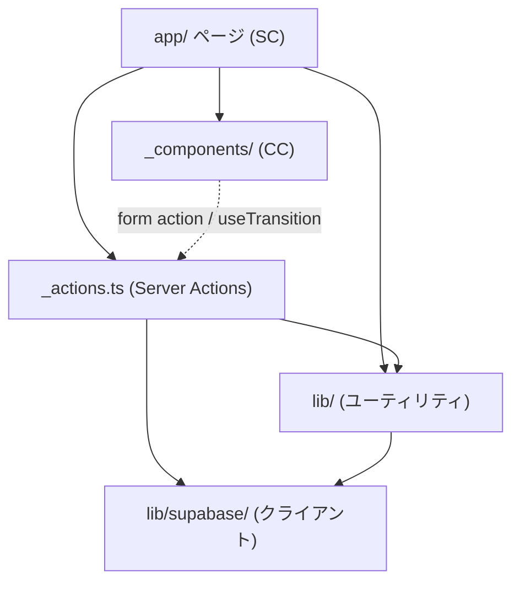
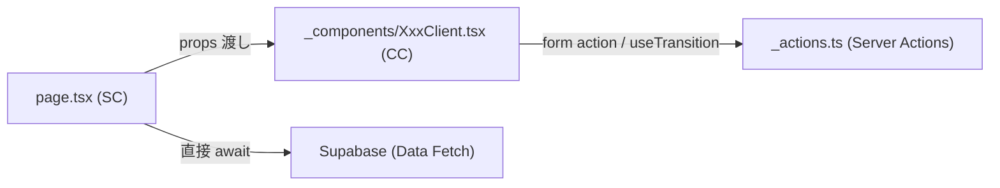

## 目的 / In-Out / Related
- **目的**: Next.js App Router 上でのモジュール分割と責務を定義する
- **対象範囲（In）**: ディレクトリ構成、レイヤー分割、依存ルール、共通ユーティリティ
- **対象範囲（Out）**: 個別関数の実装詳細
- **Related**: [アーキテクチャ概要](../../spec/architecture/) / [Supabase規約](../../spec/supabase-client/)

---

## ディレクトリ構成（実装後）

```
src/
├── app/
│   ├── layout.tsx                           # ルートレイアウト（AntdRegistry）
│   ├── page.tsx                             # / → /login リダイレクト
│   ├── login/
│   │   └── page.tsx                         # ログイン画面
│   ├── auth/
│   │   └── callback/
│   │       └── route.ts                     # OAuth コールバック
│   ├── api/
│   │   ├── health/
│   │   │   └── route.ts                     # ヘルスチェック API（NFR-04b）
│   │   └── timesheets/
│   │       └── export/
│   │           └── route.ts                 # 工数CSV エクスポート API
│   ├── (authenticated)/                     # 認証必要レイアウトグループ
│   │   ├── layout.tsx                       # サイドバー + ヘッダー + 通知ベル (SC)
│   │   ├── page.tsx                         # ダッシュボード (SC)
│   │   ├── _actions/
│   │   │   ├── dashboard.ts                 # ダッシュボード用データ取得
│   │   │   └── notifications.ts             # 通知 CRUD（既読・一括既読）
│   │   ├── _components/
│   │   │   ├── NotificationBell.tsx         # 通知ベル (CC)
│   │   │   └── HeaderSearchBar.tsx          # ヘッダー検索バー (CC)
│   │   ├── workflows/
│   │   │   ├── page.tsx                     # 申請一覧 (SC)
│   │   │   ├── new/
│   │   │   │   └── page.tsx                 # 新規申請 (SC)
│   │   │   ├── pending/
│   │   │   │   └── page.tsx                 # 承認待ち一覧 (SC)
│   │   │   ├── [id]/
│   │   │   │   ├── page.tsx                 # WF 詳細 (SC)
│   │   │   │   └── _components/
│   │   │   │       └── WorkflowDetailClient.tsx  # 承認/差戻しUI (CC)
│   │   │   └── _actions.ts                  # WF Server Actions
│   │   ├── projects/
│   │   │   ├── page.tsx                     # プロジェクト一覧 (SC)
│   │   │   ├── new/
│   │   │   │   └── page.tsx                 # 新規プロジェクト (SC)
│   │   │   ├── [id]/
│   │   │   │   ├── page.tsx                 # プロジェクト詳細 (SC)
│   │   │   │   ├── _components/
│   │   │   │   │   └── ProjectDetailClient.tsx  # 編集・メンバー管理 (CC)
│   │   │   │   ├── tasks/
│   │   │   │   │   ├── page.tsx             # タスク管理 (SC)
│   │   │   │   │   ├── _actions.ts          # タスク Server Actions
│   │   │   │   │   └── _components/
│   │   │   │   │       └── KanbanBoard.tsx  # カンバンボード (CC)
│   │   │   │   └── documents/
│   │   │   │       ├── page.tsx             # ドキュメント管理 (SC)
│   │   │   │       ├── _actions.ts          # ドキュメント Server Actions
│   │   │   │       └── _components/
│   │   │   │           └── DocumentListClient.tsx  # ドキュメント一覧 (CC)
│   │   │   └── _actions.ts                  # プロジェクト Server Actions
│   │   ├── timesheets/
│   │   │   ├── page.tsx                     # 工数入力 (SC)
│   │   │   ├── _actions.ts                  # 工数 Server Actions
│   │   │   ├── _components/
│   │   │   │   └── WeeklyTimesheetClient.tsx # 週次入力グリッド (CC)
│   │   │   └── reports/
│   │   │       ├── page.tsx                 # 工数レポート (SC)
│   │   │       ├── _actions.ts              # レポート集計 Actions
│   │   │       └── _components/
│   │   │           └── ReportClient.tsx     # レポートUI (CC)
│   │   ├── expenses/
│   │   │   ├── page.tsx                     # 経費一覧 (SC)
│   │   │   ├── new/
│   │   │   │   └── page.tsx                 # 経費登録 (SC)
│   │   │   ├── _actions.ts                  # 経費 Server Actions
│   │   │   └── summary/
│   │   │       ├── page.tsx                 # 経費集計 (SC)
│   │   │       ├── _actions.ts              # 経費集計 Server Actions
│   │   │       └── _components/
│   │   │           └── ExpenseSummaryClient.tsx  # 集計フィルタ・チャート (CC)
│   │   ├── invoices/
│   │   │   ├── page.tsx                     # 請求一覧 (SC)
│   │   │   ├── new/
│   │   │   │   └── page.tsx                 # 請求書作成 (SC)
│   │   │   ├── [id]/
│   │   │   │   ├── page.tsx                 # 請求書詳細/編集 (SC)
│   │   │   │   └── _components/
│   │   │   │       └── InvoicePrintView.tsx  # 印刷プレビュー (CC)
│   │   │   ├── _actions.ts                  # 請求書 Server Actions
│   │   │   ├── _constants.ts                # 請求書ステータス定数・遷移ルール
│   │   │   └── _components/
│   │   │       ├── InvoiceListClient.tsx     # 請求一覧UI (CC)
│   │   │       └── InvoiceForm.tsx           # 請求書フォーム (CC)
│   │   ├── search/
│   │   │   ├── page.tsx                     # 全文検索結果 (SC)
│   │   │   ├── _actions.ts                  # 全文検索 Server Actions
│   │   │   └── _components/
│   │   │       └── SearchResultsClient.tsx   # 検索結果UI (CC)
│   │   └── admin/
│   │       ├── tenant/
│   │       │   ├── page.tsx                 # テナント設定 (SC)
│   │       │   ├── _actions.ts              # テナント Server Actions
│   │       │   └── _components/
│   │       │       └── TenantManagement.tsx  # テナント設定UI (CC)
│   │       ├── users/
│   │       │   ├── page.tsx                 # ユーザー管理 (SC)
│   │       │   ├── _actions.ts              # ユーザー Server Actions
│   │       │   └── _components/
│   │       │       ├── UserManagement.tsx    # ユーザー一覧 (CC)
│   │       │       ├── UserDetailPanel.tsx   # ユーザー詳細パネル (CC)
│   │       │       └── InviteModal.tsx       # 招待モーダル (CC)
│   │       └── audit-logs/
│   │           ├── page.tsx                 # 監査ログビューア (SC)
│   │           ├── _actions.ts              # 監査ログ Actions
│   │           └── _components/
│   │               └── AuditLogViewer.tsx    # ログ閲覧UI (CC)
├── lib/                                     # 共通ユーティリティ
│   ├── supabase/
│   │   ├── client.ts                        # ブラウザ用クライアント
│   │   ├── server.ts                        # Server Component/Action 用
│   │   ├── admin.ts                         # Service Role クライアント
│   │   └── middleware.ts                    # セッション更新
│   ├── actions.ts                           # withAuth(), writeAuditLog()
│   ├── auth.ts                              # requireAuth(), requireRole(), hasRole()
│   ├── logger.ts                            # 構造化ロガー（NFR-04a）
│   └── notifications.ts                     # createNotification()
├── types/
│   ├── database.ts                          # supabase gen types 自動生成
│   └── index.ts                             # ActionResult, Role, 定数, 遷移ルール
└── middleware.ts                             # Next.js Middleware（セッション更新）
```

> **凡例**: SC = Server Component / CC = Client Component（`"use client"`）

---

## レイヤー別責務

### ページ層（app/）
- **責務**: ルーティング、レイアウト、データフェッチ（Server Component）、フォーム表示
- **ルール**: ビジネスロジックを書かない。データ取得は直接 Supabase Client、書き込みは `_actions.ts` 経由
- **コロケーション**: 各機能の `_actions.ts` / `_components/` はルート直下に配置（Next.js private folder 規約）

### アクション層（_actions.ts）
- **責務**: バリデーション、認可チェック、DB操作、監査ログ、通知作成、キャッシュ無効化
- **ルール**: `"use server"` 必須。各関数は `withAuth()` ラッパーで `ActionResult<T>` を返す
- **配置**: 利用するページの直下に `_actions.ts` として配置（ルートコロケーション）

### コンポーネント層（_components/）
- **責務**: UI表示、ユーザーインタラクション（フォーム送信、モーダル、状態管理）
- **ルール**: `"use client"` は状態やイベントが必要な場合のみ。ドメインロジックを持たない
- **配置**: 利用するページの直下に `_components/` として配置

### ライブラリ層（lib/）
- **責務**: 横断的関心事（認証、監査、通知、構造化ロギング、Supabase クライアント管理）
- **ルール**: 全モジュールから共有される基盤コード

---

## 依存ルール



**禁止方向**: `_components/` → `_actions.ts`（直接 import 不可、`form action` または `useTransition` 経由のみ）

---

## 共通ユーティリティ

### `withAuth()` — Server Action ラッパー

**ファイル**: `lib/actions.ts`

認証チェック + エラーハンドリングを自動化するジェネリックラッパー。
すべての Server Action はこのラッパーを通して定義する。

```ts
export function withAuth<TInput, TOutput>(
    handler: (user: CurrentUser, supabase: SupabaseClient, input: TInput) => Promise<TOutput>
): (input: TInput) => Promise<ActionResult<TOutput>>
```

**動作フロー**:
1. `requireAuth()` で認証チェック（未認証 → `/login` リダイレクト）
2. Supabase サーバークライアント生成
3. `handler` 実行 → 成功時 `{ success: true, data: T }`
4. 例外時 → エラーコード抽出 → `{ success: false, error: { code, message } }`

---

### `writeAuditLog()` — 監査ログ記録

**ファイル**: `lib/actions.ts`

変更操作の前後データを `audit_logs` テーブルに記録する。

```ts
export async function writeAuditLog(
    supabase: SupabaseClient,
    userId: string,
    input: {
        tenantId: string;
        action: string;           // "create" | "update" | "delete" | ...
        resourceType: string;     // "workflow" | "project" | "task" | ...
        resourceId?: string;
        before?: Record<string, unknown>;
        after?: Record<string, unknown>;
        metadata?: Record<string, unknown>;
    }
): Promise<void>
```

---

### 認証・認可ヘルパー

**ファイル**: `lib/auth.ts`

| 関数 | 用途 | 失敗時挙動 |
|---|---|---|
| `requireAuth()` | Server Action / SC で認証済みユーザーを取得 | `/login` へリダイレクト |
| `requireRole(tenantId, roles)` | Server Action で指定ロールいずれかを要求 | `ERR-AUTH-003` 例外 |
| `hasRole(user, tenantId, roles)` | SC での UI 分岐（ボタン表示/非表示等） | `false` を返す |
| `getCurrentUser()` | 認証状態の取得（未認証でも安全） | `null` を返す（例外を投げない） |

> [!NOTE]
> `getCurrentUser()` は `requireAuth()` と異なり、未認証時にリダイレクトせず `null` を返す。
> ログイン状態に応じた UI 分岐（例: レイアウトでの条件表示）に利用する。

```ts
getCurrentUser(): Promise<CurrentUser | null>
```

**`CurrentUser` 型**:
```ts
type CurrentUser = {
    id: string;
    email: string;
    tenantIds: string[];
    roles: { tenantId: string; role: Role }[];
};
```

---

### `createNotification()` — 通知作成ヘルパー

**ファイル**: `lib/notifications.ts`

他モジュールの Server Action から呼び出される通知レコード作成ヘルパー。

```ts
export async function createNotification(
    supabase: SupabaseClient,
    input: {
        tenantId: string;
        userId: string;           // 通知先ユーザーID
        type: string;             // "workflow_submitted" | "workflow_approved" | ...
        title: string;
        body?: string;
        resourceType?: string;    // リンク先リソース種別
        resourceId?: string;      // リンク先リソースID
    }
): Promise<void>
```

---

### `getNotificationLink()` — 通知リンク生成

**ファイル**: `lib/notifications.ts`

通知のリソース情報からリンク先 URL を生成する。`NotificationBell` コンポーネント等で利用。

```ts
export function getNotificationLink(
    resourceType: string | null,
    resourceId: string | null
): string | null
```

| resourceType | 生成されるリンク |
|---|---|
| `workflow` | `/workflows/{resourceId}` |
| `project` | `/projects/{resourceId}` |
| `task` | `/projects`（PJ 配下のため一覧へ） |
| `expense` | `/expenses` |
| その他 / null | `null` |

---

### profiles JOIN — ユーザー表示名取得パターン

`auth.users` は直接参照できないため、`profiles` テーブル（`id`, `display_name`, `avatar_url`）を JOIN してユーザー表示名を取得する。

```ts
// Server Action / SC での典型的な JOIN
const { data } = await supabase
    .from("workflows")
    .select("*, profiles!workflows_created_by_fkey(display_name)")
    .eq("tenant_id", tenantId);

// 表示時
const name = row.profiles?.display_name ?? row.created_by;
```

---

## 共通定数

### `types/index.ts` — 全体共通定数

#### ラベル・カラー定数

| 定数名 | 型 | 用途 |
|---|---|---|
| `ROLE_LABELS` | `Record<Role, string>` | ロール表示名（`member` → `"メンバー"` 等） |
| `USER_STATUS_LABELS` | `Record<UserStatus, string>` | ユーザーステータス表示名 |
| `USER_STATUS_COLORS` | `Record<UserStatus, string>` | ステータスごとの Ant Design カラー名 |

#### 状態遷移ルール

| 定数名 | 用途 |
|---|---|
| `TASK_TRANSITIONS` | タスクステータス遷移（`todo` → `in_progress` → `done`） |
| `PROJECT_TRANSITIONS` | プロジェクトステータス遷移 |
| `WORKFLOW_TRANSITIONS` | ワークフローステータス遷移 |

#### ActionResult 統一レスポンス型

```ts
type ActionResult<T> =
    | { success: true; data: T }
    | { success: false; error: { code: string; message: string; fields?: Record<string, string> } };
```

### `invoices/_constants.ts` — 請求書定数

| 定数名 | 型 | 用途 |
|---|---|---|
| `INVOICE_STATUSES` | `readonly ["draft", "sent", "paid", "cancelled"]` | 請求書ステータス列挙 |
| `INVOICE_STATUS_LABELS` | `Record<InvoiceStatus, string>` | ステータス表示名（`draft` → `"下書き"` 等） |
| `INVOICE_STATUS_COLORS` | `Record<InvoiceStatus, string>` | ステータスごとの Ant Design カラー名 |
| `INVOICE_STATUS_TRANSITIONS` | `Record<InvoiceStatus, InvoiceStatus[]>` | ステータス遷移ルール（`draft` → `sent` / `cancelled` 等） |

### `documents/_actions.ts` — ドキュメント管理定数

| 定数名 | 用途 |
|---|---|
| `ALLOWED_MIME_TYPES` | ドキュメントアップロードで許可される MIME タイプ一覧（PDF, Word, Excel, PNG, JPEG, テキスト） |

---

## Server Component / Client Component 分離パターン

### 基本方針



| 区分 | 使用基準 | ファイル命名 |
|---|---|---|
| **Server Component** | データフェッチ、認可チェック、初期表示 | `page.tsx` |
| **Client Component** | フォーム送信、モーダル、状態管理、イベント処理 | `*Client.tsx` / 機能名 `.tsx` |

### 実装パターン

**ページ（SC）**:
```tsx
// page.tsx — Server Component
export default async function XxxPage() {
    const user = await requireAuth();
    const supabase = await createClient();
    const { data } = await supabase.from("xxx").select("*");
    // hasRole() で UI 分岐判定
    const canEdit = hasRole(user, tenantId, ["pm", "tenant_admin"]);
    return <XxxClient data={data} canEdit={canEdit} />;
}
```

**インタラクティブ部品（CC）**:
```tsx
// _components/XxxClient.tsx — Client Component
"use client";
export default function XxxClient({ data, canEdit }: Props) {
    const [pending, startTransition] = useTransition();
    const handleSubmit = () => {
        startTransition(async () => {
            const result = await someAction(input);
            if (result.success) { /* ... */ }
        });
    };
    // ...
}
```

### 並行データフェッチ（Promise.all）

ダッシュボードやレイアウトなど複数データソースを扱うページでは `Promise.all` で並行取得する:

```ts
const [pendingApprovals, myWorkflows, myTasks, weeklyHours] = await Promise.all([
    isApprover ? getPendingApprovalsCount() : Promise.resolve(0),
    getMyWorkflowsCount(),
    isMemberOrPm ? getMyTasksCount() : Promise.resolve(0),
    isMemberOrPm ? getWeeklyHours() : Promise.resolve(0),
]);
```

---

## モジュール一覧

### DD-MOD-001 ワークフローモジュール

- **責務**: ワークフロー（申請/承認/差戻し/取下げ）の全操作、WF番号の並行安全な採番
- **ページ**: `workflows/page.tsx`, `workflows/new/page.tsx`, `workflows/pending/page.tsx`, `workflows/[id]/page.tsx`
- **Actions**: `workflows/_actions.ts`
- **Client Component**: `WorkflowDetailClient.tsx`（承認/差戻し/取下げ UI）
- **公開I/F**: `createWorkflow()`, `submitWorkflow()`, `approveWorkflow()`, `rejectWorkflow()`, `withdrawWorkflow()`
- **依存**: `withAuth`, `writeAuditLog`, `requireRole`, `createNotification`, `next_workflow_number()` RPC
- **データ境界**: `workflows`, `workflow_attachments` テーブル

### DD-MOD-002 プロジェクトモジュール

- **責務**: プロジェクトとタスクの CRUD、メンバー管理、カンバンボード
- **ページ**: `projects/page.tsx`, `projects/new/page.tsx`, `projects/[id]/page.tsx`, `projects/[id]/tasks/page.tsx`
- **Actions**: `projects/_actions.ts`, `projects/[id]/tasks/_actions.ts`
- **Client Component**: `ProjectDetailClient.tsx`, `KanbanBoard.tsx`
- **公開I/F**: `createProject()`, `updateProject()`, `assignMember()`, `createTask()`, `updateTask()`
- **依存**: `withAuth`, `writeAuditLog`, `requireRole`, `hasRole`
- **データ境界**: `projects`, `project_members`, `tasks` テーブル

### DD-MOD-003 工数モジュール

- **責務**: 工数の週次入力・更新、レポート集計、CSV エクスポート
- **ページ**: `timesheets/page.tsx`, `timesheets/reports/page.tsx`
- **Actions**: `timesheets/_actions.ts`, `timesheets/reports/_actions.ts`
- **Client Component**: `WeeklyTimesheetClient.tsx`, `ReportClient.tsx`
- **API Route**: `api/timesheets/export/route.ts`
- **公開I/F**: `upsertTimesheet()`, `getWeeklyTimesheet()`, `getProjectSummary()`
- **ヘルパー**: `escapeCsvField()` — CSV フィールドのエスケープ処理
- **依存**: `withAuth`, `requireRole`, `hasRole`
- **データ境界**: `timesheets` テーブル

### DD-MOD-004 経費モジュール

- **責務**: 経費の登録・一覧表示・集計・ワークフロー連携
- **ページ**: `expenses/page.tsx`, `expenses/new/page.tsx`, `expenses/summary/page.tsx`
- **Actions**: `expenses/_actions.ts`, `expenses/summary/_actions.ts`
- **Client Component**: `ExpenseSummaryClient.tsx`（集計フィルタ・チャート表示）
- **公開I/F**: `createExpense()`, `getExpenses()`, `getExpenseSummaryByCategory()`, `getExpenseSummaryByProject()`, `getExpenseSummaryByMonth()`, `getExpenseStats()`
- **依存**: `withAuth`, `writeAuditLog`, `requireRole`, `hasRole`
- **データ境界**: `expenses` テーブル

### DD-MOD-005 通知モジュール

- **責務**: 通知の表示・既読管理・一括既読
- **Actions**: `(authenticated)/_actions/notifications.ts`
- **Client Component**: `NotificationBell.tsx`（ヘッダー通知ベル）
- **公開I/F**: `getNotifications()`, `markAsRead()`, `markAllAsRead()`, `getUnreadCount()`
- **依存**: `withAuth`, Supabase RLS
- **データ境界**: `notifications` テーブル

### DD-MOD-006 ダッシュボードモジュール

- **責務**: KPI 集計表示、未読通知一覧、クイックアクション
- **ページ**: `(authenticated)/page.tsx`（全体が Server Component）
- **Actions**: `(authenticated)/_actions/dashboard.ts`
- **公開I/F**: `getPendingApprovalsCount()`, `getMyWorkflowsCount()`, `getMyTasksCount()`, `getWeeklyHours()`, `getProjectProgress()`, `getUnreadNotifications()`
- **ロール分岐**: `hasRole()` で表示カード・データ取得を制御
- **依存**: `requireAuth`, `hasRole`, `Promise.all` 並行取得

### DD-MOD-007 管理モジュール

- **責務**: テナント設定、ユーザー管理（招待/ロール変更/無効化）、監査ログビューア
- **ページ**: `admin/tenant/page.tsx`, `admin/users/page.tsx`, `admin/audit-logs/page.tsx`
- **Actions**: `admin/tenant/_actions.ts`, `admin/users/_actions.ts`, `admin/audit-logs/_actions.ts`
- **Client Component**: `TenantManagement.tsx`, `UserManagement.tsx`, `UserDetailPanel.tsx`, `InviteModal.tsx`, `AuditLogViewer.tsx`
- **共通定数利用**: `ROLE_LABELS`, `USER_STATUS_LABELS`, `USER_STATUS_COLORS`
- **依存**: `withAuth`, `writeAuditLog`, `requireRole`, Supabase Admin Client
- **データ境界**: `tenants`, `user_roles`, `profiles`, `audit_logs` テーブル

### DD-MOD-008 請求書モジュール

- **責務**: 請求書の CRUD、ステータス遷移（下書き → 送付済 → 入金済 / キャンセル）、印刷プレビュー、請求番号の並行安全な採番
- **ページ**: `invoices/page.tsx`, `invoices/new/page.tsx`, `invoices/[id]/page.tsx`
- **Actions**: `invoices/_actions.ts`
- **Client Component**: `InvoiceListClient.tsx`（一覧・フィルタ）, `InvoiceForm.tsx`（作成/編集フォーム）, `InvoicePrintView.tsx`（印刷プレビュー）
- **定数**: `invoices/_constants.ts`（`INVOICE_STATUS_LABELS`, `INVOICE_STATUS_COLORS`, `INVOICE_STATUS_TRANSITIONS`）
- **公開I/F**: `getInvoices()`, `getInvoice()`, `createInvoice()`, `updateInvoice()`, `updateInvoiceStatus()`, `deleteInvoice()`
- **依存**: `withAuth`, `writeAuditLog`, `requireRole`, `hasRole`, `next_invoice_number()` RPC
- **データ境界**: `invoices`, `invoice_items` テーブル

### DD-MOD-009 ドキュメント管理モジュール

- **責務**: プロジェクト配下のドキュメントのアップロード・ダウンロード・削除、Supabase Storage 連携
- **ページ**: `projects/[id]/documents/page.tsx`
- **Actions**: `projects/[id]/documents/_actions.ts`
- **Client Component**: `DocumentListClient.tsx`（ファイル一覧・アップロード UI）
- **定数**: `ALLOWED_MIME_TYPES`（許可 MIME タイプ）
- **ヘルパー**: `formatFileSize()` — ファイルサイズの人間可読変換（Client Component 内）
- **公開I/F**: `getDocuments()`, `uploadDocument()`, `deleteDocument()`, `getDownloadUrl()`
- **依存**: `withAuth`, `writeAuditLog`, `hasRole`, `logger`, Supabase Storage
- **データ境界**: `documents` テーブル、`project-documents` Storage バケット

### DD-MOD-010 全文検索モジュール

- **責務**: ワークフロー・プロジェクト・タスク・経費の横断検索、ヘッダー検索バー
- **ページ**: `search/page.tsx`
- **Actions**: `search/_actions.ts`
- **Client Component**: `SearchResultsClient.tsx`（検索結果・カテゴリタブ）, `HeaderSearchBar.tsx`（ヘッダー共通検索バー）
- **ヘルパー**: `escapeLikePattern()` — SQL LIKE メタ文字エスケープ、`highlightText()` — 検索キーワードハイライト
- **公開I/F**: `searchAll()`
- **技術**: `pg_trgm` + GIN インデックスによる部分一致検索（ADR-0006）
- **依存**: `withAuth`, `hasRole`, `Promise.all` 並行検索
- **データ境界**: `workflows`, `projects`, `tasks`, `expenses` テーブル（横断読取）

### DD-MOD-011 運用基盤モジュール

- **責務**: 構造化ロギング、ヘルスチェック
- **ライブラリ**: `lib/logger.ts` — JSON 形式の構造化ロガー（`LOG_LEVEL` 環境変数でフィルタリング）
- **API Route**: `api/health/route.ts` — ヘルスチェックエンドポイント（DB 死活確認、NFR-04b）
- **公開I/F**: `logger.error()`, `logger.warn()`, `logger.info()`, `logger.debug()`, `GET /api/health`
- **依存**: Supabase Admin Client

---

## 新規ユーティリティ関数

| 関数名 | ファイル | 用途 |
|---|---|---|
| `escapeCsvField()` | `api/timesheets/export/route.ts` | CSV フィールドのエスケープ（ダブルクォート囲み） |
| `escapeLikePattern()` | `search/_actions.ts` | SQL LIKE のメタ文字（`%`, `_`, `\`）エスケープ |
| `formatFileSize()` | `documents/_components/DocumentListClient.tsx` | ファイルサイズの人間可読変換（例: `1.5 MB`） |
| `highlightText()` | `search/_components/SearchResultsClient.tsx` | 検索キーワードを `<mark>` タグでハイライト |

---

## 決定済み事項

| 項目 | 決定内容 |
|---|---|
| 型生成 | `npx supabase gen types typescript` でローカル生成、`types/database.ts` にコミット |
| UIライブラリ | Ant Design 6 に統一、共通ラベル定数は `types/index.ts` に集約 |
| コロケーション | `_actions.ts` / `_components/` はページ直下に配置（Next.js private folder 規約） |
| WF採番 | `next_workflow_number()` RPC で FOR UPDATE ロックによる並行安全な採番 |
| 請求書採番 | `next_invoice_number()` RPC で FOR UPDATE ロックによる並行安全な採番 |
| ユーザー表示名 | `profiles` テーブル + トリガー同期、SELECT 時は JOIN パターン |
| 全文検索 | `pg_trgm` + GIN インデックスによる ILIKE 部分一致検索（ADR-0006） |
| 構造化ログ | `lib/logger.ts` で JSON 出力、`LOG_LEVEL` 環境変数制御（NFR-04a） |
| ファイル管理 | Supabase Storage `project-documents` バケット + MIME タイプ制限 |
