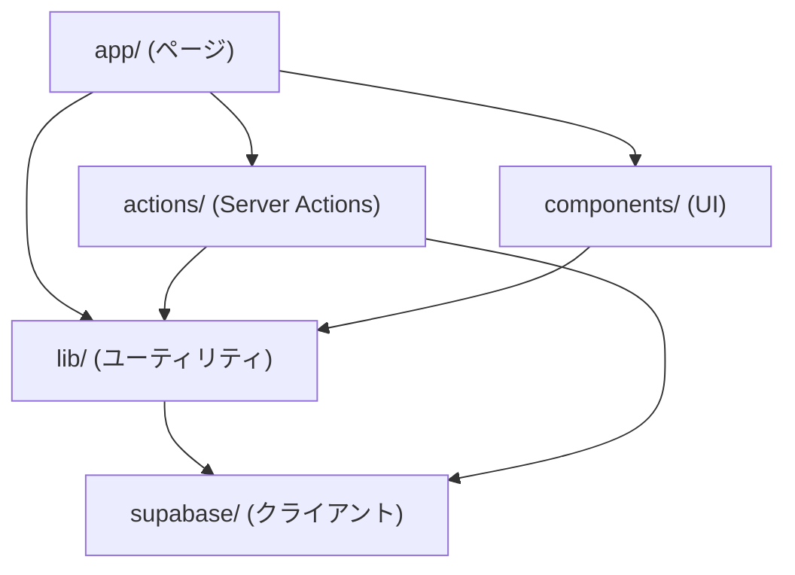

## 目的 / In-Out / Related
- **目的**: Next.js App Router 上でのモジュール分割と責務を定義する
- **対象範囲（In）**: ディレクトリ構成、レイヤー分割、依存ルール
- **対象範囲（Out）**: 個別関数の実装詳細
- **Related**: [アーキテクチャ概要](../../spec/architecture/) / [Supabase規約](../../spec/supabase-client/)

---

## ディレクトリ構成（app/src/）

```
src/
├── app/                          # Next.js App Router（ページ）
│   ├── (auth)/                   # 認証不要レイアウトグループ
│   │   └── login/
│   ├── (dashboard)/              # 認証必要レイアウトグループ
│   │   ├── layout.tsx            # 共通レイアウト（サイドバー等）
│   │   ├── dashboard/
│   │   ├── workflows/
│   │   ├── projects/
│   │   ├── timesheet/
│   │   ├── expenses/
│   │   ├── invoices/
│   │   ├── settings/
│   │   └── admin/
│   ├── error.tsx                 # グローバルエラー
│   ├── not-found.tsx
│   └── layout.tsx                # ルートレイアウト
├── actions/                      # Server Actions
│   ├── workflow.ts
│   ├── project.ts
│   ├── task.ts
│   ├── timesheet.ts
│   ├── expense.ts
│   └── auth.ts
├── components/                   # 共有UIコンポーネント
│   ├── ui/                       # 汎用（ボタン、テーブル等）
│   ├── layout/                   # レイアウト（サイドバー、ヘッダー）
│   └── domain/                   # ドメイン固有（WorkflowStatusBadge等）
├── lib/                          # ユーティリティ/基盤
│   ├── supabase/                 # Supabase クライアント
│   │   ├── client.ts
│   │   ├── server.ts
│   │   └── middleware.ts
│   ├── auth.ts                   # 認可ヘルパー（requireRole等）
│   ├── audit.ts                  # 監査ログヘルパー
│   ├── validation.ts             # バリデーション共通
│   └── errors.ts                 # エラーハンドリング共通
├── types/                        # 型定義
│   ├── database.ts               # DB スキーマ型（supabase gen types）
│   ├── actions.ts                # ActionResult型等
│   └── domain.ts                 # ドメイン型（Role, WorkflowStatus等）
└── middleware.ts                  # Next.js Middleware
```

## レイヤー別責務

### ページ層（app/）
- **責務**: ルーティング、レイアウト、データフェッチ（Server Component）、フォーム表示
- **ルール**: ビジネスロジックを書かない。データ取得は直接 Supabase Client、書き込みは actions/ 経由

### アクション層（actions/）
- **責務**: バリデーション、認可チェック、DB操作、監査ログ、キャッシュ無効化
- **ルール**: `"use server"` 必須。1ファイル=1ドメイン。各関数は ActionResult<T> を返す

### コンポーネント層（components/）
- **責務**: UI表示、ユーザーインタラクション
- **ルール**: `"use client"` は必要な場合のみ。ドメインロジックを持たない

### ライブラリ層（lib/）
- **責務**: 横断的関心事（認証、監査、バリデーション、エラーハンドリング）
- **ルール**: 副作用を持たない純粋関数が理想。Supabase クライアント以外は外部依存を避ける

## 依存ルール



**禁止方向**: components → actions（直接呼び出し不可、form action 経由のみ）

---

## DD-MOD-001 ワークフローモジュール

- **責務**: ワークフロー（申請/承認/差戻し）の全操作
- **公開I/F**: `createWorkflow()`, `submitWorkflow()`, `approveWorkflow()`, `rejectWorkflow()`, `withdrawWorkflow()`
- **依存**: lib/supabase, lib/auth, lib/audit, lib/validation
- **データ境界**: workflows, workflow_attachments テーブル

## DD-MOD-002 プロジェクトモジュール

- **責務**: プロジェクトとタスクのCRUD、メンバー管理
- **公開I/F**: `createProject()`, `updateProject()`, `assignMember()`, `createTask()`, `updateTask()`
- **依存**: lib/supabase, lib/auth, lib/audit
- **データ境界**: projects, project_members, tasks テーブル

## DD-MOD-003 工数モジュール

- **責務**: 工数の入力・更新・集計
- **公開I/F**: `upsertTimesheet()`, `getWeeklyTimesheet()`, `getProjectSummary()`
- **依存**: lib/supabase, lib/auth
- **データ境界**: timesheets テーブル

---

## 未決事項
- 型生成（`supabase gen types`）のCI/CD統合タイミング
- コンポーネントライブラリの共通化範囲
