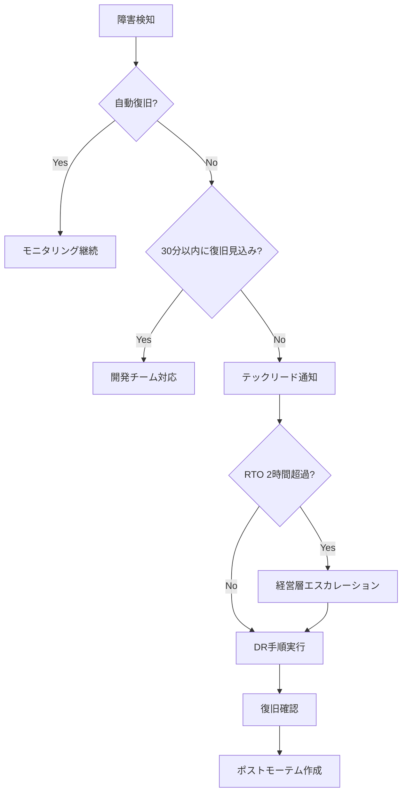

## 目的 / In-Out / Related
- **目的**: NFR で定められた可用性・運用・性能要件を満たすための運用手順を文書化する
- **対象範囲（In）**: バックアップ、DR（災害復旧）、デプロイ、構造化ログ、負荷テスト、監視
- **対象範囲（Out）**: SLA 合意値の策定、インシデント管理プロセス全体
- **Related**: [非機能要件（NFR）](../../requirements/nfr/) / [環境構築ガイド](../setup/) / [R9-4 NFR運用基盤](../../logs/walkthroughs/r9-4-nfr-infra/)

---

## 1. バックアップ手順（NFR-03b）

### 概要

| 項目 | 値 |
|---|---|
| バックアップ対象 | PostgreSQL データベース + Supabase Storage |
| 自動バックアップ | Supabase Pro Plan 日次自動バックアップ |
| 手動バックアップ | `supabase db dump` コマンド |
| 保持期間 | 7日分 |
| 保存先 | ローカル + クラウドストレージ（S3 等） |

### 自動バックアップ（Supabase 標準）

Supabase Pro Plan では **日次自動バックアップ** が有効化されている。

- **タイミング**: 毎日 UTC 0:00 頃
- **対象**: PostgreSQL データベース全体
- **復元**: Supabase ダッシュボード > Settings > Database > Backups から復元可能
- **保持期間**: 7日分（Pro Plan 標準）

### 手動バックアップ

リリース前や重要な変更の前に手動でバックアップを取得する。

```bash
# データベースダンプの取得
supabase db dump -f backup_$(date +%Y%m%d_%H%M%S).sql

# スキーマのみ（データなし）
supabase db dump -f schema_$(date +%Y%m%d).sql --schema-only

# データのみ（スキーマなし）
supabase db dump -f data_$(date +%Y%m%d).sql --data-only
```

### Storage のバックアップ

Supabase Storage に保存されたファイル（ドキュメント等）は、Supabase CLI または API 経由でエクスポートする。

```bash
# Storage バケット内ファイル一覧
supabase storage ls documents

# ファイルダウンロード（個別）
supabase storage cp sb://documents/path/to/file ./backup/
```

### バックアップ運用チェックリスト

- [ ] 週次: Supabase ダッシュボードで自動バックアップの成功を確認
- [ ] リリース前: `supabase db dump` で手動バックアップを取得
- [ ] 月次: バックアップからのリストアテストを実施

---

## 2. DR（災害復旧）手順（NFR-03c）

### RPO / RTO 目標

| 指標 | 目標値 | 根拠 |
|---|---|---|
| **RPO**（目標復旧地点） | 24時間 | Supabase 日次バックアップ基準 |
| **RTO**（目標復旧時間） | 4時間 | 手動復旧作業の所要時間見積 |

### 復旧手順

#### Step 1: 状況把握と判断（目安: 30分）

1. Supabase ダッシュボードで障害状況を確認
2. [Supabase Status Page](https://status.supabase.com/) を確認
3. 障害の種類を判定:
   - **A. Supabase 側の一時的な障害** → Supabase 復旧待ち
   - **B. データ破損・誤操作** → Step 2 へ
   - **C. プロジェクト全体の復元が必要** → Step 2 へ

#### Step 2: Supabase プロジェクトの復元（目安: 60分）

```bash
# 方法1: Supabase ダッシュボードからの復元
# Settings > Database > Backups > 復元するバックアップを選択 > Restore

# 方法2: 新規プロジェクト作成 + データリストア（完全障害時）
# 1. Supabase ダッシュボードで新規プロジェクトを作成
# 2. 環境変数を新プロジェクトの値に更新
```

#### Step 3: マイグレーション再適用（目安: 30分）

```bash
# マイグレーションの適用
supabase db push

# マイグレーション状態の確認
supabase migration list
```

#### Step 4: バックアップデータのリストア（目安: 60分）

```bash
# ダンプファイルからのリストア
psql "$DATABASE_URL" < backup_YYYYMMDD_HHMMSS.sql

# または Supabase CLI 経由
supabase db execute < backup_YYYYMMDD_HHMMSS.sql
```

#### Step 5: アプリケーションの再デプロイ + ヘルスチェック（目安: 30分）

```bash
# Vercel への再デプロイ（mainブランチ push）
git push origin main

# または Vercel CLI で強制デプロイ
vercel --prod

# ヘルスチェック
curl -s https://<app-domain>/api/health | jq .
# 期待値: { "status": "healthy", "timestamp": "...", "version": "...", "database": "healthy" }
```

### エスカレーションフロー



### 復旧確認チェックリスト

- [ ] `/api/health` が `healthy` を返す
- [ ] ログイン可能
- [ ] 直近のデータが存在する（RPO 以内のデータ損失であることを確認）
- [ ] 主要機能（申請作成、承認、工数入力）が動作する
- [ ] 通知機能が動作する

---

## 3. デプロイ手順（NFR-04d）

### デプロイフロー

| 環境 | トリガー | 方法 |
|---|---|---|
| Preview | PR 作成 / 更新 | Vercel 自動デプロイ（PR ごとにプレビュー URL 発行） |
| Production | `main` ブランチ push | Vercel 自動デプロイ（Immutable Deployments） |

### ゼロダウンタイムデプロイ

Vercel の **Immutable Deployments** により、ゼロダウンタイムデプロイを実現:

1. 新しいデプロイが完全にビルド・起動完了するまで旧バージョンが稼働
2. ヘルスチェック通過後にトラフィックを新バージョンに切り替え
3. 旧バージョンは即座に停止されず、進行中のリクエストを処理完了後に終了

### デプロイ前チェックリスト

```bash
# 1. DB マイグレーションの適用（デプロイ前に実施）
supabase db push

# 2. マイグレーション確認
supabase migration list

# 3. ローカルビルド確認
npm run build

# 4. mainブランチにマージ → 自動デプロイ
git checkout main
git merge feature/xxx
git push origin main
```

### ロールバック手順

障害発生時のロールバックは Vercel ダッシュボードから即時実行可能:

1. **Vercel ダッシュボード** > Deployments 一覧を開く
2. ロールバック先のデプロイメントを選択
3. **「Promote to Production」** をクリック
4. 即座に前バージョンに切り替わる（ダウンタイムなし）

> ⚠️ **注意**: DB マイグレーションを含むデプロイのロールバック時は、マイグレーションの巻き戻しも必要。破壊的変更を含むマイグレーションは段階的に実施すること。

### マイグレーション戦略

| パターン | 手順 |
|---|---|
| **カラム追加** | マイグレーション適用 → デプロイ（順序問わず） |
| **カラム削除** | デプロイ（カラム参照を削除）→ マイグレーション適用 |
| **テーブル追加** | マイグレーション適用 → デプロイ |
| **破壊的変更** | 2段階デプロイ（互換性を維持しながら段階的に移行） |

---

## 4. 構造化ログ運用（NFR-04a）

### 実装状況

✅ **実装済**: `src/lib/logger.ts` で JSON 構造化ロガーを提供（R9-4 で実装）。

### ログ形式

すべてのアプリケーションログは以下の JSON 形式で出力される:

```json
{
  "timestamp": "2026-02-25T01:00:00.000Z",
  "level": "error",
  "message": "Server Action failed",
  "context": { "code": "EXPENSE_CREATE" },
  "error": { "message": "...", "stack": "..." }
}
```

### ログレベル

| レベル | 用途 | 出力先 |
|---|---|---|
| `error` | 例外・障害 | `console.error` |
| `warn` | 警告・非推奨 | `console.error` |
| `info` | 通常操作の記録 | `console.log` |
| `debug` | 開発用詳細情報 | `console.log` |

### 環境変数によるレベル制御

```bash
# 環境変数で最低出力レベルを制御（デフォルト: info）
LOG_LEVEL=info    # info, warn, error のみ出力
LOG_LEVEL=debug   # 全レベル出力（開発環境向け）
LOG_LEVEL=error   # error のみ出力（ノイズ軽減）
```

### Vercel Logs でのフィルタ方法

1. **Vercel ダッシュボード** > プロジェクト > **Logs** タブを開く
2. フィルタ条件:
   - **Level**: `error` / `warn` でフィルタ可能
   - **検索**: JSON フィールド内のキーワードで検索
   - **時間範囲**: 指定期間のログを表示
3. JSON 形式のため、`jq` 等でのパースも可能

### 実用的なフィルタ例

```bash
# Vercel CLI でのログ確認
vercel logs --follow

# エラーログのみ抽出（jq 使用）
vercel logs --output json | jq 'select(.message | contains("error"))'

# 特定の Server Action のログを抽出
vercel logs --output json | jq 'select(.message | contains("EXPENSE_CREATE"))'

# DB 接続エラーの抽出
vercel logs --output json | jq 'select(.message | contains("database"))'
```

**Vercel ダッシュボードでの検索例**:

| 検索クエリ | 用途 |
|---|---|
| `Server Action failed` | Server Action のエラーを検索 |
| `Health check` | ヘルスチェック関連ログ |
| `EXPENSE` / `WORKFLOW` | 機能別のログ検索 |

### アラート設定案

| トリガー | 条件 | 通知先 |
|---|---|---|
| エラー急増 | 5分間に `error` が10件以上 | Slack `#ops-alerts` |
| 認証エラー | `auth` コンテキストの `error` | Slack `#security` |
| DB接続エラー | `database` コンテキストの `error` | Slack `#ops-alerts` + メール |

> 💡 Vercel Pro Plan では Log Drains を設定して、Datadog / Axiom 等の外部ログサービスに転送可能。

---

## 5. 負荷テスト計画（NFR-02c）

### テスト概要

| 項目 | 値 |
|---|---|
| 対象 NFR | NFR-02c: テナントあたり 100ユーザー同時アクセス |
| ツール | [k6](https://k6.io/) または [Artillery](https://artillery.io/) |
| テスト環境 | ステージング環境（本番同等構成） |
| テストデータ | 各テーブル 10万レコード（NFR-02d 相当） |

### テストシナリオ

#### シナリオ1: ログイン → ダッシュボード表示

```
1. POST /auth/v1/token (email/password ログイン)
2. GET /dashboard (Server Component でデータ取得)
3. 応答時間を計測
```

#### シナリオ2: 申請作成 → 承認

```
1. POST /api/workflows (申請作成 Server Action)
2. GET /workflows/[id] (申請詳細表示)
3. POST /api/workflows/[id]/approve (承認 Server Action)
4. 各ステップの応答時間を計測
```

#### シナリオ3: 工数入力 → 集計表示

```
1. POST /api/timesheets (工数入力 Server Action)
2. GET /timesheets/summary (集計画面表示)
3. 応答時間とデータ整合性を確認
```

### 合格基準

| 指標 | 基準値 |
|---|---|
| TTFB（Time to First Byte） | **200ms 以下**（95パーセンタイル） |
| API応答時間 | **500ms 以下**（95パーセンタイル） |
| エラー率 | **0.1% 以下** |
| 同時接続数 | **100ユーザー** |
| スループット | 安定したリクエスト処理を維持 |

### Supabase 接続プーリング設定

負荷テスト前に以下を確認・調整する:

| 設定 | 推奨値 | 確認方法 |
|---|---|---|
| Connection Pooling | 有効（pgBouncer） | Supabase ダッシュボード > Settings > Database |
| Pool Mode | Transaction | 同上 |
| Pool Size | デフォルト（15〜25） | 同上 |
| 接続文字列 | Pooler 用の接続文字列を使用 | ポート `6543`（Pooler）を使用 |

### 実施スケジュール（案）

1. テスト環境構築 + テストデータ投入
2. k6 スクリプト作成
3. ベースラインテスト（10ユーザー）
4. スケールテスト（50 → 100ユーザー）
5. 結果分析 + ボトルネック特定
6. 改善 + 再テスト

---

## 6. 監視設定（NFR-04b）

### ヘルスチェック

✅ **実装済**: `GET /api/health` エンドポイント（R9-4 で実装）。

| 項目 | 値 |
|---|---|
| エンドポイント | `/api/health` |
| チェック内容 | アプリケーション起動 + DB 接続確認 |
| 正常レスポンス | `{ "status": "healthy", "timestamp": "...", "version": "...", "database": "healthy" }` (200) |
| 異常レスポンス | `{ "status": "unhealthy", "timestamp": "..." }` (503) |

### 外部監視サービス

[UptimeRobot](https://uptimerobot.com/)（無料プラン）または同等サービスで外部から監視する。

| 設定 | 値 |
|---|---|
| 監視URL | `https://<app-domain>/api/health` |
| チェック間隔 | **5分** |
| タイムアウト | 30秒 |
| アラート条件 | 2回連続失敗でアラート |
| HTTP成功条件 | ステータスコード `200` + レスポンスに `"healthy"` を含む |

### アラート通知先

| 通知先 | 用途 |
|---|---|
| Slack `#ops-alerts` | 即時通知（ダウン検知・復旧通知） |
| メール（運用担当者） | バックアップ通知 |

### 監視ダッシュボード構成（案）

| パネル | データソース | 表示内容 |
|---|---|---|
| 稼働率 | UptimeRobot | 直近30日の稼働率（目標: 99.5%以上） |
| レスポンスタイム | UptimeRobot | `/api/health` の応答時間推移 |
| エラーログ | Vercel Logs | 直近24時間の `error` レベルログ件数 |
| デプロイ履歴 | Vercel | 直近のデプロイ一覧と成否 |

---

## 未決事項

- 負荷テストの実施（テスト環境構築後に実施予定）
- Log Drains の設定（Vercel Pro Plan 導入時）
- アラート設定の詳細（Slack Webhook URL、メールアドレスの確定）
- DR 訓練の実施スケジュール策定

## 次アクション

- 負荷テスト用 k6 スクリプトの作成
- UptimeRobot での監視設定
- DR 復旧訓練の実施
