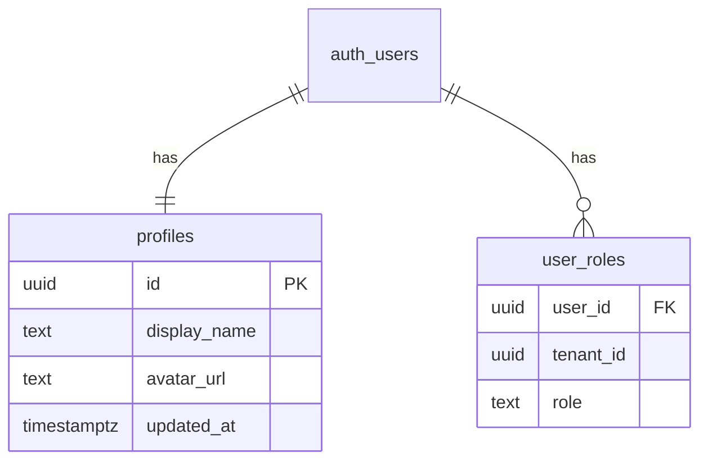

## 背景と課題

複数のレビュー指摘で「ユーザー名が UUID 表示」の問題が報告されている。Supabase の `auth.users` テーブルは RLS の制約で public スキーマから直接参照しづらい。`public.profiles` テーブルを導入し、ユーザーの表示名・アバター等を管理する設計が必要。

> [!IMPORTANT]
> [knowledge.md](file:///home/garchomp-game/workspace/starlight-test/OpsHub/docs/knowledge.md) の「次フェーズ（🟡）7.」に該当する課題。

---

## 1. 推奨テーブル設計（DDL）

### DD-DB-012 profiles（ユーザープロファイル）

Supabase 公式推奨パターン (profiles + trigger) に準拠。

| 列名 | 型 | NULL | 制約 | 備考 |
|---|---|---:|---|---|
| id | uuid | NOT NULL | PK, FK→auth.users(id) ON DELETE CASCADE | auth.users と 1:1 |
| display_name | text | NOT NULL | DEFAULT '' | 表示名（UI 表示用） |
| avatar_url | text | — | — | プロフィール画像 URL |
| created_at | timestamptz | NOT NULL | DEFAULT now() | — |
| updated_at | timestamptz | NOT NULL | DEFAULT now() | — |

```sql
-- ========================================
-- DD-DB-012 profiles テーブル
-- ========================================
CREATE TABLE public.profiles (
    id           uuid         NOT NULL REFERENCES auth.users(id) ON DELETE CASCADE,
    display_name text         NOT NULL DEFAULT '',
    avatar_url   text,
    created_at   timestamptz  NOT NULL DEFAULT now(),
    updated_at   timestamptz  NOT NULL DEFAULT now(),
    CONSTRAINT profiles_pkey PRIMARY KEY (id)
);

COMMENT ON TABLE public.profiles IS 'auth.users の補助テーブル。表示名・アバター等を管理';
```

**設計判断**:
- `tenant_id` カラムを持たない — profiles はテナント横断で 1 ユーザー 1 レコード
- `auth.users(id)` と同じ UUID を PK として使用（1:1 リレーション）
- `ON DELETE CASCADE` により auth.users 削除時に自動削除

### ER 図（追加分）



---

## 2. トリガー SQL

### auth.users INSERT 時に profiles を自動作成

```sql
-- ========================================
-- auth.users → profiles 自動同期トリガー
-- ========================================

-- INSERT トリガー関数
CREATE OR REPLACE FUNCTION public.handle_new_user()
RETURNS trigger
LANGUAGE plpgsql
SECURITY DEFINER
SET search_path = public
AS $$
BEGIN
    INSERT INTO public.profiles (id, display_name, avatar_url)
    VALUES (
        NEW.id,
        COALESCE(
            NEW.raw_user_meta_data ->> 'name',
            NEW.raw_user_meta_data ->> 'full_name',
            split_part(NEW.email, '@', 1),
            ''
        ),
        COALESCE(NEW.raw_user_meta_data ->> 'avatar_url', NULL)
    );
    RETURN NEW;
END;
$$;

-- トリガー登録
CREATE TRIGGER on_auth_user_created
    AFTER INSERT ON auth.users
    FOR EACH ROW EXECUTE FUNCTION public.handle_new_user();

-- UPDATE トリガー関数（メタデータ変更時の同期）
CREATE OR REPLACE FUNCTION public.handle_user_update()
RETURNS trigger
LANGUAGE plpgsql
SECURITY DEFINER
SET search_path = public
AS $$
BEGIN
    -- メタデータに明示的な name 変更がある場合のみ同期
    IF (NEW.raw_user_meta_data ->> 'name') IS DISTINCT FROM
       (OLD.raw_user_meta_data ->> 'name') THEN
        UPDATE public.profiles
        SET
            display_name = COALESCE(NEW.raw_user_meta_data ->> 'name', display_name),
            updated_at = now()
        WHERE id = NEW.id;
    END IF;
    RETURN NEW;
END;
$$;

CREATE TRIGGER on_auth_user_updated
    AFTER UPDATE ON auth.users
    FOR EACH ROW EXECUTE FUNCTION public.handle_user_update();
```

### 既存ユーザーのバックフィル

```sql
-- 既存 auth.users に対して profiles レコードを作成
INSERT INTO public.profiles (id, display_name)
SELECT
    id,
    COALESCE(
        raw_user_meta_data ->> 'name',
        raw_user_meta_data ->> 'full_name',
        split_part(email, '@', 1),
        ''
    )
FROM auth.users
ON CONFLICT (id) DO NOTHING;
```

---

## 3. RLS ポリシー

```sql
ALTER TABLE profiles ENABLE ROW LEVEL SECURITY;

-- 同テナントのメンバーの profiles を閲覧可能
CREATE POLICY "profiles_select" ON profiles FOR SELECT
    USING (
        id IN (
            SELECT ur.user_id
            FROM user_roles ur
            WHERE ur.tenant_id IN (SELECT get_user_tenant_ids())
        )
        OR id = auth.uid()  -- 自分のプロファイルは常に閲覧可能
    );

-- 自分のプロファイルのみ更新可能
CREATE POLICY "profiles_update" ON profiles FOR UPDATE
    USING (id = auth.uid())
    WITH CHECK (id = auth.uid());

-- INSERT はトリガーから SECURITY DEFINER で実行されるため
-- ユーザーからの直接 INSERT は不要
-- (service_role 経由のトリガーが INSERT を行う)
```

**設計ポイント**:
- SELECT: 同テナントのメンバーであれば閲覧可 + 自分は常に閲覧可
- UPDATE: 自分のレコードのみ
- INSERT: トリガー専用（`SECURITY DEFINER` 関数経由）
- DELETE: ポリシー無し（`ON DELETE CASCADE` が `auth.users` 削除時に自動処理）

---

## 4. 影響箇所一覧

UUID がユーザー表示に使われている全箇所を特定した。

### 4.1 UUID が UI に直接表示されている箇所（必須修正）

| # | ファイル | 行 | 現在の表示 | 修正方向 |
|---|---|---|---|---|
| 1 | [KanbanBoard.tsx](file:///home/garchomp-game/workspace/starlight-test/OpsHub/src/app/(authenticated)/projects/[id]/tasks/_components/KanbanBoard.tsx#L210-L213) | L212 | `task.assignee_id.slice(0, 8)...` | profiles JOIN で display_name 表示 |
| 2 | [KanbanBoard.tsx](file:///home/garchomp-game/workspace/starlight-test/OpsHub/src/app/(authenticated)/projects/[id]/tasks/_components/KanbanBoard.tsx#L374-L377) | L376 | `m.user_id.slice(0, 8)...`（作成フォーム） | Member 型に display_name を追加 |
| 3 | [KanbanBoard.tsx](file:///home/garchomp-game/workspace/starlight-test/OpsHub/src/app/(authenticated)/projects/[id]/tasks/_components/KanbanBoard.tsx#L423-L426) | L425 | `m.user_id.slice(0, 8)...`（編集フォーム） | 同上 |
| 4 | [ProjectDetailClient.tsx](file:///home/garchomp-game/workspace/starlight-test/OpsHub/src/app/(authenticated)/projects/[id]/_components/ProjectDetailClient.tsx#L207) | L207 | `project.pm_id`（PM 表示） | PM の display_name を props で渡す |
| 5 | [ProjectDetailClient.tsx](file:///home/garchomp-game/workspace/starlight-test/OpsHub/src/app/(authenticated)/projects/[id]/_components/ProjectDetailClient.tsx#L277-L278) | L277 | `user_id` テーブル列 | profiles JOIN で display_name 列 |
| 6 | [ProjectDetailClient.tsx](file:///home/garchomp-game/workspace/starlight-test/OpsHub/src/app/(authenticated)/projects/[id]/_components/ProjectDetailClient.tsx#L353-L354) | L354 | `u.user_id（role）`（メンバー追加 Select） | display_name 表示 |
| 7 | [WorkflowDetailClient.tsx](file:///home/garchomp-game/workspace/starlight-test/OpsHub/src/app/(authenticated)/workflows/[id]/_components/WorkflowDetailClient.tsx#L172-L173) | L173 | `a.user_id（role）`（承認者 Select） | display_name 表示 |
| 8 | [WorkflowDetailClient.tsx](file:///home/garchomp-game/workspace/starlight-test/OpsHub/src/app/(authenticated)/workflows/[id]/_components/WorkflowDetailClient.tsx#L234-L235) | L234-235 | `workflow.approver_id` / `workflow.created_by` | display_name 表示 |
| 9 | [workflows/new/page.tsx](file:///home/garchomp-game/workspace/starlight-test/OpsHub/src/app/(authenticated)/workflows/new/page.tsx#L157-L158) | L158 | `a.user_id（role）`（承認者 Select） | display_name 表示 |
| 10 | [projects/new/page.tsx](file:///home/garchomp-game/workspace/starlight-test/OpsHub/src/app/(authenticated)/projects/new/page.tsx#L112-L113) | L113 | `u.user_id（role）`（PM Select） | display_name 表示 |
| 11 | [ReportClient.tsx](file:///home/garchomp-game/workspace/starlight-test/OpsHub/src/app/(authenticated)/timesheets/reports/_components/ReportClient.tsx#L149-L150) | L149 | `user_id` テーブル列名 | display_name 列に変更 |
| 12 | [ReportClient.tsx](file:///home/garchomp-game/workspace/starlight-test/OpsHub/src/app/(authenticated)/timesheets/reports/_components/ReportClient.tsx#L226-L227) | L227 | `m.user_id.slice(0, 8)...`（フィルタ Select） | display_name 表示 |
| 13 | [AuditLogViewer.tsx](file:///home/garchomp-game/workspace/starlight-test/OpsHub/src/app/(authenticated)/admin/audit-logs/_components/AuditLogViewer.tsx#L329-L339) | L331-337 | `user_id.substring(0, 8)…`（テーブル列） | display_name 表示 |
| 14 | [AuditLogViewer.tsx](file:///home/garchomp-game/workspace/starlight-test/OpsHub/src/app/(authenticated)/admin/audit-logs/_components/AuditLogViewer.tsx#L448-L449) | L449 | `id.substring(0, 8)…`（フィルタ Select） | display_name 表示 |

### 4.2 バックエンド / API（必須修正）

| # | ファイル | 行 | 現在の処理 | 修正方向 |
|---|---|---|---|---|
| 15 | [route.ts](file:///home/garchomp-game/workspace/starlight-test/OpsHub/src/app/api/timesheets/export/route.ts#L80-L84) | L80-84 | CSV「メンバー名」列に `ts.user_id` を出力 | profiles JOIN で display_name を CSV 出力 |
| 16 | [reports/_actions.ts](file:///home/garchomp-game/workspace/starlight-test/OpsHub/src/app/(authenticated)/timesheets/reports/_actions.ts#L114-L118) | L114 | `MemberSummary.user_id` のみ返却 | display_name も返却 |

### 4.3 データ取得層（JOIN パターン変更）

| # | ファイル | 修正内容 |
|---|---|---|
| 17 | [tasks/page.tsx](file:///home/garchomp-game/workspace/starlight-test/OpsHub/src/app/(authenticated)/projects/[id]/tasks/page.tsx) | `project_members` 取得時に profiles を JOIN |
| 18 | [projects/[id]/page.tsx](file:///home/garchomp-game/workspace/starlight-test/OpsHub/src/app/(authenticated)/projects/[id]/page.tsx) | project の pm_id、メンバーの display_name を取得 |
| 19 | [workflows/[id]/page.tsx](file:///home/garchomp-game/workspace/starlight-test/OpsHub/src/app/(authenticated)/workflows/[id]/page.tsx) | approvers 取得時に profiles を JOIN |
| 20 | [audit-logs/_actions.ts](file:///home/garchomp-game/workspace/starlight-test/OpsHub/src/app/(authenticated)/admin/audit-logs/_actions.ts) | filterOptions.userIds に display_name を含める |

---

## 5. マイグレーション手順

### 5.1 マイグレーションファイル

ファイル名: `supabase/migrations/20260224_000003_profiles.sql`

```sql
-- ========================================
-- Migration: profiles テーブル導入
-- ========================================

-- 1. テーブル作成
CREATE TABLE public.profiles (
    id           uuid         NOT NULL REFERENCES auth.users(id) ON DELETE CASCADE,
    display_name text         NOT NULL DEFAULT '',
    avatar_url   text,
    created_at   timestamptz  NOT NULL DEFAULT now(),
    updated_at   timestamptz  NOT NULL DEFAULT now(),
    CONSTRAINT profiles_pkey PRIMARY KEY (id)
);

COMMENT ON TABLE public.profiles IS 'auth.users の補助テーブル。表示名・アバター等を管理';

-- 2. RLS 有効化
ALTER TABLE profiles ENABLE ROW LEVEL SECURITY;

CREATE POLICY "profiles_select" ON profiles FOR SELECT
    USING (
        id IN (
            SELECT ur.user_id
            FROM user_roles ur
            WHERE ur.tenant_id IN (SELECT get_user_tenant_ids())
        )
        OR id = auth.uid()
    );

CREATE POLICY "profiles_update" ON profiles FOR UPDATE
    USING (id = auth.uid())
    WITH CHECK (id = auth.uid());

-- 3. updated_at 自動更新トリガー（共通パターン）
CREATE TRIGGER set_profiles_updated_at
    BEFORE UPDATE ON profiles
    FOR EACH ROW
    EXECUTE FUNCTION public.set_updated_at();

-- 4. auth.users INSERT トリガー
CREATE OR REPLACE FUNCTION public.handle_new_user()
RETURNS trigger
LANGUAGE plpgsql
SECURITY DEFINER
SET search_path = public
AS $$
BEGIN
    INSERT INTO public.profiles (id, display_name, avatar_url)
    VALUES (
        NEW.id,
        COALESCE(
            NEW.raw_user_meta_data ->> 'name',
            NEW.raw_user_meta_data ->> 'full_name',
            split_part(NEW.email, '@', 1),
            ''
        ),
        COALESCE(NEW.raw_user_meta_data ->> 'avatar_url', NULL)
    );
    RETURN NEW;
END;
$$;

CREATE TRIGGER on_auth_user_created
    AFTER INSERT ON auth.users
    FOR EACH ROW EXECUTE FUNCTION public.handle_new_user();

-- 5. auth.users UPDATE トリガー（メタデータ同期）
CREATE OR REPLACE FUNCTION public.handle_user_update()
RETURNS trigger
LANGUAGE plpgsql
SECURITY DEFINER
SET search_path = public
AS $$
BEGIN
    IF (NEW.raw_user_meta_data ->> 'name') IS DISTINCT FROM
       (OLD.raw_user_meta_data ->> 'name') THEN
        UPDATE public.profiles
        SET
            display_name = COALESCE(NEW.raw_user_meta_data ->> 'name', display_name),
            updated_at = now()
        WHERE id = NEW.id;
    END IF;
    RETURN NEW;
END;
$$;

CREATE TRIGGER on_auth_user_updated
    AFTER UPDATE ON auth.users
    FOR EACH ROW EXECUTE FUNCTION public.handle_user_update();

-- 6. 既存ユーザーのバックフィル
INSERT INTO public.profiles (id, display_name)
SELECT
    id,
    COALESCE(
        raw_user_meta_data ->> 'name',
        raw_user_meta_data ->> 'full_name',
        split_part(email, '@', 1),
        ''
    )
FROM auth.users
ON CONFLICT (id) DO NOTHING;
```

### 5.2 型再生成

```bash
npx supabase gen types typescript --local > src/types/database.ts
```

### 5.3 実装手順（優先順序）

1. **マイグレーション適用** — profiles テーブル・トリガー・RLS・バックフィル
2. **型再生成** — `database.ts` に profiles 型を追加
3. **データ取得層の修正** — page.tsx / _actions.ts で profiles を JOIN
4. **コンポーネント修正** — Member / Approver 型に `display_name` を追加
5. **CSV エクスポート修正** — profiles JOIN で display_name を CSV 出力
6. **ビルド検証** — `npm run build` で型エラーゼロを確認

### 5.4 JOIN パターン例

```typescript
// Supabase クエリでの JOIN 例
// project_members + profiles
const { data: members } = await supabase
    .from("project_members")
    .select("user_id, profiles!inner(display_name)")
    .eq("project_id", projectId);

// tasks + profiles（assignee の表示名取得）
const { data: tasks } = await supabase
    .from("tasks")
    .select("*, profiles!tasks_assignee_id_fkey(display_name)")
    .eq("project_id", projectId);

// user_roles + profiles（メンバー一覧）
const { data: users } = await supabase
    .from("user_roles")
    .select("user_id, role, profiles!inner(display_name)")
    .eq("tenant_id", tenantId);
```

> [!NOTE]
> Supabase は FK リレーションを自動検出するため、`profiles` への JOIN は
> `profiles!inner(display_name)` の形式で記述可能。FK 名が曖昧な場合は
> `profiles!tasks_assignee_id_fkey(display_name)` のように明示する。

---

## 参考: Supabase 公式推奨パターン

Supabase 公式ドキュメントおよびコミュニティで推奨されるパターン:

1. **`public.profiles` テーブルを作成** — `auth.users` を直接変更しない
2. **FK `id → auth.users(id) ON DELETE CASCADE`** で 1:1 リレーション
3. **`AFTER INSERT` トリガー** で auth.users 登録時に profiles を自動作成
4. **`SECURITY DEFINER`** 関数で auth スキーマにアクセス
5. **RLS** で同テナントメンバーの profiles のみ閲覧可能に

OpsHub の既存設計では `admin.auth.admin.listUsers()` 経由で user_metadata を取得している箇所（[admin/users/_actions.ts](file:///home/garchomp-game/workspace/starlight-test/OpsHub/src/app/(authenticated)/admin/users/_actions.ts#L102-L111) L105）があるが、
これはサーバーサイドの管理画面用であり、通常の業務画面では profiles テーブルを使用するのが適切。
