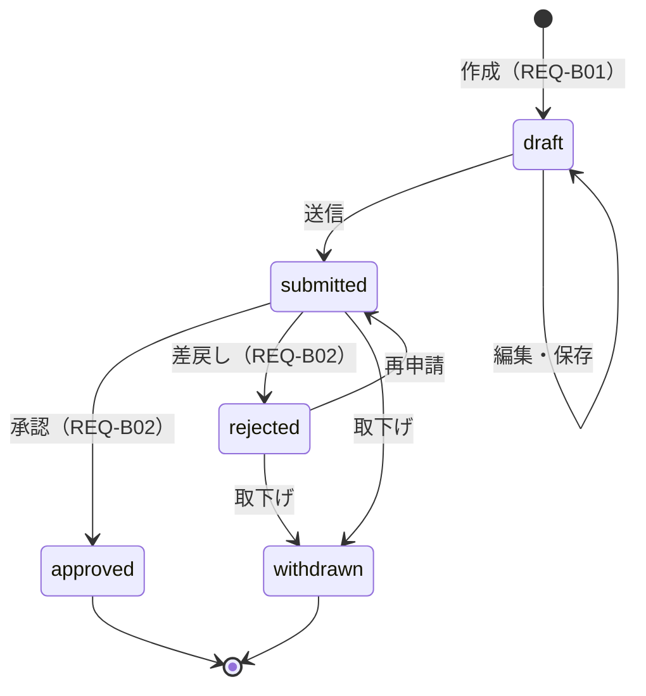
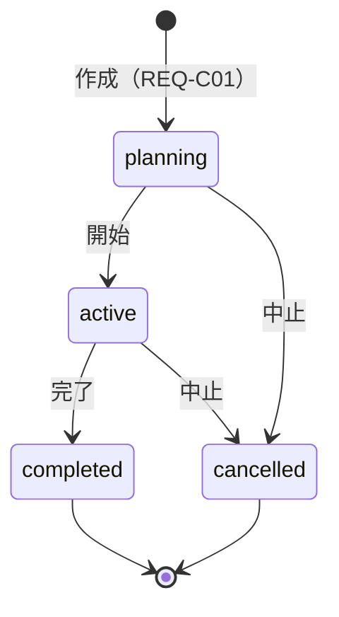
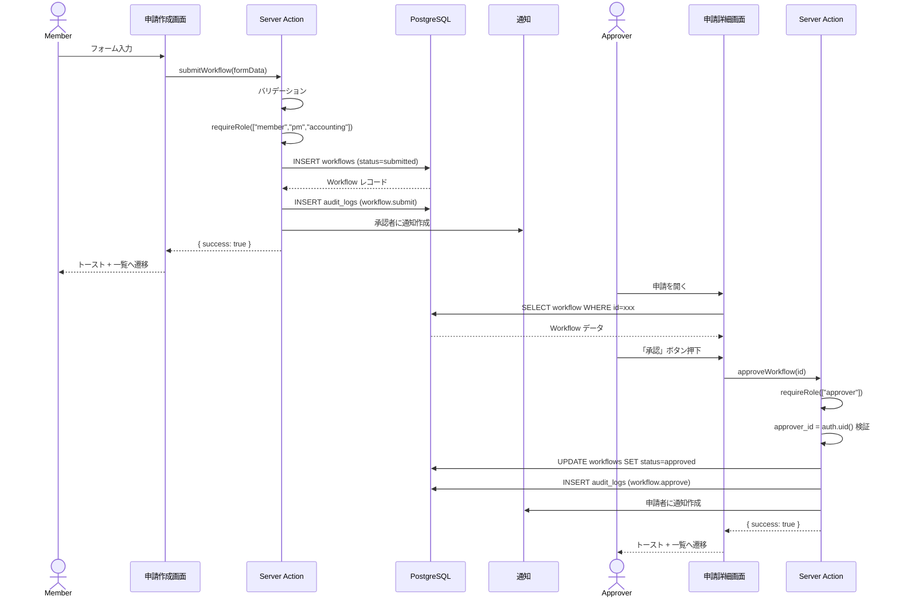
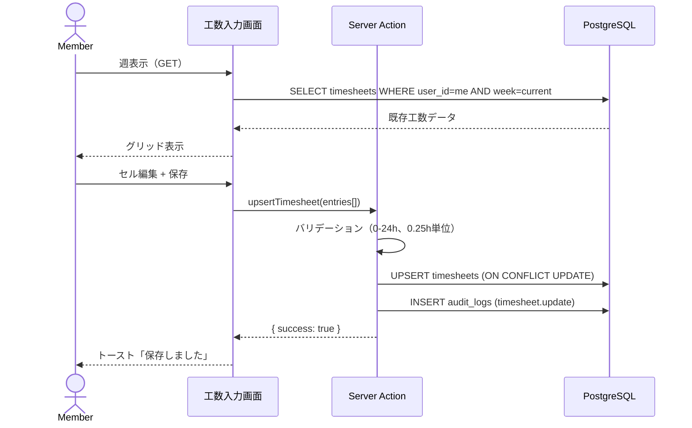

## 目的 / In-Out / Related
- **目的**: 複雑な状態遷移とコンポーネント間のやり取りを可視化する
- **対象範囲（In）**: ワークフロー状態遷移、主要操作のシーケンス
- **対象範囲（Out）**: 全画面のシーケンス（過剰にしない）
- **Related**: [API-B03](../../spec/apis/API-B03/) / [DB設計](../db/) / [モジュール設計](../modules/)

---

## ワークフロー状態遷移

### 状態遷移ルール

| 現在 | 次 | 操作者 | 条件 |
|---|---|---|---|
| — | draft | 申請者 | — |
| draft | submitted | 申請者 | 必須項目が入力済み |
| draft | draft | 申請者 | 何度でも編集可能 |
| submitted | approved | 承認者 | approver_id = 自分 |
| submitted | rejected | 承認者 | 理由必須 |
| submitted | withdrawn | 申請者 | — |
| rejected | submitted | 申請者 | 修正後に再送信 |
| rejected | withdrawn | 申請者 | — |

---

## プロジェクト状態遷移

---

## シーケンス: 申請→承認フロー

## シーケンス: 工数入力

---

## 未決事項
- 多段階承認（将来対応）の状態遷移への影響
- 通知配信のリアルタイム性（Supabase Realtime vs ポーリング）
