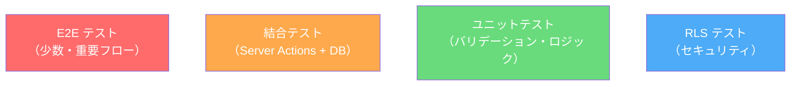
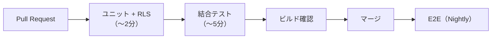

## 目的 / In-Out / Related
- **目的**: テストの方針・範囲・ツールを定め、品質と開発速度を両立する
- **対象範囲（In）**: テスト分類、対象、ツール、CI統合
- **対象範囲（Out）**: 個別テストケースの詳細
- **Related**: [NFR](../../requirements/nfr/) / [RLS設計](../rls/) / [モジュール設計](../modules/)

---

## テストピラミッド

## テスト分類

### 1. ユニットテスト
- **対象**: lib/ のユーティリティ、バリデーション関数、型変換
- **ツール**: Vitest
- **方針**: 外部依存なし、高速、カバレッジ80%以上（lib/配下）
- **例**:
  - バリデーション関数（金額フォーマット、日付範囲チェック）
  - エラーコード生成
  - 状態遷移の妥当性チェック

### 2. 結合テスト（Server Actions）
- **対象**: actions/ の Server Actions
- **ツール**: Vitest + Supabase Local（Docker）
- **方針**: 実DBに対してテスト。テストごとにトランザクションロールバック
- **例**:
  - `createWorkflow()` → DB にレコードが作成されること
  - `approveWorkflow()` → ステータスが変更され、監査ログが記録されること
  - 権限不足のユーザーが操作した場合にエラーが返ること

### 3. RLSテスト
- **対象**: RLS ポリシーの全パターン
- **ツール**: pgTAP or Vitest + 複数ユーザーセッション
- **方針**: テナント分離・ロール制御の網羅的検証
- **テストケース**:

| # | シナリオ | 期待結果 |
|---|---|---|
| RLS-01 | テナントAのMemberがテナントBのprojectsをSELECT | 0件 |
| RLS-02 | Memberがprojectsに INSERT | 拒否 |
| RLS-03 | PMが自PJのprojectsをUPDATE | 成功 |
| RLS-04 | Approverが他人の申請を承認 | 成功（approver_id一致時） |
| RLS-05 | Memberが他ユーザーのtimesheetsをSELECT | 0件 |
| RLS-06 | 全ロールで audit_logs をDELETE | 拒否 |
| RLS-07 | Tenant Adminがuser_rolesにINSERT | 成功 |
| RLS-08 | Memberがuser_rolesにINSERT | 拒否 |

### 4. E2Eテスト
- **対象**: 主要ユーザーフロー（Must画面）
- **ツール**: Playwright
- **方針**: 最小限のクリティカルパスのみ。CI で毎回実行は重いためnightly
- **対象フロー**:
  1. ログイン → ダッシュボード表示
  2. 申請作成 → 送信 → 承認者ログイン → 承認
  3. プロジェクト作成 → タスク作成 → 工数入力
  4. 経費申請 → ワークフロー連動

## CI/CD統合

| ステージ | トリガー | タイムアウト |
|---|---|---|
| ユニット + RLS | PR作成/更新 | 2分 |
| 結合テスト | PR作成/更新 | 5分 |
| ビルド | PR作成/更新 | 3分 |
| E2E | Nightly + リリース前 | 15分 |

## テスト環境

- **ローカル**: Docker Compose で Supabase を起動、テスト用テナント/ユーザーをシードデータで投入
- **CI**: GitHub Actions + Supabase Docker（service container）

---

## 未決事項
- E2E テストの認証ハンドリング（テスト用ユーザーのセットアップ方法）
- パフォーマンステスト（NFR-02）の実施タイミングと手法
- ビジュアルリグレッションテストの導入要否
