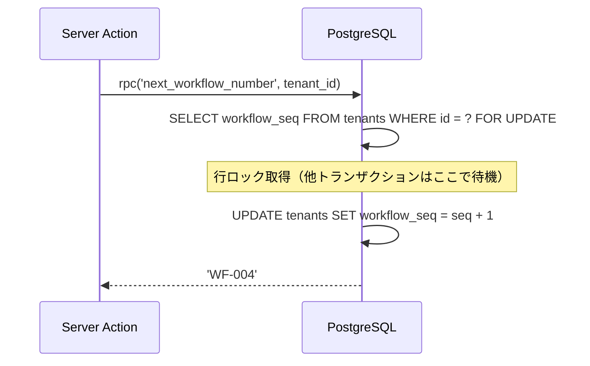

# ワークフロー番号の並行安全化 — Walkthrough

## 変更概要

旧実装の `count + 1` 方式（同時作成で番号重複のリスク）を、PostgreSQL の `SELECT ... FOR UPDATE` 行ロックによる並行安全な採番に置き換えた。

## 変更ファイル

| ファイル | 内容 |
|---|---|
| [20260224_000002_workflow_seq.sql](file:///home/garchomp-game/workspace/starlight-test/OpsHub/supabase/migrations/20260224_000002_workflow_seq.sql) | `tenants.workflow_seq` カラム追加 + `next_workflow_number()` 関数 |
| [database.ts](file:///home/garchomp-game/workspace/starlight-test/OpsHub/src/types/database.ts) | 型定義に `workflow_seq` と `next_workflow_number` RPC 追加 |
| [_actions.ts](file:///home/garchomp-game/workspace/starlight-test/OpsHub/src/app/(authenticated)/workflows/_actions.ts) | `generateWorkflowNumber` を `supabase.rpc()` 呼び出しに変更 |
| [knowledge.md](file:///home/garchomp-game/workspace/starlight-test/OpsHub/docs/knowledge.md) | WF番号の並行安全性を対応済みに更新 |

## 動作の仕組み

## テスト結果

- `npm run build` — ✅ 成功（exit code 0、型エラーなし）

> [!NOTE]
> マイグレーションの適用は Supabase へのデプロイ時に `supabase db push` または `supabase migration up` で実行してください。
