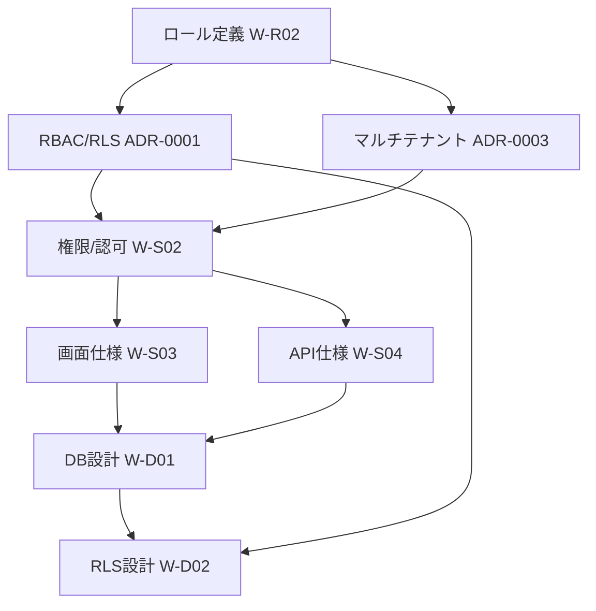

## 目的 / In-Out / Related
- **目的**: OpsHub（仮）の設計ドキュメントをDocs-as-Codeで段階的に作成する計画を立てる
- **対象範囲（In）**: 要件定義・基本設計・詳細設計・ADRのドキュメント作成
- **対象範囲（Out）**: 実装コード変更、デプロイ、運用ドキュメント
- **Related**: [START HERE](../START-HERE) / [規約](../conventions/)

---

## 1. WBS（Work Breakdown Structure）

### Phase 2: 要件定義（Requirements）
| ID | 成果物 | パス | 依存 |
|---|---|---|---|
| W-R01 | プロジェクト概要の精緻化 | `requirements/project-brief/` | — |
| W-R02 | ロール/権限（要件レベル） | `requirements/roles/` | W-R01 |
| W-R03 | 機能要件カタログ（Epic A〜G） | `requirements/req-catalog/` | W-R01, W-R02 |
| W-R04 | 主要REQ受入条件（Given/When/Then） | 各REQページ内 | W-R03 |
| W-R05 | 非機能要件（NFR） | `requirements/nfr/` | W-R01 |
| W-R06 | 画面一覧（名前・URL・ロール） | `requirements/screens/` | W-R02, W-R03 |
| W-R07 | 要件レビュー → 承認 | — | W-R01〜R06 |

### Phase 3: 基本設計（Spec）
| ID | 成果物 | パス | 依存 |
|---|---|---|---|
| W-S01 | アーキテクチャ概要 | `spec/architecture/` | W-R07, ADR-0001 |
| W-S02 | 権限と認可（RBAC/RLS方針） | `spec/authz/` | W-R02, ADR-0001 |
| W-S03 | 画面仕様（主要10〜15画面） | `spec/screens/` | W-R06, W-S02 |
| W-S04 | API仕様（主要エンドポイント） | `spec/apis/` | W-S03 |
| W-S05 | 例外・エラー方針 | `spec/errors/` | W-S03 |
| W-S06 | 監査ログ方針 | `spec/audit-logging/` | W-R05, ADR-0002 |
| W-S07 | 通知方針 | `spec/notifications/` | W-R03 |
| W-S08 | Supabaseクライアント運用規約 | `spec/supabase-client/` | W-S01 |
| W-S09 | 基本設計レビュー → 承認 | — | W-S01〜S08 |

### Phase 4: 詳細設計（Detail）
| ID | 成果物 | パス | 依存 |
|---|---|---|---|
| W-D01 | DB設計（主要テーブル群） | `detail/db/` | W-S03, W-S04 |
| W-D02 | RLS設計（ポリシー案） | `detail/rls/` | W-S02, W-D01 |
| W-D03 | モジュール設計（責務・境界） | `detail/modules/` | W-S03, W-S04 |
| W-D04 | 状態遷移/シーケンス（Mermaid） | `detail/sequences/` | W-S03, W-D01 |
| W-D05 | テスト方針 | `detail/testing/` | W-D01〜D04 |
| W-D06 | 詳細設計レビュー → 承認 | — | W-D01〜D05 |

### ADR（随時作成）
| ID | テーマ（候補） | 想定タイミング |
|---|---|---|
| ADR-0001 | RBAC/RLS 方式の選定 | Phase 2（ロール/権限検討時） |
| ADR-0002 | 監査ログ方式（イベントログ vs 履歴テーブル） | Phase 2〜3 |
| ADR-0003 | マルチテナント分離戦略（tenant_id RLS vs schema） | Phase 2 |
| ADR-0004 | PDF/帳票生成方針 | Phase 3 |
| ADR-0005 | 検索方式（pg_trgm / Full-text / 外部） | Phase 3 |
| ADR-0006 | ファイルストレージ方針（Supabase Storage vs S3直接） | Phase 3 |

---

## 2. マイルストーン

| Week | 期間 | 主な成果物 | ゲート |
|---|---|---|---|
| W1 | 2/22 〜 2/28 | PLAN承認、ロール定義、Project Brief精緻化、ADR-0001/0003 | クライアントレビュー |
| W2 | 3/1 〜 3/7 | REQカタログ（Epic A〜G ドラフト）、NFR、画面一覧 | — |
| W3 | 3/8 〜 3/14 | 主要REQ受入条件、要件レビュー承認 | **要件フリーズ** |
| W4 | 3/15 〜 3/21 | アーキ概要、権限/認可、ADR-0002 | — |
| W5 | 3/22 〜 3/28 | 画面仕様（主要画面）、API仕様（主要API） | — |
| W6 | 3/29 〜 4/4 | 例外/エラー、監査ログ、通知、Supabase規約 | **基本設計レビュー** |
| W7 | 4/5 〜 4/11 | DB設計、RLS設計 | — |
| W8 | 4/12 〜 4/18 | モジュール設計、シーケンス、テスト方針 | **詳細設計レビュー** |

> ※ 1回のセッションで複数週分を進める場合あり。クライアントレビューで差し戻しが発生した場合、後続が後ろ倒しになる。

---

## 3. 依存関係（先に固めるもの）

**クリティカルパス**: ロール定義 → ADR-0001(RBAC/RLS) → 権限/認可 → 画面/API → DB → RLS

先に確定すべきもの（ブロッカー）:
1. **ロール定義**: 全仕様の権限判定に必要
2. **ADR-0001**: RBAC/RLSの方式が画面・API・DB設計すべてに影響
3. **ADR-0003**: テナント分離方式がDB設計の根幹

---

## 4. 主要リスクと回避策

| # | リスク | 影響 | 回避策 |
|---|---|---|---|
| R1 | 要求肥大化（Epic追加で収拾がつかない） | スケジュール遅延 | Epic A〜G を固定、追加はPhase外扱い |
| R2 | リンク破綻（Related先が存在しない） | 追跡性の崩壊 | 各Phase完了時にリンク検証を実施 |
| R3 | RLS設計遅延（ロール/テナント方針未定のまま詳細へ進む） | DB設計手戻り | ADR-0001/0003をPhase 2で必ず確定 |
| R4 | 画面数過多（全画面を詳細に書きすぎる） | 時間不足 | 主要画面（10〜15）に絞り、残りは概要のみ |
| R5 | 一貫性崩壊（同じ概念に異なる名称） | 読者混乱 | 用語集を conventions に追加 |

---

## 5. クライアント確認が必要な決定点（質問リスト）

### Q1: スコープの優先度
Project Brief では Epic A〜G が挙がっていますが、以下の優先度で合っていますか？
- **Must**: A(テナント/権限), B(ワークフロー), C(案件/タスク/工数)
- **Should**: D(経費), E(請求)
- **Could**: F(ドキュメント), G(通知/検索/レポート)

### Q2: マルチテナント方式
- **案A**: `tenant_id` カラム + RLS（シンプル、Supabase標準）
- **案B**: Schema分離（強い分離、運用コスト高）
- 案A推奨ですが、確認をお願いします。

### Q3: 認証・認可方式
- **認証**: Supabase Auth（GoTrue）をそのまま利用
- **認可（RBAC）**: `user_roles` テーブル + RLSポリシーで制御
- カスタムClaims（JWT）方式は検討すべきですか？

### Q4: 監査ログの粒度
- **案A**: 主要操作のみ（CRUD + 承認/差戻し）をイベントログテーブルに記録
- **案B**: 全テーブルにトリガーで変更履歴（before/after）を自動記録
- 案Aをベースに、重要テーブルのみ案Bを併用する方針で良いですか？

### Q5: 画面仕様の詳細度
- 全画面の一覧は `requirements/screens/` に置きますが、詳細な画面仕様（SPEC-SCR）は**主要10〜15画面**に絞る方針で良いですか？
- ワイヤーフレーム/モックアップは本プロジェクトのスコープに含みますか？

### Q6: 用語の確定
以下の用語で統一して良いですか？
| 概念 | 用語（案） |
|---|---|
| 利用組織 | テナント (Tenant) |
| 案件 | プロジェクト (Project) |
| 申請承認の仕組み | ワークフロー (Workflow) |
| 経費精算 | 経費 (Expense) |
| 請求管理 | 請求 (Invoice) |

### Q7: 既存ドキュメント（Archive）の扱い
先ほど作成した技術スタックやSupabase構成のドキュメントは「旧ドキュメント（Archive）」セクションにありますが:
- このまま残す？
- spec/architecture/ に統合する？
- 削除する？

---

## 6. 次アクション

このPLANが承認されたら：
1. `conventions/index.md` に用語集セクションを追加
2. ADR-0001（RBAC/RLS方式）を起票
3. ADR-0003（マルチテナント方式）を起票
4. `requirements/roles/` にロール定義を作成
5. `requirements/project-brief/` を精緻化
6. → 要件定義フェーズ（Phase 2）に着手

---

## 未決事項
- Q1〜Q7 のクライアント回答待ち
- Epic 内の個別REQ数は要件定義フェーズで決定
