# OpsHub 全機能完成計画

> Phase 1（Must 要件 + Should 一部）は完了済み。本計画は未着手機能の全量を可能な限り効率的に完成させるためのロードマップです。

---

## 現状サマリ

| フェーズ | カバー範囲 | 状態 |
|---|---|---|
| **Phase 1** | Must 全9REQ + Should(D01) + Could(G01, G03) + 監査監修 | ✅ 完了 |
| **Phase 2** | Should 残り (D02, E01) + CSV エクスポート + NFR 運用基盤 | 📋 本計画 |
| **Phase 3** | Could (F01, G02) + NFR 性能・可用性 | 📋 本計画 |
| **Phase 4** | 品質強化・最終監査 | 📋 本計画 |

---

## Phase 2: Should 要件 + NFR 運用基盤

### 対象スコープ

| REQ / NFR | 機能 | 新規テーブル | 新規画面 | 新規 API |
|---|---|---|---|---|
| REQ-D02 | 経費集計/レポート | — | SCR-D03 | API-D02 |
| REQ-E01 | 請求書管理 | `invoices`, `invoice_items` | SCR-E01(新), SCR-E02 | API-E01(新) |
| API-C03-2 | 工数 CSV エクスポート | — | — | Route Handler |
| NFR-04a | 構造化ログ | — | — | ライブラリ導入 |
| NFR-04b | ヘルスチェック | — | — | `/api/health` |
| NFR-01f | CSP 設定 | — | — | `next.config.js` |

### 採番の整理（Phase 2 開始時に実施）

現在 SCR-E01 / API-E01 は通知機能に割り当て済み。請求機能には新しい番号を使用:

| 既存（通知） | 変更なし |
|---|---|
| SCR-E01 → 通知 NotificationBell | そのまま維持 |
| API-E01 → 通知 API | そのまま維持 |

| 新規（請求） | 新番号 |
|---|---|
| 請求一覧 | SCR-H01 |
| 請求書詳細/編集 | SCR-H02 |
| 請求 API | API-H01 |

> Epic H として「請求」を新設。Epic E の SCR-E01/E02 は要件一覧では残すが、仕様書は Epic H の番号体系を使用。

---

### Round 8: 設計（3並列）

> **目的**: Phase 2 の全機能の仕様書・設計書を先に作成

| エージェント | タスク | 出力ファイル |
|---|---|---|
| Agent 1 | SCR-D03 + API-D02 仕様書作成（経費集計） | `spec/screens/SCR-D03.md`, `spec/apis/API-D02.md` |
| Agent 2 | SCR-H01 + SCR-H02 + API-H01 仕様書作成（請求） | `spec/screens/SCR-H01.md`, `spec/screens/SCR-H02.md`, `spec/apis/API-H01.md` |
| Agent 3 | DB 設計拡張 + RLS 追記（invoices, invoice_items） | `detail/db/`, `detail/rls/` 更新 |

**依存**: なし（全並列OK）
**PM 作業**: Round 後に全仕様書レビュー

---

### Round 9: 実装（4並列）

| エージェント | タスク | 対象コード |
|---|---|---|
| Agent 1 | マイグレーション（invoices, invoice_items） + 型再生成 | `supabase/migrations/`, `types/database.ts` |
| Agent 2 | 経費集計画面 + API（REQ-D02） | `expenses/summary/`, `expenses/_actions.ts` |
| Agent 3 | 工数 CSV エクスポート実装（API-C03-2） | `api/timesheets/export/route.ts` |
| Agent 4 | NFR 運用基盤（構造化ログ + ヘルスチェック + CSP） | `lib/logger.ts`, `api/health/route.ts`, `next.config.js` |

**依存**: Agent 2, 3, 4 は独立。Agent 1（マイグレーション）完了後に Agent 5（請求実装）へ。

---

### Round 10: 実装続き（2並列）

| エージェント | タスク | 対象コード |
|---|---|---|
| Agent 5 | 請求一覧画面 + API（SCR-H01 / API-H01） | `invoices/`, `invoices/_actions.ts` |
| Agent 6 | 請求書詳細/編集 + PDF 出力（SCR-H02） | `invoices/[id]/`, PDF生成 |

**依存**: Round 9 の Agent 1（マイグレーション）完了が前提

---

### Round 11: レビュー（3並列）

| エージェント | タスク |
|---|---|
| Agent R1 | 経費集計 + CSV エクスポートのレビュー |
| Agent R2 | 請求機能のレビュー |
| Agent R3 | NFR 運用基盤のレビュー |

**PM 作業**: レビュー結果集約 → 修正チケット化 → Round 12（修正）

---

### Round 12: 修正（N並列）

レビュー結果に応じて修正タスクを並列実行。

---

## Phase 3: Could 要件 + NFR 性能・可用性

### 対象スコープ

| REQ / NFR | 機能 | 新規テーブル | 新規画面 | 新規 API |
|---|---|---|---|---|
| REQ-F01 | ドキュメント管理 | `documents` | SCR-F01 | API-F01 |
| REQ-G02 | 全文検索 | — (pg_trgm) | SCR-G02 | API-G01 |
| NFR-02a/b | 性能計測 | — | — | ベンチマーク |
| NFR-03b/c | バックアップ/DR | — | — | 手順書 |
| NFR-06a | レスポンシブ検証 | — | — | ブラウザテスト |

---

### Round 13: 設計（3並列）

| エージェント | タスク |
|---|---|
| Agent 1 | SCR-F01 + API-F01 仕様書作成（ドキュメント管理） |
| Agent 2 | SCR-G02 + API-G01 仕様書作成（全文検索） + ADR-0006 (検索方式) |
| Agent 3 | DB 設計拡張（documents テーブル + Supabase Storage 設計） |

---

### Round 14: 実装（3並列）

| エージェント | タスク |
|---|---|
| Agent 1 | マイグレーション + ドキュメント管理実装 |
| Agent 2 | 全文検索実装（pg_trgm or Supabase Vector） |
| Agent 3 | NFR ドキュメント作成（DR手順書、バックアップ手順、性能ベンチマーク計画） |

---

### Round 15: レビュー + 修正

---

## Phase 4: 品質強化・最終監査

### Round 16: 仕様書最終更新（3並列）

| エージェント | タスク |
|---|---|
| Agent 1 | 画面一覧・API一覧の最終更新 |
| Agent 2 | knowledge.md の最終更新 |
| Agent 3 | modules/index.md にPhase 2-3 で追加したコードの反映 |

---

### Round 17: 最終監査（5並列）

Phase 1 と同じ5種類の監査を再実行:

| エージェント | 調査 |
|---|---|
| Agent 1 | トレーサビリティ再検証 |
| Agent 2 | 仕様書 vs 実装 再検証 |
| Agent 3 | 詳細設計 vs 実装 再検証 |
| Agent 4 | ドキュメント内部品質 再検証 |
| Agent 5 | 要件カバレッジ 100% 確認 |

---

### Round 18: 最終修正 + ビルド検証

---

## エージェント実行ガントチャート

```mermaid
gantt
    title OpsHub 全機能完成 — エージェントラウンド計画
    dateFormat X
    axisFormat Round %s

    section Phase 2 設計
    R8 設計（3並列）              :r8, 8, 9

    section Phase 2 実装
    R9 実装A（4並列 独立）        :r9, 9, 10
    R10 実装B（2並列 請求）       :r10, 10, 11
    R11 レビュー（3並列）         :r11, 11, 12
    R12 修正（N並列）             :r12, 12, 13

    section Phase 3 設計
    R13 設計（3並列）             :r13, 13, 14

    section Phase 3 実装
    R14 実装（3並列）             :r14, 14, 15
    R15 レビュー+修正             :r15, 15, 16

    section Phase 4 品質
    R16 仕様書最終更新（3並列）   :r16, 16, 17
    R17 最終監査（5並列）         :r17, 17, 18
    R18 最終修正+検証             :r18, 18, 19
```



## ラウンド依存グラフ


---

## 工数見積もり

| ラウンド | 並列数 | 推定所要時間 | 累計 |
|---|---|---|---|
| R8 設計 | 3 | ~15分 | 15分 |
| R9 実装A | 4 | ~15分 | 30分 |
| R10 実装B | 2 | ~10分 | 40分 |
| R11 レビュー | 3 | ~5分 | 45分 |
| R12 修正 | N | ~10分 | 55分 |
| R13 設計 | 3 | ~15分 | 70分 |
| R14 実装 | 3 | ~15分 | 85分 |
| R15 レビュー+修正 | 3+N | ~10分 | 95分 |
| R16 最終更新 | 3 | ~10分 | 105分 |
| R17 最終監査 | 5 | ~10分 | 115分 |
| R18 最終修正 | N | ~5分 | **120分** |

> **推定合計: 約2時間**（PM 待機時間含む。エージェント実行時間はその1/3程度）

---

## 新規テーブル設計メモ

### invoices テーブル（DD-DB-013）

```sql
CREATE TABLE invoices (
    id UUID PRIMARY KEY DEFAULT gen_random_uuid(),
    tenant_id UUID NOT NULL REFERENCES tenants(id),
    invoice_number TEXT NOT NULL,        -- INV-YYYY-NNNN
    project_id UUID REFERENCES projects(id),
    client_name TEXT NOT NULL,
    issued_date DATE NOT NULL,
    due_date DATE NOT NULL,
    subtotal NUMERIC(12,0) NOT NULL DEFAULT 0,
    tax_rate NUMERIC(5,2) NOT NULL DEFAULT 10.00,
    tax_amount NUMERIC(12,0) NOT NULL DEFAULT 0,
    total_amount NUMERIC(12,0) NOT NULL DEFAULT 0,
    status TEXT NOT NULL DEFAULT 'draft'
        CHECK (status IN ('draft','sent','paid','cancelled')),
    notes TEXT,
    created_by UUID NOT NULL REFERENCES auth.users(id),
    created_at TIMESTAMPTZ NOT NULL DEFAULT now(),
    updated_at TIMESTAMPTZ NOT NULL DEFAULT now()
);
```

### invoice_items テーブル（DD-DB-014）

```sql
CREATE TABLE invoice_items (
    id UUID PRIMARY KEY DEFAULT gen_random_uuid(),
    tenant_id UUID NOT NULL REFERENCES tenants(id),
    invoice_id UUID NOT NULL REFERENCES invoices(id) ON DELETE CASCADE,
    description TEXT NOT NULL,
    quantity NUMERIC(10,2) NOT NULL DEFAULT 1,
    unit_price NUMERIC(12,0) NOT NULL,
    amount NUMERIC(12,0) NOT NULL,
    sort_order INTEGER NOT NULL DEFAULT 0,
    created_at TIMESTAMPTZ NOT NULL DEFAULT now()
);
```

### documents テーブル（DD-DB-015）

```sql
CREATE TABLE documents (
    id UUID PRIMARY KEY DEFAULT gen_random_uuid(),
    tenant_id UUID NOT NULL REFERENCES tenants(id),
    project_id UUID REFERENCES projects(id),
    name TEXT NOT NULL,
    file_path TEXT NOT NULL,             -- Supabase Storage path
    file_size BIGINT NOT NULL DEFAULT 0,
    mime_type TEXT NOT NULL,
    uploaded_by UUID NOT NULL REFERENCES auth.users(id),
    created_at TIMESTAMPTZ NOT NULL DEFAULT now(),
    updated_at TIMESTAMPTZ NOT NULL DEFAULT now()
);
```

---

## 次のアクション

ユーザー承認後、Round 8（設計3並列）のプロンプトを作成し、投入する。
