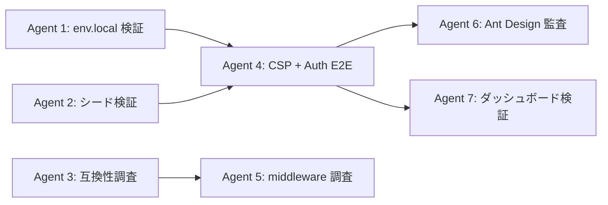
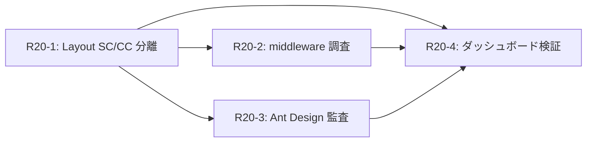

# Phase 5: ローカル環境立ち上げ＆安定化計画

> Phase 1〜4（設計・実装・レビュー・最終監査）は完了済み。本計画はローカル開発環境の起動と安定稼働を確立するためのロードマップ。

---

## 現状サマリ

| フェーズ | カバー範囲 | 状態 |
|---|---|---|
| **Phase 1** | Must 全9REQ + Should(D01) + Could(G01, G03) + 監査修正 | ✅ 完了 |
| **Phase 2** | Should 残り (D02, E01) + CSV + NFR 運用基盤 | ✅ 完了 |
| **Phase 3** | Could (F01, G02) + NFR ドキュメント | ✅ 完了 |
| **Phase 4** | 品質強化・最終監査 (R16〜R18) | ✅ 完了 |
| **Phase 5** | ローカル環境立ち上げ・安定化 | 📋 本計画 |

---

## 背景と課題

ローカル環境でのログインが失敗する。表面的な原因は **CSP がローカル Supabase (`http://127.0.0.1:54321`) への接続をブロック** しているためだが、調査を進めると複数の潜在課題が存在することが判明した。

### 確認済みの問題
1. `next.config.ts` の CSP `connect-src` にローカル Supabase URL が含まれていなかった（修正済みだが反映未確認）
2. `login/page.tsx` の `App.useApp()` コンテキスト問題（修正済み）
3. `seed.sql` の profiles 重複キーエラー（修正済み）

### 未確認の潜在課題
4. Next.js 16 の `middleware.ts` 非推奨化の影響
5. `@supabase/ssr` v0.8.0 と Next.js 16 の互換性
6. Ant Design v6 の `App.useApp()` パターンの全体適用
7. `.env.local` のキー整合性
8. シードデータの bcrypt ハッシュ互換性

---

## 対象スコープ

| チケット | 領域 | 優先度 |
|---|---|---|
| INV-01 | CSP `connect-src` 修正・検証 | **P0** |
| INV-04 | Supabase Auth E2E フロー検証 | **P0** |
| INV-05 | `.env.local` キー整合性 | **P1** |
| INV-06 | シードデータ & bcrypt 検証 | **P1** |
| INV-02 | Next.js 16 middleware 非推奨対応 | **P1** |
| INV-03 | Ant Design v6 App.useApp() 全体検証 | **P1** |
| INV-07 | `@supabase/ssr` バージョン互換性 | **P2** |
| INV-08 | 認証後画面遷移・ダッシュボード検証 | **P2** |

---

## Round 19: 調査＆基盤修正（3グループ）

### グループ A（即時・独立 — 3並列）

| エージェント | チケット | タスク |
|---|---|---|
| Agent 1 | INV-05 | `.env.local` と Supabase キーの整合性確認・修正 |
| Agent 2 | INV-06 | シードデータ検証（DB 内容確認 + bcrypt ハッシュ + Auth API 直接テスト） |
| Agent 3 | INV-07 | `@supabase/ssr` / Next.js 16 / Ant Design v6 互換性調査 |

**依存**: なし（全並列OK）

---

### グループ B（グループ A 完了後 — 2並列）

| エージェント | チケット | タスク |
|---|---|---|
| Agent 4 | INV-01 + INV-04 | CSP 修正確認 → Auth E2E フロー検証（`.next` キャッシュ削除 → curl でヘッダー確認 → ログインテスト） |
| Agent 5 | INV-02 | Next.js 16 middleware → proxy 移行調査・必要に応じて修正 |

**依存**: Agent 1（キー整合性確認済み）, Agent 2（シードデータ正常確認済み）

---

### グループ C（グループ B 完了後 — 2並列）

| エージェント | チケット | タスク |
|---|---|---|
| Agent 6 | INV-03 | Ant Design v6 App.useApp() パターンの全画面監査・修正 |
| Agent 7 | INV-08 | ログイン成功後のダッシュボード表示検証 |

**依存**: Agent 4（ログイン成功確認済み）

---

## ラウンド依存グラフ

---

## 工数見積もり

| グループ | 並列数 | 推定所要時間 | 累計 |
|---|---|---|---|
| A: 基盤調査 | 3 | ~5分 | 5分 |
| B: CSP + Auth + middleware | 2 | ~10分 | 15分 |
| C: UI + ダッシュボード | 2 | ~10分 | 25分 |

> **推定合計: 約25分**

---

## 成功基準

1. ✅ `admin@test-corp.example.com` / `password123` でログインが成功する
2. ✅ ログイン後にダッシュボードが正常に表示される
3. ✅ 全 6 ロールのユーザーでそれぞれログインしてロール別 UI が表示される
4. ✅ `npm run build` がエラーなしで完了する
5. ✅ Next.js 16 の middleware 非推奨警告が解消される（or 対応方針が文書化される）

---

## Round 19 完了状況（2026-02-25）

| チケット | 結果 | 備考 |
|---|---|---|
| INV-01 | ✅ 完了 | CSP `connect-src` に `http://127.0.0.1:54321` 含む |
| INV-04 | ✅ 完了 | Auth E2E ログイン成功、リダイレクト正常 |
| INV-05 | ✅ 完了 | `.env.local` キー一致確認済み |
| INV-06 | ✅ 完了 | bcrypt ハッシュ更新、phone カラム除去 |
| INV-07 | ✅ 完了 | 別会話でウォークスルー作成済み |

### 新規発見課題

- **FIX-NEW-01**: `src/app/page.tsx`（プレースホルダー）がダッシュボードを隠していた。削除後、`(authenticated)/layout.tsx` で antd `Sider` が RSC コンテキストで `undefined` になるエラーが発生。SC/CC 分離が必要。

### ウォークスルー

- [R19 ローカル環境安定化](../../logs/walkthroughs/r19-local-env-stabilization/)

---

## Round 20 計画

### プロンプト（`round-20/` サブフォルダ、1ファイル＝1プロンプト）

| 実行順 | Wave | ファイル | タスク |
|---|---|---|---|
| 1 | Wave 1 | `r20-1-layout-sc-cc-split.md` | **FIX-NEW-01**: `(authenticated)/layout.tsx` SC/CC 分離 |
| 2 | Wave 2 | `r20-2-middleware-investigation.md` | INV-02: Next.js 16 middleware → proxy 調査 |
| 3 | Wave 2 | `r20-3-antd-app-audit.md` | INV-03: Ant Design v6 App.useApp() 全体監査 |
| 4 | Wave 3 | `r20-4-dashboard-verification.md` | INV-08: ダッシュボード表示・RLS 検証 |

### 依存関係

### 体制

- **実装担当**: Claude Opus 4.6 (thinking)
- **PM 担当**: Gemini 3.1 Pro (High)
