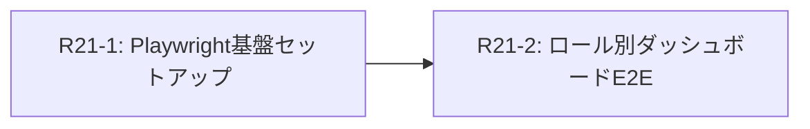

# Phase 6: 自動テスト基盤の確立（Playwright E2E）

> Phase 5（ローカル環境立ち上げ・安定化）でのダッシュボード手動検証（R20-4）において、全6ロールのUI・RLS網羅確認の手間が判明した。本フェーズでは今後の継続的開発に備え、Playwrightを用いたE2Eテスト基盤を構築する。

---

## 背景と課題

- 6つの各ロール（Tenant Admin, PM, Member, Approver, Accounting, IT Admin）ごとのUI表示分岐やデータアクセス制御（RLS）が複雑化している。
- 手動検証での担保は限界があり、特に回帰テスト（リグレッションテスト）のコストが高い。
- `detail/testing/index.md`（テスト方針）において、E2Eテストは「Playwrightを用い、最小限のクリティカルパスのみ」と定義されている。

---

## 対象スコープ

本フェーズでは、ローカル開発環境（Local Supabase起動状態）でのE2Eテスト実行基盤の確立と、最小限のクリティカルパス（ログインプロセスとダッシュボード表示）の自動化を目標とする。

| チケット | 領域 | 優先度 |
|---|---|---|
| E2E-01 | Playwright基盤セットアップと認証ヘルパー実装 | **P0** |
| E2E-02 | ダッシュボードロール別UI検証（全6ロール） | **P0** |

---

## Round 21: Playwright導入とダッシュボード検証

### エージェントプロンプト（`round-21/` サブフォルダ）

| 実行順 | Wave | ファイル | タスク |
|---|---|---|---|
| 1 | Wave 1 | `r21-1-playwright-setup.md` | **E2E-01**: `@playwright/test` の導入、`playwright.config.ts` の設定、認証ヘルパー（global setup 等）の実装 |
| 2 | Wave 2 | `r21-2-dashboard-e2e.md` | **E2E-02**: 全6ロール（シードデータ利用）でのログイン → ダッシュボード表示内容の検証自動化 |

### 依存関係

---

## 成功基準

1. ✅ `npm run test:e2e` コマンドでPlaywrightのテストがヘッドレスで一括実行できること。
2. ✅ 全6ロールでのログインとダッシュボード表示確認が自動で成功すること。
3. ✅ Playwrightのレポート（HTML）でテスト結果・スクリーンショット（エラー時）が確認できること。

---

## 体制

- **実装担当**: Claude Opus 4.6 (thinking) 等のコーディング・エージェント
- **PM 担当**: Gemini 3.1 Pro (High) 
