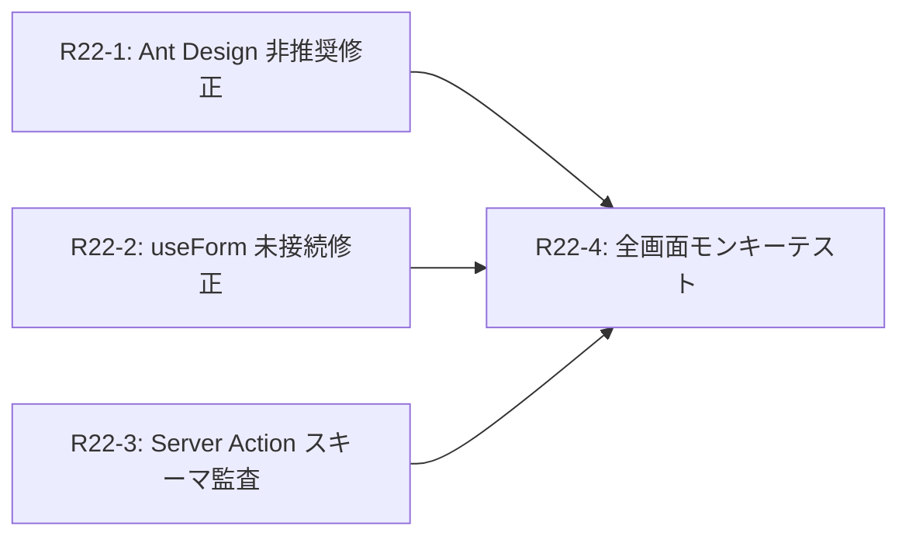

# Phase 7: 包括的バグ撲滅

> Phase 6（E2E基盤）で構築したスモークテストにより、全13ルートを自動検証可能になった。
> Phase 7 では、全22画面に対してコンソールエラー・非推奨APIの完全排除と、
> 全Server Action のスキーマ不整合を修正する。

---

## 背景と発見済みの問題

### 既に修正済み（Round 22 前に完了）

| 問題 | ファイル | 修正内容 |
|---|---|---|
| ESLint 28 issues (5E/23W) | 14ファイル | React Compiler hooks修正、未使用import/var削除、ESLint config更新 |
| `expenses.status` not found | `search/_actions.ts` | `workflows(status)` JOIN に変更 |
| `profiles` join (table missing) | `invoices/_actions.ts` | profiles JOIN 削除 |

### 未修正（Round 22 対象）

| カテゴリ | 件数 | 対象 |
|---|---|---|
| Ant Design `destroyOnClose` → `destroyOnHidden` | 1 | `InviteModal.tsx` |
| Ant Design `addonAfter` → `Space.Compact` | 1 | `InvoiceForm.tsx` |
| Ant Design `orientation` → `direction` | 9 | 6ファイル |
| `Form.useForm()` not connected | 要調査 | 10ファイル |
| 未検出のコンソールエラー（モンキー打鍵） | 不明 | 全22ルート |

---

## Round 22: エージェントチケット構成

### Wave 1（並列実行可）

| チケット | ファイル | タスク | 依存 |
|---|---|---|---|
| `r22-1-antd-deprecations.md` | 全ソース | Ant Design v6 非推奨API の全件修正 | なし |
| `r22-2-form-useform-audit.md` | 10ファイル | `Form.useForm()` 未接続警告の調査・修正 | なし |
| `r22-3-server-action-schema-audit.md` | 全 `_actions.ts` | DB スキーマと Server Action クエリの整合性監査 | なし |

### Wave 2（Wave 1 完了後）

| チケット | ファイル | タスク | 依存 |
|---|---|---|---|
| `r22-4-full-screen-monkey-test.md` | 全22ルート | 全画面モンキー打鍵テスト + コンソール0エラー確認 | W1 完了 |

### 依存関係

---

## 成功基準

1. ✅ `npm run lint` — 0 errors, 0 warnings
2. ✅ `npm run build` — 成功
3. ✅ `npm run test:e2e` — 全テスト PASSED（smoke 含む42件以上）
4. ✅ 全22ルートのブラウザコンソールに error/warning が 0 件
5. ✅ 全 Server Action の `select()` クエリが実在するカラム・リレーションのみ参照

---

## 体制

- **実装担当**: Claude Opus 4.6 等のコーディング・エージェント（最大3並列）
- **PM 担当**: Gemini 3.1 Pro
