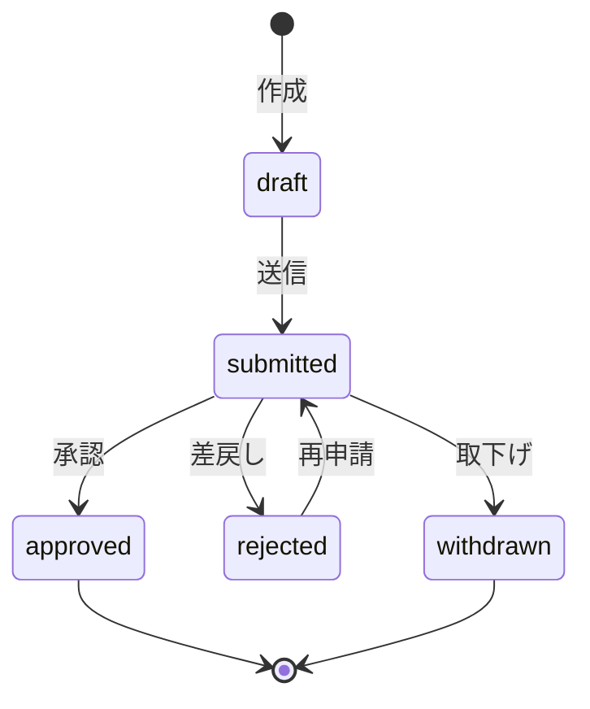

## 目的 / In-Out / Related
- **目的**: 承認者が申請を承認/差戻しする、または申請者が取下げる
- **対象範囲（In/Out）**: 状態遷移、通知、監査ログ
- **Related**: REQ-B02 / SPEC-SCR-B03 / DD-DB-workflows

## API情報
- **API ID**: SPEC-API-B03
- **用途**: 申請の承認/差戻し/取下げ
- **認可**: 承認/差戻し→Approver, Tenant Admin / 取下げ→申請者本人
- **種別**: Server Action

## Request
```typescript
{
  workflow_id: string;
  action: "approve" | "reject" | "withdraw";
  reason?: string;  // reject時は必須
}
```

## Response
- 成功: `{ success: true, data: { id: string, status: string } }`
- 失敗: `{ success: false, error: { code: string, message: string } }`

## 状態遷移



## 処理フロー
1. **認証確認**: `auth.getUser()`
2. **ロール/権限チェック**:
   - approve/reject: `approver_id = user.id` かつ Approver ロール
   - withdraw: `created_by = user.id`
3. **状態遷移チェック**: 現在のステータスから遷移可能か検証
4. **DB更新**: `workflows.status` を更新
5. **監査ログ**: before/after を記録、reject時は reason を metadata に含む
6. **通知作成**: 申請者（approve/reject時）or 承認者（withdraw時）に通知
7. **キャッシュ無効化**: `revalidatePath`

## エラー設計
| コード | 内容 |
|---|---|
| ERR-AUTH-001 | 未認証 |
| ERR-AUTH-002 | 権限不足（承認者でない） |
| ERR-WF-001 | 不正な状態遷移 |
| ERR-WF-002 | 差戻し理由未入力 |
| ERR-WF-003 | 対象の申請が見つからない |

## 監査ログポイント
- `workflow.approve`: 承認（before/after ステータス）
- `workflow.reject`: 差戻し（理由を metadata に記録）
- `workflow.withdraw`: 取下げ

## Related
- REQ-B02 / SPEC-SCR-B03 / DD-DB-workflows
