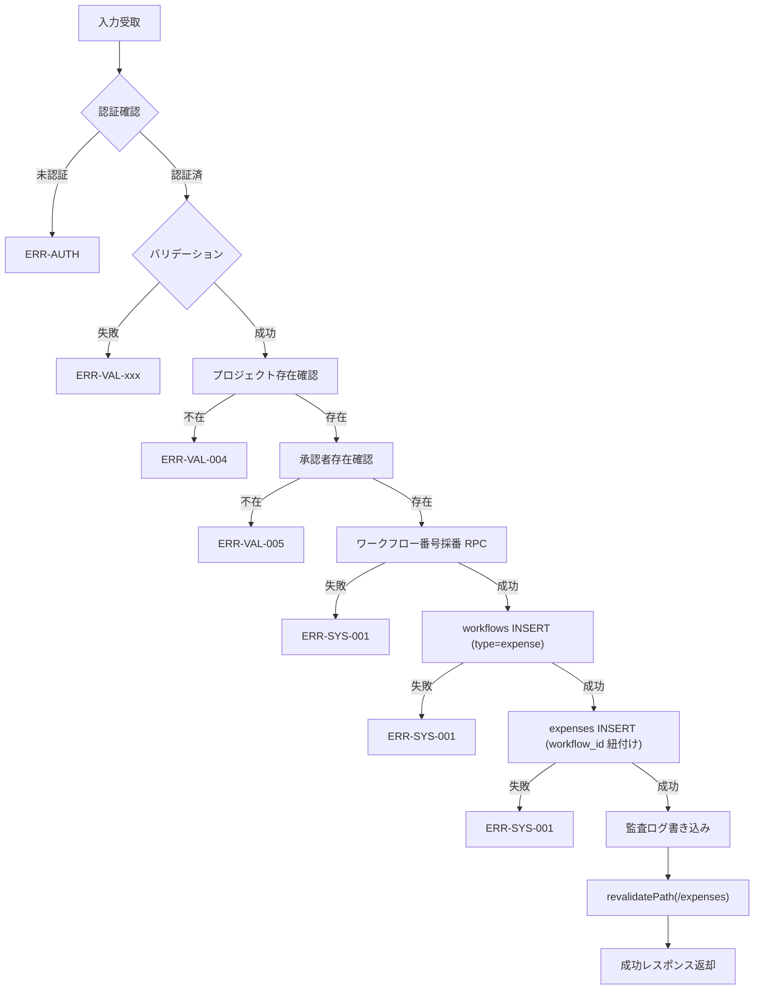

## 目的 / In-Out / Related
- **目的**: 経費の作成（下書き保存・送信）、一覧取得、詳細取得、および関連マスタデータ取得を処理する
- **対象範囲（In/Out）**: バリデーション、DB操作、ワークフロー自動作成、監査ログ
- **Related**: REQ-D01 / SPEC-SCR-D01 / DD-DB-expenses / DD-DB-workflows

## API情報
- **API ID**: SPEC-API-D01
- **用途**: 経費管理
- **認可**: 全認証ユーザー（ロール別データフィルタあり）
- **種別**: Server Action（`"use server"`）

---

## Server Action 一覧

| # | Action 名 | 用途 | 認可 |
|---|---|---|---|
| 1 | `createExpense` | 経費申請の新規作成 | 全認証ユーザー |
| 2 | `getExpenses` | 経費一覧の取得 | 全認証ユーザー（ロール別フィルタ） |
| 3 | `getExpenseById` | 経費詳細の取得 | 作成者 or Accounting / Tenant Admin |
| 4 | `getProjects` | プロジェクト一覧取得（補助） | 全認証ユーザー |
| 5 | `getApprovers` | 承認者一覧取得（補助） | 全認証ユーザー |

---

## 1. createExpense

### Request

```typescript
type CreateExpenseInput = {
  category: "交通費" | "宿泊費" | "会議費" | "消耗品費" | "通信費" | "その他"; // 必須
  amount: number;        // 必須、1〜10,000,000
  expense_date: string;  // 必須、YYYY-MM-DD
  description?: string;  // 任意
  project_id: string;    // 必須、テナント内プロジェクトID
  approver_id: string;   // 必須、承認ロールを持つユーザーID
  status?: "draft" | "submitted"; // デフォルト: "draft"
};
```

### バリデーション

| # | チェック内容 | エラーコード | メッセージ |
|---|---|---|---|
| 1 | テナント所属確認 | `ERR-AUTH-003` | テナントが見つかりません |
| 2 | カテゴリが有効値か | `ERR-VAL-001` | 有効なカテゴリを選択してください |
| 3 | 金額が1以上か | `ERR-VAL-002` | 金額は1円以上で入力してください |
| 4 | 金額が10,000,000以下か | `ERR-VAL-002` | 金額は10,000,000円以下で入力してください |
| 5 | 日付が入力されているか | `ERR-VAL-003` | 日付は必須です |
| 6 | プロジェクトIDが入力されているか | `ERR-VAL-004` | プロジェクトを選択してください |
| 7 | プロジェクトがテナント内に存在するか | `ERR-VAL-004` | 指定されたプロジェクトが見つかりません |
| 8 | 承認者IDが入力されているか | `ERR-VAL-005` | 承認者を選択してください |
| 9 | 承認者がテナント内に存在し承認ロールを持つか | `ERR-VAL-005` | 指定された承認者が見つかりません |

### 処理フロー



### ワークフロー自動作成

経費申請時に `workflows` テーブルへ以下のレコードが自動作成される:

| フィールド | 値 |
|---|---|
| `workflow_number` | `next_workflow_number` RPC で採番 |
| `type` | `"expense"` |
| `title` | `経費申請: {category} ¥{amount}` |
| `description` | 入力値（未入力時 `null`） |
| `amount` | 入力金額 |
| `date_from` | `expense_date` |
| `date_to` | `expense_date` |
| `approver_id` | 入力値 |
| `status` | `"draft"` or `"submitted"` |
| `tenant_id` | ユーザーのテナントID |
| `created_by` | ユーザーID |

### Response

```typescript
// 成功
{ success: true, data: { expense: Expense, workflow: Workflow } }

// 失敗
{ success: false, error: { message: string } }
```

### 監査ログ

| アクション | 条件 | 記録内容 |
|---|---|---|
| `expense.create` | `status = "draft"` | `{ expense, workflow_id }` |
| `expense.submit` | `status = "submitted"` | `{ expense, workflow_id }` |

---

## 2. getExpenses

### Request

```typescript
type GetExpensesInput = {
  category?: string; // カテゴリフィルタ（任意）
};
```

### 権限チェック

| ロール | データ範囲 |
|---|---|
| Accounting / Tenant Admin | テナント内全件 |
| その他 | `created_by = 自身のID` のみ |

### SELECT カラム

```sql
expenses.*,
projects ( id, name ),
workflows ( id, status, workflow_number ),
profiles!expenses_created_by_fkey ( display_name )
```

### ソート
- `created_at` 降順

### Response

```typescript
// 成功
{ success: true, data: Expense[] }

// 失敗
{ success: false, error: { message: string } }
```

---

## 3. getExpenseById

### Request

```typescript
{ expense_id: string } // 必須
```

### 権限チェック
1. テナント所属確認
2. 経費の存在確認（`tenant_id` スコープ）
3. **作成者本人** or **Accounting / Tenant Admin** のみアクセス可

### SELECT カラム

```sql
expenses.*,
projects ( id, name ),
workflows ( id, status, workflow_number, approver_id, rejection_reason ),
profiles!expenses_created_by_fkey ( display_name )
```

### Response

```typescript
// 成功
{ success: true, data: Expense }

// 失敗（存在しない場合）
{ success: false, error: { message: "ERR-EXP-001: 経費が見つかりません" } }

// 失敗（権限不足）
{ success: false, error: { message: "ERR-AUTH-003: 権限がありません" } }
```

---

## 4. getProjects

### Request
- 入力なし（`void`）

### 処理
- テナント内のプロジェクトを取得
- `status` が `planning` または `active` のもののみ
- `name` 昇順でソート

### Response

```typescript
{ success: true, data: { id: string, name: string, status: string }[] }
```

---

## 5. getApprovers

### Request
- 入力なし（`void`）

### 処理
- テナント内の `user_roles` から承認ロール（`approver` / `accounting` / `tenant_admin`）を持つユーザーを取得
- `profiles` テーブルを JOIN して `display_name` を取得

### Response

```typescript
{ success: true, data: { user_id: string, role: string, display_name: string }[] }
```

---

## エラーコード体系

| コード | 分類 | 内容 |
|---|---|---|
| `ERR-AUTH-003` | 認証/認可 | テナント未所属 / 権限不足 |
| `ERR-VAL-001` | バリデーション | カテゴリ不正 |
| `ERR-VAL-002` | バリデーション | 金額不正（範囲外） |
| `ERR-VAL-003` | バリデーション | 日付未入力 |
| `ERR-VAL-004` | バリデーション | プロジェクト未選択 / 不存在 |
| `ERR-VAL-005` | バリデーション | 承認者未選択 / 不存在 |
| `ERR-EXP-001` | 経費 | 経費レコード不存在 |
| `ERR-SYS-001` | システム | DB操作失敗（採番/INSERT） |

## 監査ログポイント

| アクション | タイミング | 記録データ |
|---|---|---|
| `expense.create` | 下書き保存時 | `{ tenantId, resourceType: "expense", resourceId, after: { expense, workflow_id } }` |
| `expense.submit` | 送信時 | `{ tenantId, resourceType: "expense", resourceId, after: { expense, workflow_id } }` |

## Related
- REQ-D01 / SPEC-SCR-D01 / DD-DB-expenses / DD-DB-workflows / SPEC-API-B02（ワークフロー申請）
