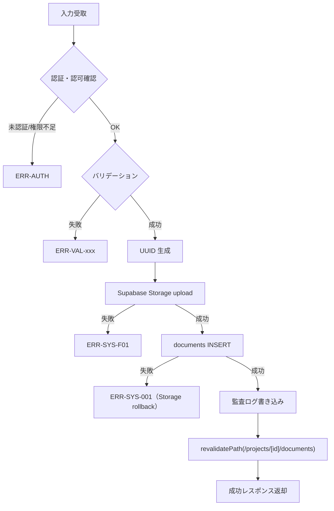
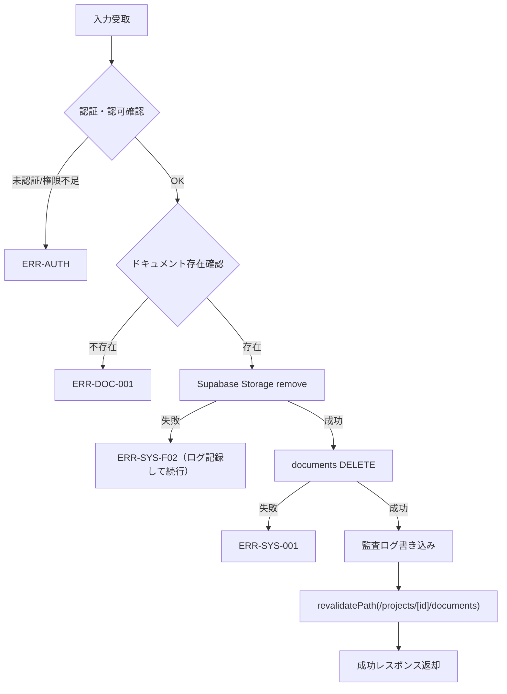

## 目的 / In-Out / Related
- **目的**: プロジェクトに紐づくドキュメントの CRUD 操作および Supabase Storage 連携を処理する
- **対象範囲（In/Out）**: バリデーション、Supabase Storage 操作、DB操作（documents テーブル）、signedURL 生成、監査ログ
- **Related**: REQ-F01 / SPEC-SCR-F01 / DD-DB-015(documents) / ADR-0006（ストレージ方針）

## API情報
- **API ID**: SPEC-API-F01
- **用途**: ドキュメント管理
- **認可**: プロジェクトメンバー（閲覧・DL）、PM / Tenant Admin（アップロード・削除）
- **種別**: Server Action（`"use server"`）

---

## Server Action 一覧

| # | Action 名 | 用途 | 認可 |
|---|---|---|---|
| 1 | `getDocuments` | プロジェクトのドキュメント一覧取得 | プロジェクトメンバー |
| 2 | `uploadDocument` | ファイルアップロード | PM, Tenant Admin |
| 3 | `deleteDocument` | ファイル削除 | PM, Tenant Admin |
| 4 | `getDownloadUrl` | 署名付きダウンロード URL 取得 | プロジェクトメンバー |

---

## 1. getDocuments

### Request

```typescript
type GetDocumentsInput = {
  project_id: string; // 必須、プロジェクトID
};
```

### 権限チェック

| # | チェック内容 | エラーコード | メッセージ |
|---|---|---|---|
| 1 | 認証確認 | `ERR-AUTH-001` | 認証が必要です |
| 2 | テナント所属確認 | `ERR-AUTH-003` | テナントが見つかりません |
| 3 | プロジェクトメンバーか | `ERR-AUTH-F01` | このプロジェクトへのアクセス権がありません |

### SELECT カラム

```sql
documents.*,
profiles!documents_uploaded_by_fkey ( display_name )
```

### フィルタ・ソート
- `WHERE project_id = :project_id AND tenant_id = :tenant_id`
- `ORDER BY created_at DESC`

### Response

```typescript
// 成功
{ success: true, data: Document[] }

// 失敗
{ success: false, error: { message: string } }
```

### Document 型定義

```typescript
type Document = {
  id: string;
  tenant_id: string;
  project_id: string;
  name: string;
  file_path: string;
  file_size: number;
  mime_type: string;
  uploaded_by: string;
  created_at: string;
  updated_at: string;
  profiles: {
    display_name: string | null;
  };
};
```

---

## 2. uploadDocument

### Request

```typescript
type UploadDocumentInput = {
  project_id: string; // 必須、プロジェクトID
  file: File;         // 必須、アップロードファイル
};
```

### バリデーション

| # | チェック内容 | エラーコード | メッセージ |
|---|---|---|---|
| 1 | 認証確認 | `ERR-AUTH-001` | 認証が必要です |
| 2 | テナント所属確認 | `ERR-AUTH-003` | テナントが見つかりません |
| 3 | ロール確認（PM / Tenant Admin） | `ERR-AUTH-F02` | ドキュメントのアップロード権限がありません |
| 4 | プロジェクトがテナント内に存在するか | `ERR-VAL-F01` | 指定されたプロジェクトが見つかりません |
| 5 | ファイルサイズが 10MB 以下か | `ERR-VAL-F02` | ファイルサイズは10MB以下にしてください |
| 6 | MIME タイプが許可リストに含まれるか | `ERR-VAL-F03` | 許可されていないファイル形式です |

### 許可 MIME タイプ

```typescript
const ALLOWED_MIME_TYPES = [
  "application/pdf",
  "image/png",
  "image/jpeg",
  "image/gif",
  "application/vnd.openxmlformats-officedocument.wordprocessingml.document",
  "application/vnd.openxmlformats-officedocument.spreadsheetml.sheet",
  "application/vnd.openxmlformats-officedocument.presentationml.presentation",
  "text/plain",
] as const;
```

### 処理フロー



### ストレージパス生成ルール

```
Bucket: project-documents
Path:   {tenant_id}/{project_id}/{uuid}_{original_filename}
```

- `uuid`: `crypto.randomUUID()` で生成
- `original_filename`: `file.name` をサニタイズ（特殊文字除去）

### documents テーブル INSERT 内容

| フィールド | 値 |
|---|---|
| `id` | DB デフォルト（`gen_random_uuid()`） |
| `tenant_id` | ユーザーのテナントID |
| `project_id` | 入力値 |
| `name` | `file.name`（元のファイル名） |
| `file_path` | Storage パス（`{tenant_id}/{project_id}/{uuid}_{filename}`） |
| `file_size` | `file.size` |
| `mime_type` | `file.type` |
| `uploaded_by` | ユーザーID |

### Response

```typescript
// 成功
{ success: true, data: { document: Document } }

// 失敗
{ success: false, error: { message: string } }
```

### エラー時のロールバック
- DB INSERT が失敗した場合、Storage にアップロード済みのファイルを削除する

### 監査ログ

| アクション | 記録内容 |
|---|---|
| `document.upload` | `{ tenantId, resourceType: "document", resourceId, after: { name, file_size, mime_type, project_id } }` |

---

## 3. deleteDocument

### Request

```typescript
{ document_id: string } // 必須
```

### バリデーション

| # | チェック内容 | エラーコード | メッセージ |
|---|---|---|---|
| 1 | 認証確認 | `ERR-AUTH-001` | 認証が必要です |
| 2 | テナント所属確認 | `ERR-AUTH-003` | テナントが見つかりません |
| 3 | ロール確認（PM / Tenant Admin） | `ERR-AUTH-F02` | ドキュメントの削除権限がありません |
| 4 | ドキュメントが存在するか（tenant_id スコープ） | `ERR-DOC-001` | ドキュメントが見つかりません |

### 処理フロー



### Response

```typescript
// 成功
{ success: true }

// 失敗
{ success: false, error: { message: string } }
```

### 監査ログ

| アクション | 記録内容 |
|---|---|
| `document.delete` | `{ tenantId, resourceType: "document", resourceId, before: { name, file_size, mime_type, project_id } }` |

---

## 4. getDownloadUrl

### Request

```typescript
{ document_id: string } // 必須
```

### 権限チェック

| # | チェック内容 | エラーコード | メッセージ |
|---|---|---|---|
| 1 | 認証確認 | `ERR-AUTH-001` | 認証が必要です |
| 2 | テナント所属確認 | `ERR-AUTH-003` | テナントが見つかりません |
| 3 | ドキュメントが存在するか（tenant_id スコープ） | `ERR-DOC-001` | ドキュメントが見つかりません |
| 4 | プロジェクトメンバーか | `ERR-AUTH-F01` | このプロジェクトへのアクセス権がありません |

### 処理

```typescript
const { data, error } = await supabase
  .storage
  .from("project-documents")
  .createSignedUrl(document.file_path, 60); // 有効期限: 60秒
```

### Response

```typescript
// 成功
{ success: true, data: { url: string, filename: string } }

// 失敗（存在しない場合）
{ success: false, error: { message: "ERR-DOC-001: ドキュメントが見つかりません" } }

// 失敗（権限不足）
{ success: false, error: { message: "ERR-AUTH-F01: アクセス権がありません" } }
```

### 監査ログ

| アクション | 記録内容 |
|---|---|
| `document.download` | `{ tenantId, resourceType: "document", resourceId, after: { name, document_id } }` |

---

## エラーコード体系

| コード | 分類 | 内容 |
|---|---|---|
| `ERR-AUTH-001` | 認証 | 未認証 |
| `ERR-AUTH-003` | 認証/認可 | テナント未所属 |
| `ERR-AUTH-F01` | 認可 | プロジェクトアクセス権なし |
| `ERR-AUTH-F02` | 認可 | アップロード/削除権限なし（PM / Tenant Admin 必須） |
| `ERR-VAL-F01` | バリデーション | プロジェクト不存在 |
| `ERR-VAL-F02` | バリデーション | ファイルサイズ超過（10MB） |
| `ERR-VAL-F03` | バリデーション | MIME タイプ不許可 |
| `ERR-DOC-001` | ドキュメント | ドキュメント不存在 |
| `ERR-SYS-001` | システム | DB操作失敗 |
| `ERR-SYS-F01` | システム | Storage アップロード失敗 |
| `ERR-SYS-F02` | システム | Storage 削除失敗 |

## 監査ログポイント

| アクション | タイミング | 記録データ |
|---|---|---|
| `document.upload` | アップロード成功時 | `{ tenantId, resourceType: "document", resourceId, after: { name, file_size, mime_type, project_id } }` |
| `document.delete` | 削除成功時 | `{ tenantId, resourceType: "document", resourceId, before: { name, file_size, mime_type, project_id } }` |
| `document.download` | ダウンロードURL生成時 | `{ tenantId, resourceType: "document", resourceId, after: { name, document_id } }` |

## Related
- REQ-F01 / SPEC-SCR-F01 / DD-DB-015(documents) / ADR-0006（ストレージ方針） / SPEC-API-D01（経費API — 類似パターン）
