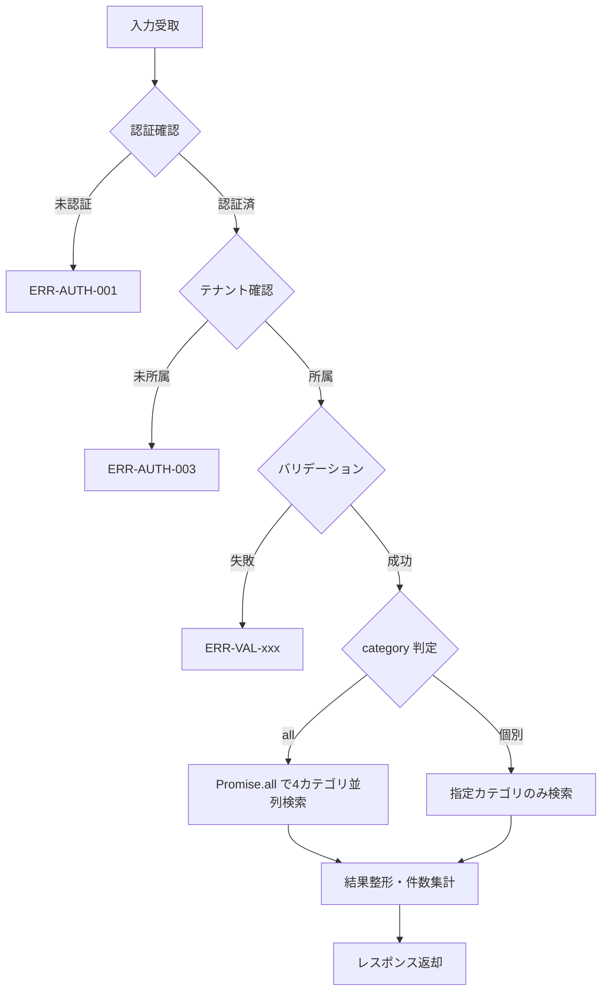

## 目的 / In-Out / Related
- **目的**: テナント内のワークフロー・プロジェクト・タスク・経費を横断的にキーワード検索し、カテゴリ別に結果を返却する
- **対象範囲（In/Out）**: 検索クエリの処理、ILIKE 検索、結果の整形。検索インデックス管理は ADR-0006 の範囲
- **Related**: REQ-G02 / SPEC-SCR-G02 / ADR-0006（検索方式） / NFR-02e（検索1秒以内）

## API情報
- **API ID**: SPEC-API-G01
- **用途**: 全文検索（横断検索）
- **認可**: 全認証ユーザー（RLS によるテナント・ロール別データフィルタ）
- **種別**: Server Action（`"use server"`）

---

## Server Action 一覧

| # | Action 名 | 用途 | 認可 |
|---|---|---|---|
| 1 | `searchAll` | 全カテゴリ横断検索 | 全認証ユーザー（RLS 自動制御） |

---

## 1. searchAll

### Request

```typescript
type SearchAllInput = {
  query: string;         // 必須、検索キーワード（1〜100文字）
  category?: SearchCategory; // 任意、カテゴリフィルタ
  page?: number;         // 任意、ページ番号（デフォルト: 1）
};

type SearchCategory = "all" | "workflows" | "projects" | "tasks" | "expenses";
```

### バリデーション

| # | チェック内容 | エラーコード | メッセージ |
|---|---|---|---|
| 1 | 認証確認 | `ERR-AUTH-001` | 認証が必要です |
| 2 | テナント所属確認 | `ERR-AUTH-003` | テナントが見つかりません |
| 3 | `query` が空でないこと | `ERR-VAL-001` | 検索キーワードを入力してください |
| 4 | `query` が100文字以下 | `ERR-VAL-002` | 検索キーワードは100文字以下で入力してください |
| 5 | `category` が有効値（指定時） | `ERR-VAL-003` | 無効なカテゴリです |
| 6 | `page` が1以上の整数（指定時） | `ERR-VAL-004` | 無効なページ番号です |

### 処理フロー



### 検索処理詳細

#### カテゴリ別検索クエリ

各カテゴリは `ILIKE` による partial match で検索する。検索パターンは `%{query}%`。

| カテゴリ | テーブル | 検索条件 | SELECT カラム |
|---|---|---|---|
| workflows | `workflows` | `title ILIKE` OR `description ILIKE` | `id, title, description, status, created_at` |
| projects | `projects` | `name ILIKE` OR `description ILIKE` | `id, name, description, status, created_at` |
| tasks | `tasks` | `title ILIKE` | `id, title, status, created_at, project_id` |
| expenses | `expenses` | `description ILIKE` | `id, description, category, amount, status, created_at` |

#### 並列実行

`category = "all"` の場合、4カテゴリを `Promise.all` で並列実行する:

```typescript
const [workflows, projects, tasks, expenses] = await Promise.all([
  searchWorkflows(supabase, tenantId, query, limit),
  searchProjects(supabase, tenantId, query, limit),
  searchTasks(supabase, tenantId, query, limit),
  searchExpenses(supabase, tenantId, query, limit, userRole, userId),
]);
```

#### 取得件数

| モード | 件数 |
|---|---|
| `category = "all"` | 各カテゴリ **10件** ずつ |
| `category = 個別` | **20件/ページ** |

#### ソート
- 全カテゴリ共通: `created_at` 降順

### 権限チェック（ロール別データ範囲）

RLS ポリシーにより自動制御される。追加のアプリ層チェックは以下:

| カテゴリ | ロール | データ範囲 |
|---|---|---|
| workflows | 全ロール | RLS による自動フィルタ（作成者 or 承認者） |
| projects | 全ロール | RLS による自動フィルタ（メンバーアサイン済PJ） |
| tasks | 全ロール | RLS による自動フィルタ（担当者 or PJメンバー） |
| expenses | Member / Approver / PM | `created_by = 自身のID` のみ |
| expenses | Accounting / Tenant Admin | テナント内全件 |

### Response

```typescript
// 成功
type SearchAllResponse = {
  success: true;
  data: {
    results: SearchResult[];
    counts: {
      all: number;
      workflows: number;
      projects: number;
      tasks: number;
      expenses: number;
    };
    page: number;
    hasMore: boolean;
  };
};

type SearchResult = {
  id: string;
  category: "workflow" | "project" | "task" | "expense";
  title: string;           // タイトルまたは名前
  description?: string;    // 説明文（スニペット用）
  status: string;          // 各リソースのステータス
  createdAt: string;       // ISO 8601
  link: string;            // 遷移先 URL
  metadata?: {
    amount?: number;       // 経費の場合
    projectId?: string;    // タスクの場合
    expenseCategory?: string; // 経費の場合
  };
};

// 失敗
type SearchAllErrorResponse = {
  success: false;
  error: { message: string };
};
```

### レスポンス生成ロジック

各カテゴリの検索結果を統一的な `SearchResult` 型に変換する:

| カテゴリ | `title` マッピング | `link` マッピング |
|---|---|---|
| workflows | `workflows.title` | `/workflows/{id}` |
| projects | `projects.name` | `/projects/{id}` |
| tasks | `tasks.title` | `/projects/{project_id}/tasks` |
| expenses | `expenses.description` | `/expenses/{id}` |

---

## エラーコード体系

| コード | 分類 | 内容 |
|---|---|---|
| `ERR-AUTH-001` | 認証 | 未認証 |
| `ERR-AUTH-003` | 認証/認可 | テナント未所属 |
| `ERR-VAL-001` | バリデーション | 検索キーワード未入力 |
| `ERR-VAL-002` | バリデーション | 検索キーワード文字数超過 |
| `ERR-VAL-003` | バリデーション | 無効なカテゴリ |
| `ERR-VAL-004` | バリデーション | 無効なページ番号 |
| `ERR-SYS-001` | システム | DB 検索エラー |

---

## パフォーマンス要件

| 項目 | 基準 | 根拠 |
|---|---|---|
| レスポンスタイム | **1秒以内**（95パーセンタイル） | NFR-02e |
| 対象データ量 | テナントあたり 10万レコード/テーブル | NFR-02d |
| 並列実行 | 4カテゴリを `Promise.all` で並列 | レスポンスタイム短縮 |
| インデックス | `pg_trgm` + `GIN` インデックス | ADR-0006 |

---

## 監査ログポイント
- 検索操作は監査ログ不要（閲覧のみの操作）

---

## Related
- REQ-G02 / SPEC-SCR-G02 / ADR-0006（検索方式） / NFR-02e（検索1秒以内）
