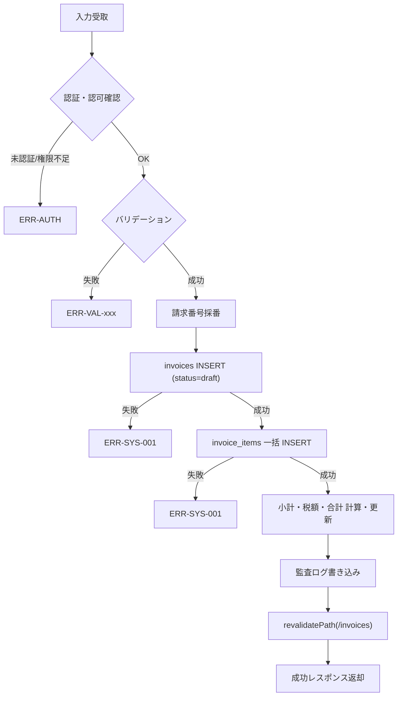

## 目的 / In-Out / Related
- **目的**: 請求書のCRUD操作、ステータス管理、および明細操作を処理する
- **対象範囲（In/Out）**: バリデーション、DB操作（invoices + invoice_items）、ステータス遷移制御、監査ログ
- **Related**: REQ-E01 / SPEC-SCR-H01 / SPEC-SCR-H02 / DD-DB-013(invoices) / DD-DB-014(invoice_items)

## API情報
- **API ID**: SPEC-API-H01
- **用途**: 請求書管理
- **認可**: Accounting / Tenant Admin（CRUD）、PM（閲覧のみ・自PJスコープ）
- **種別**: Server Action（`"use server"`）

---

## Server Action 一覧

| # | Action 名 | 用途 | 認可 |
|---|---|---|---|
| 1 | `createInvoice` | 請求書作成（ヘッダー + 明細） | Accounting, Tenant Admin |
| 2 | `updateInvoice` | 請求書更新（ヘッダー + 明細） | Accounting, Tenant Admin |
| 3 | `getInvoices` | 一覧取得（フィルタ対応） | Accounting, Tenant Admin, PM（自PJのみ） |
| 4 | `getInvoiceById` | 詳細取得（明細含む） | Accounting, Tenant Admin, PM（自PJのみ） |
| 5 | `updateInvoiceStatus` | ステータス変更 | Accounting, Tenant Admin |
| 6 | `deleteInvoice` | 削除（draft のみ） | Accounting, Tenant Admin |

---

## 1. createInvoice

### Request

```typescript
type CreateInvoiceInput = {
  client_name: string;           // 必須、200文字以内
  project_id?: string;           // 任意、テナント内プロジェクトID
  issued_date: string;           // 必須、YYYY-MM-DD
  due_date: string;              // 必須、YYYY-MM-DD、issued_date 以降
  tax_rate?: number;             // 任意、デフォルト 10.00
  notes?: string;                // 任意
  items: CreateInvoiceItemInput[]; // 必須、1行以上
};

type CreateInvoiceItemInput = {
  description: string;           // 必須、品目名
  quantity: number;              // 必須、0超
  unit_price: number;            // 必須、0以上
};
```

### バリデーション

| # | チェック内容 | エラーコード | メッセージ |
|---|---|---|---|
| 1 | テナント所属確認 | `ERR-AUTH-003` | テナントが見つかりません |
| 2 | ロール確認（Accounting / Tenant Admin） | `ERR-AUTH-004` | 請求書の作成権限がありません |
| 3 | 取引先名が入力されているか | `ERR-VAL-H01` | 取引先名は必須です |
| 4 | 取引先名が200文字以内か | `ERR-VAL-H01` | 取引先名は200文字以内で入力してください |
| 5 | 発行日が入力されているか | `ERR-VAL-H02` | 発行日は必須です |
| 6 | 支払期日が入力されているか | `ERR-VAL-H03` | 支払期日は必須です |
| 7 | 支払期日 ≥ 発行日 | `ERR-VAL-H03` | 支払期日は発行日以降の日付を指定してください |
| 8 | プロジェクトがテナント内に存在するか（指定時） | `ERR-VAL-H04` | 指定されたプロジェクトが見つかりません |
| 9 | 明細が1行以上あるか | `ERR-VAL-H05` | 明細は1行以上必要です |
| 10 | 明細の品目が入力されているか | `ERR-VAL-H06` | 品目名は必須です |
| 11 | 明細の数量が0超か | `ERR-VAL-H07` | 数量は0より大きい値を入力してください |
| 12 | 明細の単価が0以上か | `ERR-VAL-H08` | 単価は0以上で入力してください |

### 処理フロー



### 請求番号採番ルール
- フォーマット: `INV-{YYYY}-{NNNN}`
- `YYYY`: 発行年
- `NNNN`: テナント内の年次連番（0001〜）
- 例: `INV-2026-0001`, `INV-2026-0042`

### 金額計算ロジック

| 項目 | 計算式 |
|---|---|
| 明細金額 | `quantity × unit_price`（各行） |
| 小計（subtotal） | `Σ 明細金額` |
| 消費税額（tax_amount） | `FLOOR(subtotal × tax_rate / 100)` |
| 合計金額（total_amount） | `subtotal + tax_amount` |

### Response

```typescript
// 成功
{ success: true, data: { invoice: Invoice, items: InvoiceItem[] } }

// 失敗
{ success: false, error: { message: string } }
```

### 監査ログ

| アクション | 記録内容 |
|---|---|
| `invoice.create` | `{ tenantId, resourceType: "invoice", resourceId, after: { invoice, items } }` |

---

## 2. updateInvoice

### Request

```typescript
type UpdateInvoiceInput = {
  id: string;                    // 必須、請求書ID
  client_name: string;           // 必須、200文字以内
  project_id?: string;           // 任意
  issued_date: string;           // 必須、YYYY-MM-DD
  due_date: string;              // 必須、YYYY-MM-DD、issued_date 以降
  tax_rate?: number;             // 任意
  notes?: string;                // 任意
  items: UpdateInvoiceItemInput[]; // 必須、1行以上
};

type UpdateInvoiceItemInput = {
  id?: string;                   // 既存行は ID あり、新規行は省略
  description: string;
  quantity: number;
  unit_price: number;
};
```

### 処理
1. `draft` ステータスの請求書のみ編集可能
2. 既存明細を全削除 → 新しい明細で再INSERT（シンプルな差し替え方式）
3. 金額再計算 → invoices テーブル更新
4. 監査ログ書き込み（before/after）

### バリデーション
- `createInvoice` と同一のバリデーションルールに加え:

| # | チェック内容 | エラーコード | メッセージ |
|---|---|---|---|
| 1 | 請求書が存在するか | `ERR-INV-001` | 請求書が見つかりません |
| 2 | ステータスが `draft` か | `ERR-INV-002` | 下書き以外の請求書は編集できません |

### Response

```typescript
// 成功
{ success: true, data: { invoice: Invoice, items: InvoiceItem[] } }

// 失敗
{ success: false, error: { message: string } }
```

### 監査ログ

| アクション | 記録内容 |
|---|---|
| `invoice.update` | `{ tenantId, resourceType: "invoice", resourceId, before: {...}, after: {...} }` |

---

## 3. getInvoices

### Request

```typescript
type GetInvoicesInput = {
  status?: "draft" | "sent" | "paid" | "cancelled";  // 任意
  project_id?: string;                                 // 任意
  from?: string;                                       // 任意、発行日開始 YYYY-MM-DD
  to?: string;                                         // 任意、発行日終了 YYYY-MM-DD
};
```

### 権限チェック

| ロール | データ範囲 |
|---|---|
| Accounting / Tenant Admin | テナント内全件 |
| PM | `project_id` が自分がアサインされたプロジェクトのもののみ |

### SELECT カラム

```sql
invoices.*,
projects ( id, name ),
profiles!invoices_created_by_fkey ( display_name )
```

### フィルタ適用

| パラメータ | SQL条件 |
|---|---|
| `status` | `invoices.status = :status` |
| `project_id` | `invoices.project_id = :project_id` |
| `from` | `invoices.issued_date >= :from` |
| `to` | `invoices.issued_date <= :to` |

### ソート
- `issued_date` 降順、同日は `created_at` 降順

### Response

```typescript
// 成功
{ success: true, data: Invoice[] }

// 失敗
{ success: false, error: { message: string } }
```

---

## 4. getInvoiceById

### Request

```typescript
{ invoice_id: string } // 必須
```

### 権限チェック
1. テナント所属確認
2. 請求書の存在確認（`tenant_id` スコープ）
3. **Accounting / Tenant Admin** → アクセス可
4. **PM** → `project_id` が自分のアサインプロジェクトの場合のみアクセス可

### SELECT カラム

```sql
invoices.*,
invoice_items ( id, description, quantity, unit_price, amount, sort_order ),
projects ( id, name ),
profiles!invoices_created_by_fkey ( display_name )
```

### Response

```typescript
// 成功
{ success: true, data: { invoice: Invoice, items: InvoiceItem[] } }

// 失敗（存在しない場合）
{ success: false, error: { message: "ERR-INV-001: 請求書が見つかりません" } }

// 失敗（権限不足）
{ success: false, error: { message: "ERR-AUTH-004: 権限がありません" } }
```

---

## 5. updateInvoiceStatus

### Request

```typescript
type UpdateInvoiceStatusInput = {
  id: string;                                          // 必須
  status: "sent" | "paid" | "cancelled";               // 必須
};
```

### ステータス遷移バリデーション

| 現在 → 遷移先 | 許可 |
|---|---|
| `draft` → `sent` | ✅ |
| `draft` → `cancelled` | ✅ |
| `sent` → `paid` | ✅ |
| `sent` → `cancelled` | ✅ |
| その他すべて | ❌ `ERR-INV-003` |

### バリデーション

| # | チェック内容 | エラーコード | メッセージ |
|---|---|---|---|
| 1 | 請求書が存在するか | `ERR-INV-001` | 請求書が見つかりません |
| 2 | ロール確認 | `ERR-AUTH-004` | ステータス変更の権限がありません |
| 3 | ステータス遷移が有効か | `ERR-INV-003` | 無効なステータス遷移です |

### Response

```typescript
// 成功
{ success: true, data: { invoice: Invoice } }

// 失敗
{ success: false, error: { message: string } }
```

### 監査ログ

| アクション | 記録内容 |
|---|---|
| `invoice.status_change` | `{ tenantId, resourceType: "invoice", resourceId, before: { status: "draft" }, after: { status: "sent" } }` |

---

## 6. deleteInvoice

### Request

```typescript
{ invoice_id: string } // 必須
```

### バリデーション

| # | チェック内容 | エラーコード | メッセージ |
|---|---|---|---|
| 1 | 請求書が存在するか | `ERR-INV-001` | 請求書が見つかりません |
| 2 | ロール確認 | `ERR-AUTH-004` | 削除権限がありません |
| 3 | ステータスが `draft` か | `ERR-INV-004` | 下書き以外の請求書は削除できません |

### 処理
1. `invoice_items` を CASCADE 削除（FK 制約による自動削除）
2. `invoices` レコードを DELETE
3. 監査ログ書き込み
4. `revalidatePath("/invoices")`

### Response

```typescript
// 成功
{ success: true }

// 失敗
{ success: false, error: { message: string } }
```

### 監査ログ

| アクション | 記録内容 |
|---|---|
| `invoice.delete` | `{ tenantId, resourceType: "invoice", resourceId, before: { invoice, items } }` |

---

## エラーコード体系

| コード | 分類 | 内容 |
|---|---|---|
| `ERR-AUTH-003` | 認証/認可 | テナント未所属 |
| `ERR-AUTH-004` | 認証/認可 | 操作権限不足 |
| `ERR-VAL-H01` | バリデーション | 取引先名不正 |
| `ERR-VAL-H02` | バリデーション | 発行日未入力 |
| `ERR-VAL-H03` | バリデーション | 支払期日不正 |
| `ERR-VAL-H04` | バリデーション | プロジェクト不存在 |
| `ERR-VAL-H05` | バリデーション | 明細行なし |
| `ERR-VAL-H06` | バリデーション | 品目名未入力 |
| `ERR-VAL-H07` | バリデーション | 数量不正（0以下） |
| `ERR-VAL-H08` | バリデーション | 単価不正（負数） |
| `ERR-INV-001` | 請求書 | 請求書不存在 |
| `ERR-INV-002` | 請求書 | 下書き以外の編集不可 |
| `ERR-INV-003` | 請求書 | 無効なステータス遷移 |
| `ERR-INV-004` | 請求書 | 下書き以外の削除不可 |
| `ERR-SYS-001` | システム | DB操作失敗 |

## 監査ログポイント

| アクション | タイミング | 記録データ |
|---|---|---|
| `invoice.create` | 新規作成時 | `{ tenantId, resourceType: "invoice", resourceId, after: { invoice, items } }` |
| `invoice.update` | 更新時 | `{ tenantId, resourceType: "invoice", resourceId, before: {...}, after: {...} }` |
| `invoice.status_change` | ステータス変更時 | `{ tenantId, resourceType: "invoice", resourceId, before: { status }, after: { status } }` |
| `invoice.delete` | 削除時 | `{ tenantId, resourceType: "invoice", resourceId, before: { invoice, items } }` |

## Related
- REQ-E01 / SPEC-SCR-H01 / SPEC-SCR-H02 / DD-DB-013(invoices) / DD-DB-014(invoice_items) / SPEC-API-D01（経費API — 類似パターン）
