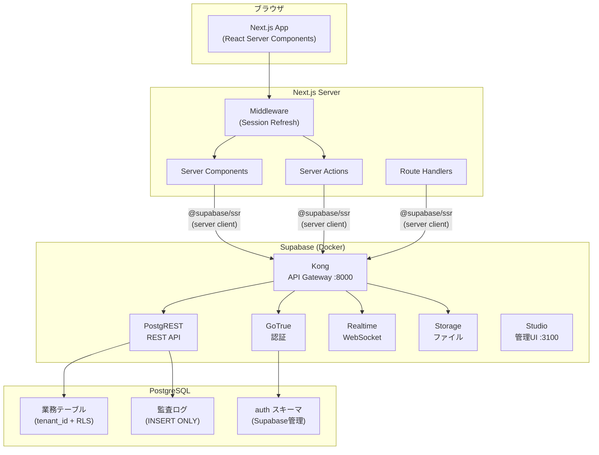

## 目的 / In-Out / Related
- **目的**: システムの全体像と技術選定の根拠を示す
- **対象範囲（In）**: レイヤー構成、データフロー、技術スタック、デプロイ構成
- **対象範囲（Out）**: 各コンポーネントの実装詳細（→ Detail）
- **Related**: [ADR-0001](../../adr/ADR-0001/) / [ADR-0003](../../adr/ADR-0003/) / [NFR](../../requirements/nfr/)

---

## システム構成図



## レイヤー構成

| レイヤー | 技術 | 責務 |
|---|---|---|
| **プレゼンテーション** | Next.js (React Server Components, Ant Design) | UI表示、フォーム、ナビゲーション |
| **アプリケーション** | Server Actions / Route Handlers | ビジネスロジック、バリデーション、認可チェック |
| **認証/認可** | Supabase Auth + Middleware | セッション管理、トークンリフレッシュ |
| **データアクセス** | Supabase Client SDK (PostgREST) | CRUD操作、リアルタイム購読 |
| **データ保護** | PostgreSQL RLS | テナント分離、ロールベースアクセス制御 |
| **永続化** | PostgreSQL 15 | データ保管、Index、制約 |
| **ファイル** | Supabase Storage | アップロードファイル管理 |

## データフロー

### 読み取り（Server Component）
```
ブラウザ → Middleware(セッション更新) → Server Component
  → supabase.from("table").select() → Kong → PostgREST → PostgreSQL(RLS適用)
  → レスポンス → Server Component(HTML生成) → ブラウザ
```

### 書き込み（Server Action）
```
ブラウザ(フォーム送信) → Server Action
  → バリデーション → supabase.from("table").insert() → Kong → PostgREST → PostgreSQL(RLS適用)
  → 監査ログ記録 → レスポンス → revalidatePath() → ブラウザ(再描画)
```

## 技術方針

### Server Components ファースト
- **原則**: ページは Server Component で構築し、インタラクティブ部分のみ Client Component
- **理由**: TTFB短縮（NFR-02a: 200ms以下）、SEO不要だがデータフェッチ効率化
- **例外**: リアルタイム更新が必要な箇所（通知バッジ等）

### Server Actions 中心の書き込み
- **原則**: データ書き込みは Server Actions を使用
- **理由**: API Route を別途定義する必要がなく、型安全性の確保
- **例外**: 外部システムからのWebhook受信は Route Handler

### Supabaseクライアントの使い分け
- 詳細は [Supabaseクライアント運用規約](../supabase-client/) を参照

---

## 未決事項
- CDN/Edge Caching 戦略（NFR-02a達成のため）
- Realtime の利用範囲（通知のみ or ダッシュボードのリアルタイム更新も含む）

## 次アクション
- 権限/認可の詳細仕様 → authz
- 画面仕様・API仕様の作成
