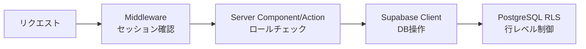

## 目的 / In-Out / Related
- **目的**: 認証済みユーザーに対する認可（何ができるか）の仕様を確定する
- **対象範囲（In）**: 認可チェックの実施層、RLS/アプリ層の役割分担、画面/APIごとの権限
- **対象範囲（Out）**: RLSポリシーの具体SQL（→ DD-RLS）
- **Related**: [ADR-0001](../../adr/adr-0001/) / [ロール定義](../../requirements/roles/) / [ADR-0003](../../adr/adr-0003/)

---

## 認可アーキテクチャ



### 2層認可モデル

| 層 | 責務 | チェック内容 |
|---|---|---|
| **アプリ層** (Server Component / Action) | 画面アクセス・機能アクセスの制御 | ユーザーのロールが画面/操作に必要なロールを含むか |
| **DB層** (RLS) | データアクセスの制御 | tenant_id一致 + ロールに応じたCRUD許可 |

**設計原則**: アプリ層は「見せるか見せないか」、DB層は「触れるか触れないか」を制御する。

---

## 認証フロー

1. ユーザーが `/login` でメール/パスワードを入力
2. Supabase Auth (GoTrue) が認証し、JWTを発行
3. `@supabase/ssr` が Cookie にセッションを保存
4. Middleware が全リクエストでセッションをリフレッシュ
5. Server Component / Action で `supabase.auth.getUser()` によりユーザー取得

## アプリ層の認可チェック

### 画面アクセス制御

```typescript
// lib/auth.ts（想定）
export async function requireRole(roles: Role[]) {
  const supabase = await createClient();
  const { data: { user } } = await supabase.auth.getUser();
  if (!user) redirect("/login");

  const { data: userRoles } = await supabase
    .from("user_roles")
    .select("role")
    .eq("user_id", user.id);

  const hasRole = userRoles?.some(r => roles.includes(r.role));
  if (!hasRole) redirect("/unauthorized");

  return { user, roles: userRoles };
}
```

### 画面別必要ロール

| 画面 | 必要ロール | チェック方法 |
|---|---|---|
| ダッシュボード | 全ロール | ログイン確認のみ |
| テナント管理 | IT Admin | `requireRole(["it_admin"])` |
| ユーザー管理 | Tenant Admin | `requireRole(["tenant_admin"])` |
| 承認画面 | Approver, Tenant Admin | `requireRole(["approver","tenant_admin"])` |
| プロジェクト管理 | PM, Tenant Admin | `requireRole(["pm","tenant_admin"])` |
| 経費承認/集計 | Accounting, Tenant Admin | `requireRole(["accounting","tenant_admin"])` |
| 監査ログ | IT Admin, Tenant Admin | `requireRole(["it_admin","tenant_admin"])` |

## DB層の認可（RLS）

### RLSポリシー設計方針

1. **全業務テーブルにRLSを有効化** (`ALTER TABLE ... ENABLE ROW LEVEL SECURITY`)
2. **テナント分離** が最優先: `tenant_id` フィルタは全ポリシーに含む
3. **ロール別ポリシー**: SELECT/INSERT/UPDATE/DELETE ごとに必要ロールを定義
4. **service_role** は RLS をバイパス（バッチ処理・管理操作用）

### ポリシー設計パターン

| パターン | 用途 | 条件例 |
|---|---|---|
| テナントメンバー | 同一テナント内の閲覧 | `tenant_id IN (SELECT tenant_id FROM user_roles WHERE user_id = auth.uid())` |
| 自分のデータ | 自分が作成/担当 | 上記 + `created_by = auth.uid()` |
| ロール限定 | 特定ロールのみ操作 | 上記 + `EXISTS (SELECT 1 FROM user_roles WHERE role = 'pm' AND ...)` |
| 公開読取 | テナント内全員が閲覧可 | テナントメンバーと同じ |

---

## 権限エラー時の振る舞い

| 場面 | 振る舞い |
|---|---|
| 未ログイン | `/login` にリダイレクト |
| ロール不足（画面） | `/unauthorized` にリダイレクト + トースト通知 |
| RLS拒否（データ） | 空の結果が返る（エラーではなくフィルタ） |
| RLS拒否（書き込み） | PostgreSQL error → Server Action でキャッチ → ユーザーフレンドリーなエラー表示 |

---

## 未決事項
- ロールのキャッシュ戦略（毎回DBクエリ vs セッションキャッシュ）
- IT Admin のテナント横断アクセス範囲の確定

## 次アクション
- 詳細設計で RLS ポリシーの具体SQL を定義（DD-RLS）
