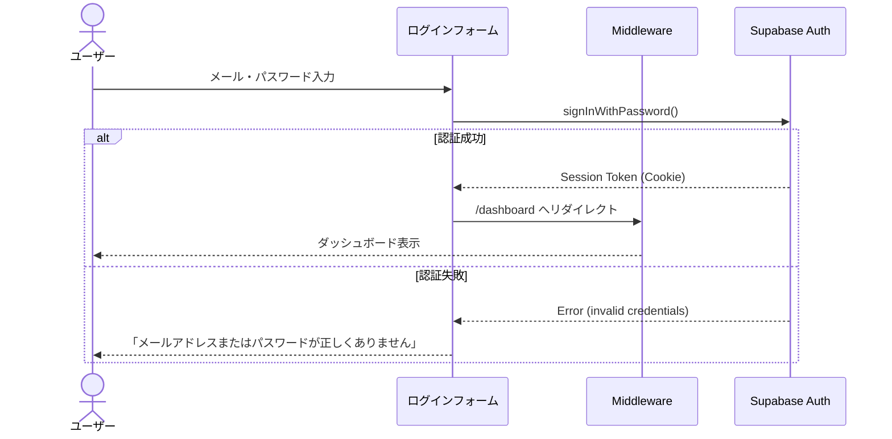

## 目的 / In-Out / Related
- **目的**: ユーザー認証画面の仕様を定める
- **対象範囲（In/Out）**: ログインフォーム、エラー表示、リダイレクト
- **Related**: Supabase Auth (GoTrue) / [Supabase規約](../../spec/supabase-client/)

---

## ワイヤーフレーム

```
┌─────────────────────────────────────────────────────────┐
│                                                         │
│  ┌──────────────┐  ┌─────────────────────────────────┐  │
│  │              │  │                                 │  │
│  │   OpsHub     │  │         ログイン                │  │
│  │   ロゴ       │  │                                 │  │
│  │              │  │  ┌─────────────────────────┐    │  │
│  │   業務統合   │  │  │ メールアドレス           │    │  │
│  │   プラット   │  │  └─────────────────────────┘    │  │
│  │   フォーム   │  │                                 │  │
│  │              │  │  ┌─────────────────────────┐    │  │
│  │              │  │  │ パスワード          👁   │    │  │
│  │              │  │  └─────────────────────────┘    │  │
│  │              │  │                                 │  │
│  │              │  │  ┌─────────────────────────┐    │  │
│  │              │  │  │      ログイン           │    │  │
│  │              │  │  └─────────────────────────┘    │  │
│  │              │  │                                 │  │
│  │              │  │  パスワードを忘れた方 →         │  │
│  │              │  │                                 │  │
│  └──────────────┘  └─────────────────────────────────┘  │
│                                                         │
└─────────────────────────────────────────────────────────┘
```

## UI構成

| 要素 | 種別 | 必須 | 説明 |
|---|---|---|---|
| メールアドレス | Input (email) | ✅ | メール形式バリデーション |
| パスワード | Input (password) | ✅ | 最低8文字、表示/非表示トグル |
| ログインボタン | Button (primary) | — | Supabase Auth `signInWithPassword` 呼び出し |
| パスワードリセット | Link | — | パスワードリセットフローへ遷移 |

## 認証フロー



## エラーパターン

| 条件 | メッセージ | 動作 |
|---|---|---|
| メール未入力 | 「メールアドレスを入力してください」 | フィールドハイライト |
| パスワード未入力 | 「パスワードを入力してください」 | フィールドハイライト |
| 認証失敗 | 「メールアドレスまたはパスワードが正しくありません」 | Alert表示 |
| アカウントロック | 「アカウントがロックされています。管理者にお問い合わせください」 | Alert表示 |

## 権限

- **アクセス**: 未認証ユーザーのみ
- 認証済みユーザーがアクセスした場合は `/dashboard` にリダイレクト

## 監査ログポイント

| イベント | action | 備考 |
|---|---|---|
| ログイン成功 | `auth.login` | Supabase Auth側で自動記録 |
| ログイン失敗 | `auth.login_failed` | 連続失敗時のアラート検討 |
