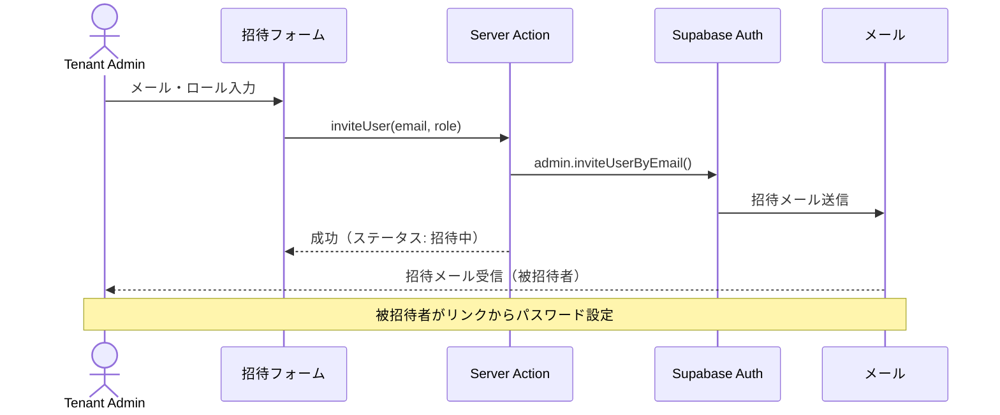

## 目的 / In-Out / Related
- **目的**: テナント内のユーザー管理（招待、ロール設定、無効化）
- **対象範囲（In/Out）**: ユーザーCRUD、ロール割当、招待フロー
- **Related**: REQ-A02 / [SCR-A01 テナント管理](./scr-a01/) / [ロール定義](../../requirements/roles/) / [ADR-0001 RBAC](../../adr/adr-0001/)

---

## ワイヤーフレーム

```
┌──────────────────────────────────────────────────────────────┐
│  ユーザー管理                               [＋ユーザー招待] │
│                                                              │
│  🔍 検索                    ロール: [全ロール ▼]  状態: [全▼]│
│                                                              │
│  ┌──────────────────────────────────────────────────────────┐│
│  │ 👤 | 名前          | メール              | ロール    |状態││
│  ├──────────────────────────────────────────────────────────┤│
│  │ 🟢 | 田中太郎      | tanaka@example.com  | PM        |有効││
│  │ 🟢 | 鈴木花子      | suzuki@example.com  | Member    |有効││
│  │ 🟢 | 佐藤一郎      | sato@example.com    | Approver  |有効││
│  │ 🟡 | 高橋美咲      | takahashi@ex.com    | Member    |招待中│
│  │ 🔴 | 山田健一      | yamada@example.com  | Member    |無効││
│  └──────────────────────────────────────────────────────────┘│
│                                                              │
│  表示: 1-5 / 25件   [← 前へ] [1] [2] [3] [次へ →]          │
│                                                              │
│  ── ユーザー詳細パネル（行クリックで展開） ──────────────── │
│  ┌──────────────────────────────────────────────────────────┐│
│  │  田中太郎                                               ││
│  │  メール: tanaka@example.com                             ││
│  │  ロール: [PM ▼]  [Approver ☑] [Member ☑]               ││
│  │  所属PJ: ECサイトリニューアル, 社内システム改修          ││
│  │  最終ログイン: 2026/02/22 14:30                         ││
│  │                                                         ││
│  │  [ロール変更を保存]  [パスワードリセット]  [無効化]      ││
│  └──────────────────────────────────────────────────────────┘│
└──────────────────────────────────────────────────────────────┘
```

## ユーザー一覧テーブル

| カラム | ソート | フィルタ |
|---|---|---|
| アバター/状態 | — | 状態（有効/招待中/無効） |
| 名前 | ✅ (A-Z) | — |
| メールアドレス | ✅ | テキスト検索 |
| ロール | — | セレクト（複数選択） |
| 最終ログイン | ✅ (日時) | — |
| 操作 | — | — |

## 招待フロー



## 操作

| 操作 | UI | 確認 |
|---|---|---|
| ユーザー招待 | モーダル（メール + ロール選択） | — |
| ロール変更 | 詳細パネル内のセレクト | 確認ダイアログ |
| パスワードリセット | ボタン | 確認ダイアログ |
| ユーザー無効化 | ボタン（赤） | 二重確認ダイアログ |
| ユーザー再有効化 | ボタン | 確認ダイアログ |

## 権限

| ロール | 操作 |
|---|---|
| Member / PM | アクセス不可 |
| Tenant Admin | テナント内ユーザーの管理（IT Admin ロールの付与除く） |
| IT Admin | 全テナントのユーザー管理 |

## バリデーション

| ルール | メッセージ |
|---|---|
| メールが既にテナントに存在 | 「このメールアドレスは既に登録されています」 |
| メール形式不正 | 「有効なメールアドレスを入力してください」 |
| 自分自身のロール変更 | 「自分のロールは変更できません」 |
| 最後のTenant Admin削除 | 「テナントには最低1人のTenant Adminが必要です」 |

## 監査ログポイント

| イベント | action | 重要度 |
|---|---|---|
| ユーザー招待 | `user.invite` | 高 |
| ロール変更 | `user.role_change` | 最高 |
| ユーザー無効化 | `user.deactivate` | 高 |
| パスワードリセット | `user.password_reset` | 高 |
