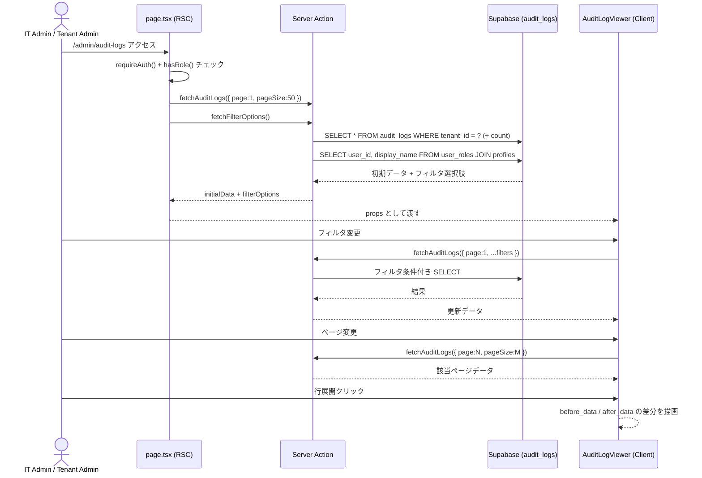

## 目的 / In-Out / Related
- **目的**: テナント内の操作履歴（監査ログ）を閲覧し、「いつ・誰が・何をしたか」を追跡する
- **対象範囲（In）**: ログ一覧表示、フィルタリング、ページネーション、変更差分表示
- **対象範囲（Out）**: ログ書込みロジック（→ [監査ログ方針](../../spec/audit-logging/)）、CSV/JSONエクスポート（未実装）
- **Related**: REQ-A03 / [監査ログ方針](../../spec/audit-logging/) / [DD-DB-009 audit_logs](../../detail/db/) / NFR-05

---

## 画面情報

| 項目 | 値 |
|---|---|
| **画面ID** | SPEC-SCR-A03 |
| **画面名** | 監査ログビューア |
| **対象ロール** | IT Admin / Tenant Admin のみ |
| **URL** | `/admin/audit-logs` |
| **状態** | Approved |
| **読み取り専用** | ✅ 編集・削除 UI は一切なし |

---

## 主要ユースケース
1. 管理者がテナント内の全操作履歴を時系列で確認する
2. フィルタを組み合わせて特定ユーザーの操作を追跡する（NFR目標: 5分以内に特定）
3. 行を展開して変更前後のデータ差分を確認する

---

## アクセス権限

| ロール | アクセス |
|---|---|
| IT Admin | ✅ 閲覧可 |
| Tenant Admin | ✅ 閲覧可 |
| PM / Approver / Accounting / Member | ❌ アクセス不可（エラーメッセージ表示） |

権限チェックはサーバーサイド（`page.tsx` および各 Server Action）で二重に実施される。

---

## ワイヤーフレーム

```
┌───────────────────────────────────────────────────────────────────┐
│  監査ログ                                                         │
│                                                                   │
│  ┌─ フィルタ ──────────────────────────────────────── [クリア] ─┐ │
│  │ 期間             ユーザー        アクション種別  リソース種別 │ │
│  │ [開始日〜終了日]  [すべて ▼]      [すべて ▼]      [すべて ▼]  │ │
│  └─────────────────────────────────────────────────────────────┘ │
│                                                                   │
│  ┌─────────────────────────────────────────────────────────────┐ │
│  │ ▶ | 日時               | 操作者   | アクション  | リソース | ID │
│  ├─────────────────────────────────────────────────────────────┤ │
│  │ ▶ | 2026/02/22 14:30:00| 田中太郎 | 申請承認    | ワークフロー | abc… │
│  │ ▼ | 2026/02/22 14:25:00| 鈴木花子 | PJ更新      | プロジェクト | def… │
│  │   ┌───────────── 展開行（差分表示） ──────────────────┐     │ │
│  │   │  変更前                    │  変更後                │     │ │
│  │   │  { "status": "planning" }  │  { "status": "active" }│     │ │
│  │   └────────────────────────────────────────────────────┘     │ │
│  │ ▶ | 2026/02/22 14:20:00| 佐藤一郎 | タスク作成  | タスク   | ghi… │
│  └─────────────────────────────────────────────────────────────┘ │
│                                                                   │
│  全 256 件    [10|20|50|100]件/頁    [← 前へ] [1] [2] ... [次へ →]│
└───────────────────────────────────────────────────────────────────┘
```

---

## UI構成

### ヘッダ
- `Typography.Title level={3}` で「監査ログ」を表示

### フィルタカード
- Ant Design `Card`（`size="small"`）にフィルタ群を配置
- タイトル: `FilterOutlined` アイコン + 「フィルタ」
- フィルタがアクティブ時のみ「クリア」ボタン（`ClearOutlined`）を `extra` に表示
- レスポンシブ: `Row` / `Col` — `xs={24} sm={12} md={6}` の4カラムレイアウト

### フィルタ項目

| # | フィルタ | コンポーネント | プレースホルダー | 値の取得元 | 備考 |
|---|---|---|---|---|---|
| F-1 | 期間 | `DatePicker.RangePicker` | 開始日 / 終了日 | — | `YYYY-MM-DD` で Server Action に送信 |
| F-2 | ユーザー | `Select`（`allowClear`） | すべてのユーザー | `fetchFilterOptions` → `user_roles` JOIN `profiles` | 表示名で表示、値は `user_id` |
| F-3 | アクション種別 | `Select`（`allowClear`） | すべてのアクション | 定数リスト（21種） | 日本語ラベルで表示 |
| F-4 | リソース種別 | `Select`（`allowClear`） | すべてのリソース | 定数リスト（7種） | 日本語ラベルで表示 |

### ログ一覧テーブル

| カラム | dataIndex | 幅 | レンダリング |
|---|---|---|---|
| 日時 | `created_at` | 180px | `ja-JP` ロケールで `YYYY/MM/DD HH:mm:ss` 表示 |
| 操作者 | `user_id` | 200px | `profiles.display_name` で表示、未登録時は UUID 先頭8文字 + `…`。Copyable |
| アクション | `action` | 160px | `Tag` で日本語ラベル表示（色付き） |
| リソース種別 | `resource_type` | 140px | 日本語ラベルで表示 |
| リソースID | `resource_id` | 200px | UUID 先頭8文字 + `…`。Copyable。null 時は `—` 表示 |

- **ソート**: `created_at DESC` 固定（サーバーサイド）
- **行キー**: `id`
- **サイズ**: `middle`
- **空メッセージ**: 「該当する監査ログはありません」

### ページネーション（サーバーサイド）

| 設定項目 | 値 |
|---|---|
| デフォルト件数 | 50件 |
| 選択可能件数 | 10 / 20 / 50 / 100 |
| `showSizeChanger` | ✅ |
| `showTotal` | `全 {total} 件` |
| 方式 | サーバーサイド（`range(from, to)` による取得） |

> **FIX-03 改修**: 初期実装ではクライアントサイドで最新100件をフィルタしていたが、サーバーサイドページネーションに改修済み。

### 詳細展開（Expandable Row）

行をクリックすると `before_data` / `after_data` の差分を表示する。

| 要素 | 表示内容 |
|---|---|
| 変更前（左） | `before_data` JSON を赤系背景（`#fff1f0`）で表示。null 時は「（なし — 新規作成）」 |
| 変更後（右） | `after_data` JSON を緑系背景（`#f6ffed`）で表示。null 時は「（なし — 削除）」 |
| メタデータ | `metadata` が空でなければ灰色背景で JSON 表示 |
| 差分抽出 | オブジェクト型の場合、変更のあったキーのみ抽出して表示 |
| 展開条件 | `before_data` / `after_data` / `metadata` のいずれかが存在する行のみ展開可能 |

---

## アクション種別ラベル一覧

| アクション値 | 日本語ラベル | タグ色 |
|---|---|---|
| `workflow.create` | 申請作成 | blue |
| `workflow.submit` | 申請送信 | cyan |
| `workflow.approve` | 申請承認 | green |
| `workflow.reject` | 申請差戻し | red |
| `workflow.withdraw` | 申請取下げ | orange |
| `project.create` | PJ作成 | blue |
| `project.update` | PJ更新 | geekblue |
| `project.delete` | PJ削除 | red |
| `project.add_member` | メンバー追加 | green |
| `project.remove_member` | メンバー削除 | orange |
| `task.create` | タスク作成 | blue |
| `task.update` | タスク更新 | geekblue |
| `task.delete` | タスク削除 | red |
| `task.status_change` | ステータス変更 | purple |
| `user.invite` | ユーザー招待 | blue |
| `user.role_change` | ロール変更 | purple |
| `user.activate` | ユーザー有効化 | green |
| `user.deactivate` | ユーザー無効化 | red |
| `tenant.update` | テナント更新 | geekblue |
| `tenant.delete` | テナント削除 | red |
| `timesheet.create` | 工数作成 | blue |
| `timesheet.update` | 工数更新 | geekblue |
| `timesheet.delete` | 工数削除 | red |

## リソース種別ラベル一覧

| 値 | 日本語ラベル |
|---|---|
| `workflow` | ワークフロー |
| `project` | プロジェクト |
| `task` | タスク |
| `user` | ユーザー |
| `tenant` | テナント |
| `timesheet` | 工数 |
| `expense` | 経費 |

---

## 入力項目

本画面は **読み取り専用** であり、ユーザーが編集可能な入力項目は存在しない。
フィルタ条件のみが操作対象となる（上記「フィルタ項目」参照）。

---

## 振る舞い・遷移

### 正常系



### 異常系
- **テナント未所属**: 「テナントが見つかりません」メッセージを表示
- **権限不足**: 「アクセス権がありません — このページはIT管理者またはテナント管理者のみ閲覧できます。」
- **Server Action エラー**: `throw new Error("ERR-SYS-001: ...")` をスロー

---

## エラー/例外

| エラーコード | 発生条件 | 表示/挙動 |
|---|---|---|
| ERR-AUTH-002 | 権限不足（非管理者からの Server Action 呼び出し） | Error throw |
| ERR-AUTH-003 | テナントIDが取得できない | Error throw |
| ERR-SYS-001 | Supabase クエリエラー | エラーメッセージを含めて throw |
| — | データ0件 | テーブル空表示（「該当する監査ログはありません」） |

- **リトライ**: フィルタ変更・ページ変更で自動的に再取得される。手動リトライ UI は未実装。

---

## データベース参照

**DD-DB-009 `audit_logs`** テーブルを参照。

| 列名 | 型 | 用途 |
|---|---|---|
| `id` | uuid | 行キー |
| `tenant_id` | uuid | テナント分離（RLS） |
| `user_id` | uuid | 操作者（profiles JOIN で表示名取得） |
| `action` | text | アクション種別 |
| `resource_type` | text | リソース種別 |
| `resource_id` | uuid | 対象リソースID |
| `before_data` | jsonb | 変更前データ（展開行で表示） |
| `after_data` | jsonb | 変更後データ（展開行で表示） |
| `metadata` | jsonb | 追加メタ情報（展開行で表示） |
| `created_at` | timestamptz | 日時列に表示 |

- **制約**: INSERT ONLY（UPDATE/DELETE 禁止の RLS ポリシー）
- **Index**: `(tenant_id, created_at DESC)` — 一覧表示のデフォルトソートに使用

---

## 監査ログポイント

本画面自体は **読み取り専用** であり、画面操作に起因する監査ログの書込みは発生しない。

---

## 実装ファイル

| ファイル | 役割 |
|---|---|
| `page.tsx` | Server Component：認証・権限チェック、初期データ取得 |
| `_actions.ts` | Server Action：`fetchAuditLogs` / `fetchFilterOptions` |
| `_components/AuditLogViewer.tsx` | Client Component：フィルタ UI、テーブル、展開行差分表示 |

---

## 関連リンク
- [監査ログ方針](../../spec/audit-logging/) — 記録方式・対象操作・改ざん防止
- [DD-DB-009 audit_logs](../../detail/db/) — テーブル定義
- [SCR-A01 テナント管理](./scr-a01/) / [SCR-A02 ユーザー管理](./scr-a02/) — 同カテゴリの管理画面
- [Public Docs: 監査ログ](https://docs.example.com/admin/audit-logs) — エンドユーザー向けヘルプ
