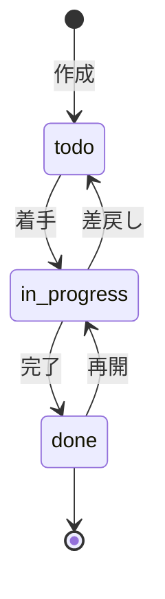

## 目的 / In-Out / Related
- **目的**: プロジェクト内タスクの作成・管理・進捗追跡
- **対象範囲（In/Out）**: カンバンビュー、タスクCRUD、担当者割当
- **Related**: REQ-C02 / [SCR-C02 PJ詳細](./scr-c02/) / [SCR-C04 工数入力](./scr-c04/)

---

## ワイヤーフレーム

```
┌──────────────────────────────────────────────────────────────┐
│  ← ECサイトリニューアル > タスク管理                          │
│                                                              │
│  PJ: [ECサイトリニューアル ▼]  🔍 検索   [＋タスク追加]      │
│                                                              │
│  フィルタ: [全担当者 ▼] [全優先度 ▼] [期限なし含む ☑]       │
│                                                              │
│  ┌─────────────┐ ┌─────────────┐ ┌─────────────┐            │
│  │ 📋 未着手(5) │ │ 🔄 進行中(3)│ │ ✅ 完了(12)  │            │
│  │             │ │             │ │             │            │
│  │ ┌─────────┐ │ │ ┌─────────┐ │ │ ┌─────────┐ │            │
│  │ │DB設計   │ │ │ │API実装  │ │ │ │要件定義 │ │            │
│  │ │👤田中   │ │ │ │👤鈴木   │ │ │ │👤田中   │ │            │
│  │ │🔴 高    │ │ │ │🟡 中    │ │ │ │🟢 低    │ │            │
│  │ │📅 3/1   │ │ │ │📅 3/15  │ │ │ │✓ 2/15   │ │            │
│  │ └─────────┘ │ │ └─────────┘ │ │ └─────────┘ │            │
│  │             │ │             │ │             │            │
│  │ ┌─────────┐ │ │ ┌─────────┐ │ │ ┌─────────┐ │            │
│  │ │UI設計   │ │ │ │テスト   │ │ │ │画面設計 │ │            │
│  │ │👤佐藤   │ │ │ │👤佐藤   │ │ │ │👤鈴木   │ │            │
│  │ │🟡 中    │ │ │ │🟡 中    │ │ │ │✓ 2/20   │ │            │
│  │ │📅 3/5   │ │ │ │📅 3/20  │ │ │          │ │            │
│  │ └─────────┘ │ │ └─────────┘ │ │ └─────────┘ │            │
│  └─────────────┘ └─────────────┘ └─────────────┘            │
└──────────────────────────────────────────────────────────────┘
```

## タスクカード表示項目

| 項目 | 型 | 必須 |
|---|---|---|
| タスク名 | text | ✅ |
| 担当者 | select (メンバーから) | — |
| 優先度 | select (高/中/低) | ✅（デフォルト: 中） |
| 期限 | date | — |
| ステータス | enum | ✅ |
| 説明 | textarea | — |
| 見積工数 | number (h) | — |

## ステータス定義



| ステータス | 表示名 | カラム |
|---|---|---|
| `todo` | 未着手 | 左 |
| `in_progress` | 進行中 | 中 |
| `done` | 完了 | 右 |

## 操作

| 操作 | 方法 | 権限 |
|---|---|---|
| タスク作成 | [＋タスク追加] ボタン → モーダル | PM / Member |
| ステータス変更 | カードをドラッグ＆ドロップ or カード内ボタン | PM / 担当者 |
| タスク編集 | カードクリック → 詳細パネル | PM / 担当者 |
| タスク削除 | 詳細パネル内の削除ボタン | PM のみ |
| フィルタ | ドロップダウンで担当者・優先度絞り込み | 全ロール |

## 権限

| ロール | 操作 |
|---|---|
| Member | 自分のタスク編集、ステータス変更 |
| PM | 全タスクCRUD、担当者割当 |
| Tenant Admin | 全PJのタスク閲覧 |

## 監査ログポイント

| イベント | action |
|---|---|
| タスク作成 | `task.create` |
| タスク更新 | `task.update` |
| タスク削除 | `task.delete` |
| ステータス変更 | `task.status_change` |
