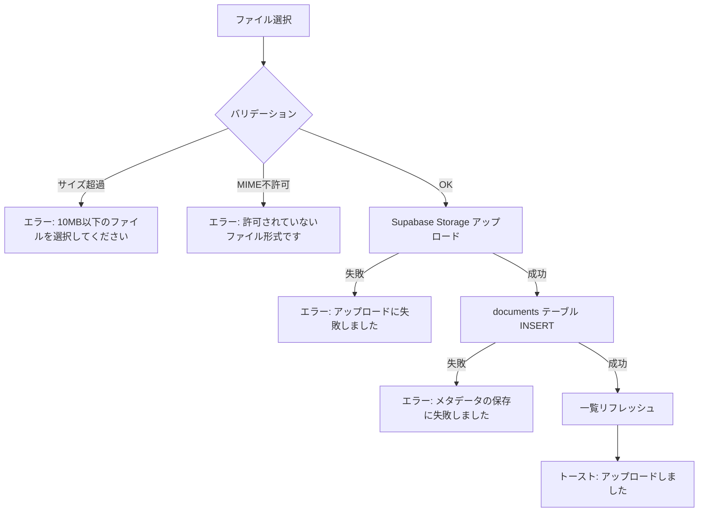

## 目的 / In-Out / Related
- **目的**: プロジェクトに紐づくドキュメントのアップロード・閲覧・ダウンロード・削除を提供する
- **対象範囲（In/Out）**: ファイル一覧、アップロード（Supabase Storage）、ダウンロード（signedURL）、削除、プレビュー（画像/PDF）
- **Related**: REQ-F01 / SPEC-API-F01 / DD-DB-015(documents) / [SCR-C01-2 PJ詳細](./scr-c01-2/)

---

## 画面情報
- **画面ID**: SPEC-SCR-F01
- **画面名**: ドキュメント管理
- **対象ロール**: プロジェクトメンバー（閲覧・ダウンロード）、PM / Tenant Admin（CRUD）
- **URL**: `/projects/[id]/documents`
- **状態**: Draft

## 主要ユースケース
- プロジェクトメンバーがプロジェクトの関連ドキュメントを閲覧・ダウンロードする
- PM / Tenant Admin がドキュメントをアップロード・削除する
- 画像・PDF を画面上でプレビューする（将来拡張）

---

## ワイヤーフレーム

```
┌─────────────────────────────────────────────────────────────┐
│  ← PJ詳細に戻る                                            │
│                                                             │
│  ECサイトリニューアル > ドキュメント                          │
│                                                             │
│  ┌──────┬──────┬──────┬──────┬──────┐                      │
│  │ 概要 │タスク│ 工数 │メンバー│ドキュメント│                   │
│  └──────┴──────┴──────┴──────┴──────┘                      │
│                                                             │
│  ┌─────────────────────────────────────────────────────────┐│
│  │ アップロードエリア（PM/Admin のみ表示）                   ││
│  │ ┌─────────────────────────────────────────────────────┐││
│  │ │  📁 ここにファイルをドラッグ＆ドロップ                │││
│  │ │     またはクリックして選択                            │││
│  │ │     最大 10MB / PDF, 画像, Office文書, テキスト       │││
│  │ └─────────────────────────────────────────────────────┘││
│  └─────────────────────────────────────────────────────────┘│
│                                                             │
│  ┌─────────────────────────────────────────────────────────┐│
│  │ ドキュメント一覧                                        ││
│  │ ┌──────┬──────┬──────┬────────┬──────┬──────┐          ││
│  │ │ ファイル名 │サイズ│MIME    │ｱｯﾌﾟﾛｰﾄﾞ者│日時  │ 操作 │          ││
│  │ ├──────┼──────┼──────┼────────┼──────┼──────┤          ││
│  │ │設計書.pdf │2.3MB│PDF     │田中太郎 │02/20│ ⬇ 🗑 │          ││
│  │ │mockup.png │1.1MB│PNG     │鈴木花子 │02/19│ ⬇ 👁 🗑│          ││
│  │ │議事録.docx│450KB│DOCX    │佐藤一郎 │02/18│ ⬇ 🗑 │          ││
│  │ └──────┴──────┴──────┴────────┴──────┴──────┘          ││
│  │  全 XX 件                                               ││
│  └─────────────────────────────────────────────────────────┘│
└─────────────────────────────────────────────────────────────┘
```

---

## UI構成（概要）

### アップロードセクション
- **コンポーネント**: Ant Design `Upload.Dragger`
- **表示条件**: PM / Tenant Admin ロールのみ
- **動作**: ドラッグ＆ドロップ または ファイル選択ダイアログ

### ドキュメント一覧テーブル
- **コンポーネント**: Ant Design `Table`
- **ソート**: `created_at` 降順（デフォルト）
- **ページネーション**: 20件/ページ

---

## テーブル列定義

| # | 列名 | データソース | 表示形式 | 備考 |
|---|---|---|---|---|
| 1 | ファイル名 | `documents.name` | テキスト（アイコン付き） | MIME に応じたファイルアイコンを表示 |
| 2 | サイズ | `documents.file_size` | 人間可読形式（KB/MB） | `formatFileSize()` ヘルパー |
| 3 | 種別 | `documents.mime_type` | Tag（色分け） | 下記 MIME 色定義参照 |
| 4 | アップロード者 | `profiles.display_name` | テキスト | `documents.uploaded_by` → `profiles` JOIN |
| 5 | 日時 | `documents.created_at` | `ja-JP` ロケール日時 | — |
| 6 | 操作 | — | アクションボタン群 | 下記操作ボタン参照 |

---

## MIME 種別色定義

| 種別 | 表示ラベル | Tag色 |
|---|---|---|
| `application/pdf` | PDF | `red` |
| `image/png`, `image/jpeg`, `image/gif` | 画像 | `blue` |
| `application/vnd.openxmlformats-officedocument.wordprocessingml.document` | DOCX | `geekblue` |
| `application/vnd.openxmlformats-officedocument.spreadsheetml.sheet` | XLSX | `green` |
| `application/vnd.openxmlformats-officedocument.presentationml.presentation` | PPTX | `orange` |
| `text/plain` | TXT | `default` |

---

## 操作ボタン

| ボタン | アイコン | 権限 | 動作 |
|---|---|---|---|
| ダウンロード | ⬇ `DownloadOutlined` | 全メンバー | signedURL を生成し、ブラウザでダウンロード |
| プレビュー | 👁 `EyeOutlined` | 全メンバー | 画像/PDF の場合のみ表示。モーダルでプレビュー |
| 削除 | 🗑 `DeleteOutlined` | PM / Tenant Admin | 確認モーダル → Storage + DB から削除 |

---

## アップロード仕様

### ファイル制約

| 項目 | 制約 |
|---|---|
| 最大ファイルサイズ | 10 MB |
| 同時アップロード | 複数ファイル可（逐次処理） |

### 許可 MIME タイプ

| カテゴリ | MIME |
|---|---|
| PDF | `application/pdf` |
| 画像 | `image/png`, `image/jpeg`, `image/gif` |
| Word | `application/vnd.openxmlformats-officedocument.wordprocessingml.document` |
| Excel | `application/vnd.openxmlformats-officedocument.spreadsheetml.sheet` |
| PowerPoint | `application/vnd.openxmlformats-officedocument.presentationml.presentation` |
| テキスト | `text/plain` |

### アップロード処理フロー



### ストレージパス構造

```
Bucket: project-documents
Path:   {tenant_id}/{project_id}/{uuid}_{filename}
```

- `uuid` はファイルごとにサーバー側で生成（ファイル名衝突を防止）
- 元のファイル名は `documents.name` に保持

---

## プレビュー（将来拡張）

| MIME | プレビュー方式 | 状態 |
|---|---|---|
| `image/*` | `` タグでモーダル表示 | Phase 3 実装予定 |
| `application/pdf` | `<iframe>` or ブラウザ内蔵 PDF ビューア | Phase 3 実装予定 |
| Office / Text | — | 対象外（ダウンロードのみ） |

---

## 権限

| ロール | 操作 |
|---|---|
| Member（PJメンバー） | 閲覧・ダウンロード |
| PM | 閲覧・ダウンロード・アップロード・削除 |
| Tenant Admin | 閲覧・ダウンロード・アップロード・削除 |
| 非PJメンバー | アクセス不可（RLS で制御） |

---

## 振る舞い・遷移
- **アップロード成功**: 一覧が自動リフレッシュ、トースト「{ファイル名} をアップロードしました」
- **ダウンロード**: signedURL（有効期限: 60秒）を生成、`window.open()` でダウンロード開始
- **削除確認**: Ant Design `Modal.confirm` で「{ファイル名} を削除しますか？」
- **削除成功**: 一覧が自動リフレッシュ、トースト「{ファイル名} を削除しました」
- **権限エラー時**: `message.error(\"操作権限がありません\")` + 操作ボタンは非表示（事前制御）

## エラー/例外
- アップロードサイズ超過: クライアント側で即時ブロック、`message.error` でトースト
- MIME 不許可: クライアント側で即時ブロック、`message.error` でトースト
- Storage エラー: `message.error(\"アップロードに失敗しました。再度お試しください\")` リトライ可
- ネットワークエラー: リトライ可

## 監査ログポイント

| イベント | action | 記録内容 |
|---|---|---|
| ドキュメントアップロード | `document.upload` | `{ file_name, file_size, mime_type, project_id }` |
| ドキュメント削除 | `document.delete` | `{ file_name, document_id, project_id }` |
| ドキュメントダウンロード | `document.download` | `{ file_name, document_id }` |

## 関連リンク
- Related: REQ-F01 / SPEC-API-F01 / DD-DB-015(documents) / [SCR-C01-2 PJ詳細](./scr-c01-2/) / ADR-0006（ストレージ方針）
