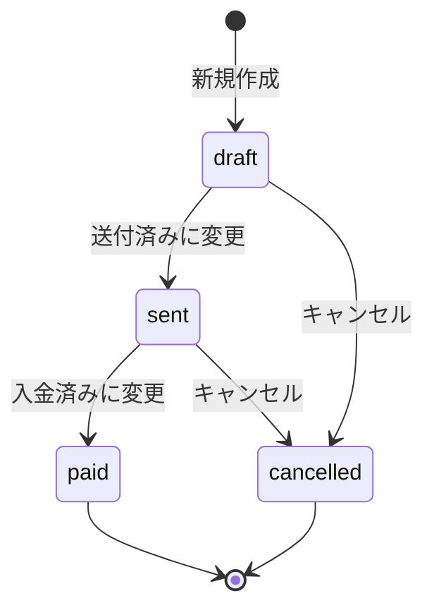

## 目的 / In-Out / Related
- **目的**: 請求書の新規作成・編集・ステータス変更・PDF出力を提供する
- **対象範囲（In/Out）**: ヘッダー情報入力、明細テーブル編集、合計自動計算、ステータス遷移、PDF出力。請求書テンプレートのカスタマイズは対象外
- **Related**: REQ-E01 / SPEC-API-H01 / SPEC-SCR-H01 / DD-DB-013(invoices) / DD-DB-014(invoice_items)

---

## 画面情報
- **画面ID**: SPEC-SCR-H02
- **画面名**: 請求書詳細/編集
- **対象ロール**: Accounting, Tenant Admin（編集可）, PM（閲覧のみ）
- **URL**: `/invoices/new`（新規） / `/invoices/[id]`（既存）
- **状態**: Draft

---

## 主要ユースケース
- 経理担当が新規請求書を作成し、明細を入力して保存する
- 既存の請求書を編集し、ステータスを「送付済」に変更する
- 入金確認後、ステータスを「入金済」に変更する
- 請求書をPDFとして出力する

---

## UI構成（概要）

```
┌──────────────────────────────────────────────────────────┐
│  [h2] 請求書詳細                           [ステータス Tag]  │
├──────────────────────────────────────────────────────────┤
│  ヘッダー情報 Card                                        │
│  ┌────────────────────────────────────────────────────┐  │
│  │ 請求番号   [INV-YYYY-NNNN] (自動/読取専用)          │  │
│  │ 取引先名   [テキスト入力                          ] │  │
│  │ プロジェクト[Select ▼                             ] │  │
│  │ 発行日     [DatePicker    ] 支払期日 [DatePicker  ] │  │
│  │ 備考       [TextArea                              ] │  │
│  └────────────────────────────────────────────────────┘  │
├──────────────────────────────────────────────────────────┤
│  明細テーブル Card                            [+ 行追加]   │
│  ┌──────────┬──────┬──────┬──────┬──────┐               │
│  │ 品目     │ 数量 │ 単価 │ 金額 │ 操作 │               │
│  ├──────────┼──────┼──────┼──────┼──────┤               │
│  │コンサル… │  10  │8,000│80,000│ [🗑] │               │
│  │交通費    │   1  │3,200│ 3,200│ [🗑] │               │
│  └──────────┴──────┴──────┴──────┴──────┘               │
├──────────────────────────────────────────────────────────┤
│  合計セクション                                           │
│  ┌────────────────────────────────────────────────────┐  │
│  │                       小計:        ¥83,200         │  │
│  │           消費税率: [10] % → 消費税額: ¥8,320      │  │
│  │                     合計金額:       ¥91,520        │  │
│  └────────────────────────────────────────────────────┘  │
├──────────────────────────────────────────────────────────┤
│  [下書き保存] [送付済みに変更] [入金済みに変更]             │
│  [キャンセル] [PDF出力]  [戻る]                            │
└──────────────────────────────────────────────────────────┘
```

---

## ヘッダー入力項目

| 項目 | 型 | 必須 | バリデーション | 備考 |
|---|---|---:|---|---|
| 請求番号 | Text（読取専用） | — | 自動採番 | `INV-YYYY-NNNN` 形式。新規作成時はサーバー側で採番 |
| 取引先名 | Input | ✅ | 必須、200文字以内 | — |
| プロジェクト | Select | — | テナント内プロジェクトから選択 | 任意（プロジェクト未紐付の請求も可） |
| 発行日 | DatePicker | ✅ | 必須 | — |
| 支払期日 | DatePicker | ✅ | 必須、発行日以降であること | 発行日より前の場合エラー |
| 備考 | TextArea | — | — | 3行表示、任意入力 |

---

## 明細テーブル（Editable Table）

### 列定義

| # | 列名 | 型 | 必須 | バリデーション | 備考 |
|---|---|---|---:|---|---|
| 1 | 品目 | Input（テキスト） | ✅ | 必須 | — |
| 2 | 数量 | InputNumber | ✅ | 0超（正の数） | 小数2桁まで対応 |
| 3 | 単価 | InputNumber | ✅ | 0以上 | `¥` プレフィクス、カンマ区切り |
| 4 | 金額 | Text（読取専用） | — | 自動計算（数量 × 単価） | `¥` + カンマ区切り表示 |
| 5 | 操作 | Button | — | — | 行削除ボタン（🗑） |

### 行操作
- **行追加**: 「行追加」ボタンで末尾に空行を追加
- **行削除**: 操作列の削除ボタンで行を削除（最低1行は必須、最後の行は削除不可）
- **バリデーション**: 明細は **1行以上** 必須

---

## 合計セクション（自動計算）

| 項目 | 計算ロジック | 備考 |
|---|---|---|
| 小計 | Σ（明細金額） | 明細の金額合計 |
| 消費税率 | デフォルト `10%`、変更可能 | InputNumber（0〜100%） |
| 消費税額 | 小計 × 消費税率 / 100（端数切捨） | 自動計算・読取専用 |
| 合計金額 | 小計 + 消費税額 | 自動計算・読取専用 |

---

## ステータス遷移



### 遷移ルール

| 現在のステータス | 可能な遷移先 | 条件 |
|---|---|---|
| `draft` | `sent` | Accounting / Tenant Admin のみ |
| `draft` | `cancelled` | Accounting / Tenant Admin のみ |
| `sent` | `paid` | Accounting / Tenant Admin のみ |
| `sent` | `cancelled` | Accounting / Tenant Admin のみ |
| `paid` | — | 遷移不可（最終状態） |
| `cancelled` | — | 遷移不可（最終状態） |

---

## アクションボタン

| ボタン | 種別 | 表示条件 | 動作 |
|---|---|---|---|
| 下書き保存 | default | 新規 or `draft` 状態 | `status: "draft"` で保存 |
| 送付済みに変更 | primary | `draft` 状態 | `status` を `sent` に変更 |
| 入金済みに変更 | primary | `sent` 状態 | `status` を `paid` に変更 |
| キャンセル | danger | `draft` or `sent` 状態 | `status` を `cancelled` に変更 |
| PDF出力 | default | 常時表示 | PDF生成・ダウンロード |
| 戻る | default | 常時表示 | `/invoices` へ遷移 |

### ロール別ボタン表示

| ロール | 編集操作 | ステータス変更 | PDF出力 |
|---|---|---|---|
| Accounting | ✅ | ✅ | ✅ |
| Tenant Admin | ✅ | ✅ | ✅ |
| PM | — | — | ✅（閲覧のみ） |

---

## PDF出力

### 方式
- **方式A（推奨）**: ブラウザの印刷ダイアログ（`window.print()`）+ 印刷用CSS
- **方式B（代替）**: Route Handler で PDF 生成（`@react-pdf/renderer` 等）

### 印刷用CSSレイアウト
- A4 縦向き
- ヘッダー: 請求番号、発行日、取引先名
- 明細テーブル: 品目・数量・単価・金額
- フッター: 小計・消費税・合計金額・振込先情報（備考欄）

---

## 振る舞い・遷移
- 正常系（新規保存）: 保存 → `/invoices/{id}` へ遷移、トースト「請求書を保存しました」
- 正常系（更新）: 保存 → 画面リロード、トースト「請求書を更新しました」
- 正常系（ステータス変更）: 変更 → 画面リロード、トースト「ステータスを変更しました」
- 異常系: バリデーション失敗 → フィールドごとにエラーメッセージ表示
- Server Action エラー → エラーメッセージをトースト表示
- 権限エラー時 → ダッシュボードへリダイレクト

---

## 削除

- `draft` ステータスの請求書のみ削除可能
- 削除確認ダイアログを表示
- 削除後 → `/invoices` へ遷移、トースト「請求書を削除しました」

---

## エラー/例外
- バリデーションエラー: 各フィールドの `rules` に基づきフォーム上にインライン表示
- サーバーエラー: `message.error()` でトースト通知
- ネットワークエラー: 入力内容は保持したままリトライ可能
- 請求書が見つからない場合: 404 表示

## 監査ログポイント
- `invoice.create`: 新規作成時
- `invoice.update`: 更新時
- `invoice.status_change`: ステータス変更時（before/after を記録）
- `invoice.delete`: 削除時
- `invoice.export_pdf`: PDF出力時

## 関連リンク
- Related: REQ-E01 / SPEC-API-H01 / SPEC-SCR-H01 / DD-DB-013(invoices) / DD-DB-014(invoice_items)
