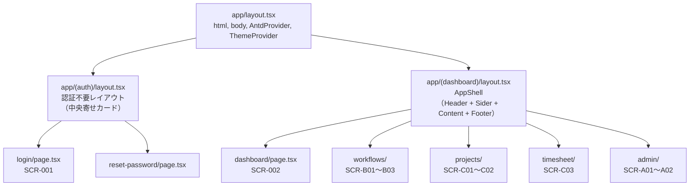

## 目的 / In-Out / Related
- **目的**: 全画面共通のレイアウト構成と再利用コンポーネントの設計を定める
- **対象範囲（In）**: レイアウト階層、共通コンポーネント定義、Ant Design利用方針
- **対象範囲（Out）**: 各画面固有のUI詳細（→ 各SPEC-SCR）
- **Related**: [モジュール設計](../../detail/modules/) / [画面仕様一覧](../screens/) / [ロール定義](../../requirements/roles/)

---

## Next.js レイアウト階層



---

## AppShell レイアウト構成

Ant Design `Layout` コンポーネントを使用。

```
┌─────────────────────────────────────────────────────────┐
│ Header                                                  │
│  Logo │ グローバル検索 │       │ 通知ベル │ ユーザー   │
├────────┬────────────────────────────────────────────────┤
│ Sider  │ Content                                       │
│        │                                               │
│ メニュー │  ┌─ Breadcrumb ────────────────────────┐    │
│        │  │ Home > プロジェクト > ECサイト        │    │
│ ・ダッシュ│  └──────────────────────────────────────┘    │
│ ・申請  │                                               │
│ ・PJ   │  ┌─ PageHeader ─────────────────────────┐    │
│ ・工数  │  │ ECサイトリニューアル      [編集][削除]│    │
│ ・経費  │  └──────────────────────────────────────┘    │
│ ・請求  │                                               │
│ ────── │  ┌─ Page Content ───────────────────────┐    │
│ ・設定  │  │                                      │    │
│ ・管理  │  │  (各画面固有のコンテンツ)            │    │
│        │  │                                      │    │
│        │  └──────────────────────────────────────┘    │
│        │                                               │
├────────┴────────────────────────────────────────────────┤
│ Footer                                                  │
│  © 2026 OpsHub │ ヘルプ │ 利用規約               v1.0  │
└─────────────────────────────────────────────────────────┘
```

---

## 共通コンポーネント定義

### レイアウト系（`components/layout/`）

| コンポーネント | Ant Design ベース | 責務 |
|---|---|---|
| `AppShell` | `Layout` | Header + Sider + Content + Footer の組み立て |
| `AppHeader` | `Layout.Header` | ロゴ、検索、通知、ユーザーメニュー |
| `AppSider` | `Layout.Sider` + `Menu` | サイドメニュー、折りたたみ対応 |
| `AppFooter` | `Layout.Footer` | コピーライト、バージョン |
| `PageContainer` | `PageContainer` (ProLayout) | Breadcrumb + PageHeader + Content の統一ラッパー |

### AppHeader 仕様

| 要素 | Ant Design コンポーネント | 動作 |
|---|---|---|
| ロゴ | カスタム（Imageリンク） | クリックで `/dashboard` へ |
| グローバル検索 | `Input.Search` | Cmd+K でフォーカス、申請/PJ/タスクを横断検索 |
| 通知ベル | `Badge` + `Popover` | 未読件数バッジ、クリックで通知一覧表示 |
| ユーザーメニュー | `Dropdown` + `Avatar` | プロフィール、テナント切替（将来）、ログアウト |

### AppSider メニュー構成

```typescript
const menuItems: MenuProps['items'] = [
  { key: 'dashboard', icon: <DashboardOutlined />, label: 'ダッシュボード' },
  { key: 'workflows', icon: <FileTextOutlined />, label: '申請', children: [
    { key: 'workflows-list', label: '申請一覧' },
    { key: 'workflows-create', label: '新規申請' },
  ]},
  { key: 'projects', icon: <ProjectOutlined />, label: 'プロジェクト' },
  { key: 'timesheet', icon: <ClockCircleOutlined />, label: '工数' },
  { key: 'expenses', icon: <WalletOutlined />, label: '経費' },
  // --- 以下、ロールに応じて表示制御 ---
  { type: 'divider' },
  { key: 'admin', icon: <SettingOutlined />, label: '管理',
    // tenant_admin / it_admin のみ表示
    children: [
      { key: 'admin-tenant', label: 'テナント管理' },
      { key: 'admin-users', label: 'ユーザー管理' },
    ]
  },
];
```

**表示制御ルール**: `lib/auth.ts` の `getCurrentUserRoles()` でロールを取得し、メニューの `display` をサーバー側で制御。

---

## 汎用UIコンポーネント（`components/ui/`）

Ant Design のコンポーネントをそのまま使う場合はラップ不要。**プロジェクト固有の振る舞いを加える場合のみ**ラップする。

| コンポーネント | Ant Design ベース | ラップ理由 |
|---|---|---|
| `DataTable` | `Table` + `Input.Search` | フィルタ・ソート・ページネーションのプリセット統一 |
| `FormModal` | `Modal` + `Form` | モーダルフォームのopen/close/submit/loading制御を共通化 |
| `ConfirmDialog` | `Modal.confirm` | 削除・無効化等の二重確認UIを統一 |
| `StatusBadge` | `Tag` | ステータスに応じた色マッピングを一元管理 |
| `DateRangePicker` | `DatePicker.RangePicker` | 和暦表示・営業日判定などロケール対応 |
| `CurrencyDisplay` | `Statistic` | ¥フォーマット・3桁カンマの統一 |

### StatusBadge の色マッピング例

```typescript
const STATUS_COLORS: Record<string, string> = {
  // Workflow
  draft: 'default',
  submitted: 'processing',
  approved: 'success',
  rejected: 'error',
  withdrawn: 'warning',
  // Project
  planning: 'default',
  active: 'processing',
  completed: 'success',
  cancelled: 'error',
  // Task
  todo: 'default',
  in_progress: 'processing',
  done: 'success',
};
```

---

## ドメイン固有コンポーネント（`components/domain/`）

特定の業務ロジックに紐づくUIパーツ。再利用頻度が高いものをここに配置。

| コンポーネント | 用途 | 使用画面 |
|---|---|---|
| `WorkflowStatusBadge` | 申請ステータス表示 | SCR-B01, B03 |
| `ProjectSelector` | PJドロップダウン（所属PJのみ） | SCR-C02, C03-1, C03-2 |
| `MemberAvatarGroup` | メンバーアバター一覧 | SCR-C01-1, C01-2 |
| `TaskCard` | カンバンのタスクカード | SCR-C02 |
| `TimesheetGrid` | 週間グリッド入力 | SCR-C03-1 |
| `KPICard` | KPIカード（数値 + 前月比） | SCR-002 |
| `AuditTimeline` | 監査ログタイムライン表示 | SCR-B03, C02 |

---

## ページテンプレートパターン

各画面は以下3パターンのいずれかに分類される。

### パターン1: 一覧ページ

```
PageContainer
  ├── フィルタバー（Search + Select + DateRange）
  ├── アクションバー（[＋新規作成] ボタン）
  └── DataTable（ソート・ページネーション付き）
```

**該当画面**: SCR-B01, SCR-C01-1, SCR-A02

### パターン2: 詳細/タブページ

```
PageContainer
  ├── PageHeader（タイトル + ステータスバッジ + アクションボタン群）
  └── Tabs
       ├── Tab1: 概要（Description + カード群）
       ├── Tab2: 関連データ（テーブル or リスト）
       └── Tab3: アクティビティ（Timeline）
```

**該当画面**: SCR-B03, SCR-C01-2, SCR-A01

### パターン3: フォーム/入力ページ

```
PageContainer
  ├── Form
  │    ├── フィールドグループ1（Card でラップ）
  │    ├── フィールドグループ2
  │    └── ...
  └── フッターバー（[下書き保存] [提出] [キャンセル]）
```

**該当画面**: SCR-B02, SCR-C04

---

## Ant Design 利用方針

### 基本原則
- **ProComponents は使わない**（依存が重い。標準コンポーネントの組み合わせで対応）
- **カスタムテーマ**: `ConfigProvider` でブランドカラー・border-radius を統一設定
- **アイコン**: `@ant-design/icons` を使用（Lucide等は混在させない）
- **レスポンシブ**: Ant Design `Grid`（`Row`/`Col`）+ `breakpoints` で対応

### テーマ設定

```typescript
// app/providers.tsx
const theme: ThemeConfig = {
  token: {
    colorPrimary: '#1677ff',       // ブランドカラー
    borderRadius: 8,
    fontFamily: "'Inter', 'Noto Sans JP', sans-serif",
  },
  components: {
    Layout: {
      headerBg: '#001529',         // ダークヘッダー
      siderBg: '#001529',
    },
  },
};
```

### レスポンシブ方針

| ブレークポイント | 挙動 |
|---|---|
| `>= 1200px` | Sider展開 + Content フル幅 |
| `768〜1199px` | Sider折りたたみ（アイコンのみ） |
| `< 768px` | Sider非表示（ハンバーガーメニュー）、テーブルはカード表示に切替 |

---

## ファイル構成まとめ

```
src/components/
├── layout/
│   ├── AppShell.tsx           # Layout 統合
│   ├── AppHeader.tsx          # ヘッダー
│   ├── AppSider.tsx           # サイドバー + メニュー
│   ├── AppFooter.tsx          # フッター
│   └── PageContainer.tsx      # Breadcrumb + PageHeader ラッパ
├── ui/
│   ├── DataTable.tsx          # 汎用テーブル
│   ├── FormModal.tsx          # モーダルフォーム
│   ├── ConfirmDialog.tsx      # 二重確認
│   ├── StatusBadge.tsx        # ステータスバッジ
│   ├── DateRangePicker.tsx    # 日付範囲
│   └── CurrencyDisplay.tsx    # 金額表示
└── domain/
    ├── WorkflowStatusBadge.tsx
    ├── ProjectSelector.tsx
    ├── MemberAvatarGroup.tsx
    ├── TaskCard.tsx
    ├── TimesheetGrid.tsx
    ├── KPICard.tsx
    └── AuditTimeline.tsx
```
